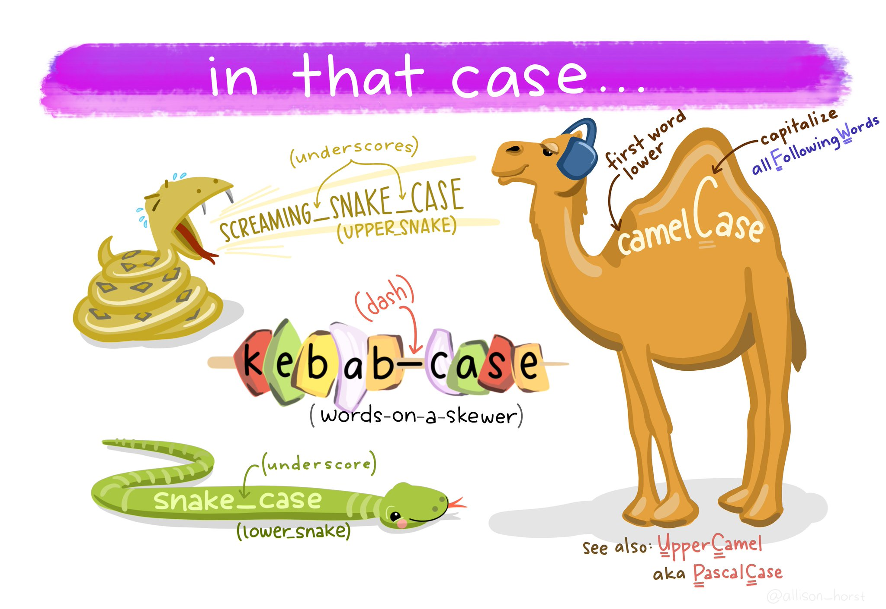

```{r, child="../setup.Rmd"}
```

---

```{r child="topics/0.Rmd"}
```

---

```{r child="topics/1.Rmd"}
```

---

# Meet your instructor!

.leftcol30[.circle[


]]

.rightcol70[

### John Helveston, Ph.D.

.font80[

Assistant Professor, Engineering Management & Systems Engineering

- 2016-2018 Postdoc at [Institute for Sustainable Energy](https://www.bu.edu/ise/), Boston University
- 2016 PhD in Engineering & Public Policy at Carnegie Mellon University
- 2015 MS in Engineering & Public Policy at Carnegie Mellon University
- 2010 BS in Engineering Science & Mechanics at Virginia Tech
- Website: [www.jhelvy.com](http://www.jhelvy.com/)

]]

---

# Meet your tutors!

.leftcol30[.circle[


]]

.rightcol70[

### **Michael Rossetti**

- Graduate Assistant (GA)
- PhD student in EMSE

]

---

# Meet your tutors!

.leftcol30[.circle[


]]

.rightcol70[

### **Ben Buechner**

- Learning Assistant (LA)
- EMSE Sophomore & P4A / EDA alumni

]

---

# Course orientation

--

## `r fa('globe')` Everything you need will be on the course website:

### https://p4a.seas.gwu.edu/2023-Spring/

--

## `r fa('puzzle-piece')` Course is broken into **two chunks**:

### 1. Programming (before Spring Break)
### 2. Analytics (after Spring Break)

---

# Learning Objectives

<br>

## After this class, you will know how to...

### ...write `r fa('r-project')` code to solve medium-sized tasks.
### ...pro-actively test and debug code.
### ...reproducibly import, export, manipulate, and visualize data.

---

# Attendance / Participation

### **Attendance will be taken** and will be part of your participation grade (7%).

---

# Homeworks (48% of grade)

--

## `r fa('calendar')` ~Every week (13 total, lowest dropped)

--

## `r fa('clock')` Due 11:59pm Wed. before class

---

# Late submissions

<br>

### - **3** late days - use them anytime, no questions asked
### - After that, 50% off for up to 24 hours after deadline, 0% afterwards
### - Contact me for special cases

---

# Quizzes (15% of grade)

--

## `r fa('calendar')` In class every other week-ish (7 total, drop lowest 2)

--

## `r fa('clock')` 10 minutes (1-3 questions)

--

> **Why quiz at all?** There's a phenomenon called the "retrieval effect" - basically, you have to _practice_ remembering things, otherwise your brain won't remember them (details in the book ["Make It Stick: The Science of Successful Learning"](https://www.hup.harvard.edu/catalog.php?isbn=9780674729018)).

---

# Exams (30% of grade)

<br>

## `r fa('calendar')` Midterm (weeks 1 - 7) on March 09

## `r fa('calendar')` Final (weeks 1 - 14) on May 11

---

# .center[Grades]

<br>

Component                  | Weight | Notes
---------------------------|--------|----------------
Participation / Attendance | 7%     |
Homeworks & Readings (13x) | 48%    | Lowest 1 dropped
Quizzes (7x)               | 15%    | Lowest 2 dropped
Midterm Exam               | 10%    |
Final Exam                 | 20%    |

---

# .center[Alternative Minimum Grade (AMG)]

- Designed for those who struggle early but work hard to succeed in 2nd half.
- Highest possible grade is "C"

<br>

Course Component   | Weight
-------------------|----
Best 10 Homeworks  | 40%
Best 4 Quizzes     | 10%
Midterm Exam       | 10%
Final Exam         | 40%

---

# Course policies

--

.leftcol35[

- ## BE NICE
- ## BE HONEST
- ## DON'T CHEAT

]

--

.rightcol65[

# **Don't copy-paste others' code!**

]

---

# How to succeed in this class

--

## `r fa("users")` Participate during class!

--

## `r fa("pen-ruler")` Start assignments early and **read carefully**!

--

## `r fa("bed")` Get sleep and take breaks often!

--

## `r fa("people-carry-box")` Ask for help!

---

# Getting Help

--

## `r fa('slack')` Use [Slack](https://emse-p4a-s23.slack.com/) to ask questions.

--

## `r fa('person-chalkboard')` Meet with your tutors

--

## `r fa('user-clock')` [Schedule a meeting](https://jhelvy.appointlet.com/b/professor-helveston) w/Prof. Helveston:

- Mondays from 8:00am - 2:00pm
- Wednesdays from 2:00 - 5:00pm
- Fridays from 12:00 - 2:00pm

--

## `r fa('code')` [GW Coders](http://gwcoders.github.io/)

---

# `r fa('hard-drive')` [Course Software](https://p4a.seas.gwu.edu/2023-Spring/software.html)

<br>

--

## `r fa('slack')` [Slack](https://emse-p4a-s23.slack.com/): Install app & **turn notifications on**!

--

## `r fa('r-project')` [R](https://cloud.r-project.org/) & [RStudio](https://rstudio.com/products/rstudio/download/): Install both.

--

## `r fa('r-project')` [RStudio Cloud](https://rstudio.cloud/plans/free): A web-based version of RStudio.

---

class: inverse, center

# .fancy[Break]

## `r fa('hard-drive')` Install [course software](https://p4a.seas.gwu.edu/2023-Spring/software.html) if you haven't

```{r, echo=FALSE}
countdown(
  minutes      = 5,
  warn_when    = 30,
  update_every = 1,
  left         = 0,
  right        = 0,
  top          = 1,
  bottom       = 0,
  margin       = "5%",
  font_size    = "8em"
)
```

---

```{r child="topics/2.Rmd"}
```

---

class: center

## What is `r fa('r-project')`? ([Read a brief history here](https://bookdown.org/rdpeng/rprogdatascience/history-and-overview-of-r.html))

Chambers creates "S" (1976, Bell Labs)<br>
Ross & Robert create "R" (1991, U. of Auckland)

.cols3[

## .center[[John Chambers](https://en.wikipedia.org/wiki/John_Chambers_(statistician)]

<center>

</center>

]

.cols3[

## .center[[Ross Ihaka](https://en.wikipedia.org/wiki/Ross_Ihaka)]

<center>

</center>

]

.cols3[

## .center[[Robert Gentleman](https://en.wikipedia.org/wiki/Robert_Gentleman_(statistician)]

<center>

</center>

]

---

class: center, middle

.leftcol[

## `r fa('r-project')`

<center>

</center>

]

.rightcol[

## `r fa('r-project')`Studio

<center>

</center>

]

---

class: center

# RStudio Orientation

.leftcol[

## Open this

<center>

</center>

]

.rightcol[

## Not this

<center>

</center>

]

---

# RStudio Orientation

.leftcol70[

<center>

</center>

]

.rightcol30[

- Know the boxes
- Customize the layout
- Customize the look
- [Extra themes](https://github.com/gadenbuie/rsthemes)

]

---

# Your first conveRsation

### Write stuff in the console, then press "enter"

--

Example: **addition**

```{r}
3 + 4
```

--

Example: **error**

```{r, error=TRUE}
3 + "4"
```

---

# Storing values

### Use the "`<-`" symbol to assign _values_ to _objects_

--

```{r}
x <- 40
x
```

--

```{r}
x + 2
```

---

# Storing values

### If you overwrite an object, R "forgets" the old value

--

Example:

```{r}
x <- 42
x
```

--

```{r}
x <- 50
x
```

---

# Storing values

<br>

### You can also use the `=` symbol to assign values

```{r}
x = 50
x
```

### (but it's more R-like to use `<-`)

---

# Storing values

### You can store more than just numbers

--

```{r}
x <- "If you want to view paradise"
y <- "simply look around and view it"
```

--

```{r}
x
y
```

---

# Storing values

--

.leftcol[

### **Pro tip 1**:

### Shortcut for `<-` symbol

.left[

|OS | Shortcut
|:--|:--------
|mac | `option` + `-`
|windows | `alt` + `-`

]

(see [here](https://support.rstudio.com/hc/en-us/articles/200711853-Keyboard-Shortcuts) for more shortcuts)

]

--

.rightcol[

### **Pro tip 2**:

### Always surround `<-` with spaces

Example:

```{r, eval=FALSE}
x<-2
```

Does this mean `x <- 2` or `x < -2`?

]

---

.leftcol[

## R ignores **extra space**

```{r}
x     <-       2
y  <-            3
z        <- 4
```

Check:
```{r}
x
y
z
```

]

--

.rightcol[

## R cares about **casing**

```{r}
number <- 2
Number <- 3
numbeR <- 4
```

Check:

```{r}
number
Number
numbeR
```

]

---

# Use `#` for comments

### R ignores everything after the `#` symbol

Example:

```{r}
speed <- 42 # This is mph, not km/h
speed
```

---

# Use meaningful variable names

--

**Example**: You are recording the speed of a car in mph

--

**Poor** variable name:

```{r}
x <- 42
```

--

**Good** variable name:

```{r}
speed <- 42
```

--

**Even better** variable name:

```{r}
speed_mph <- 42
```

---

# Use standard casing styles

.leftcol60[

 Art by [Allison Horst](https://github.com/allisonhorst/stats-illustrations)

]

--

.rightcol40[

I recommend using one of these:

- `snake_case_uses_underscores`
- `camelCaseUsesCaps`

Example:

```{r}
days_in_week <- 7
monthsInYear <- 12
```

]

---

## The workspace

.leftcol[

View all the current objects:

```{r}
objects()
```

]

--

.rightcol[

Remove an object by name:

```{r}
rm(number)
objects()
```

]

---

# View prior code in history pane


--

# Use "up" arrow see previous code

---

# Staying organized

--

## 1) Save your code in .R files

> ### File > New File > R Script

--

## 2) Keep work in R Project files

> ### File > New Project...

---

class: inverse

```{r, echo=FALSE}
countdown(
  minutes      = 10,
  warn_when    = 30,
  update_every = 15,
  bottom       = 0,
  left         = 0,
  font_size    = '2em'
)
```

.leftcol[.font80[

## Your turn

### A. Practice getting organized

1. Open RStudio and create a new R project called `week1`.
2. Create a new R script and save it as `practice.R`.
3. Open the `practice.R` file and write your answers to these questions in it.

]]

.rightcol[.font80[

### B. Creating & working with objects

1). Create objects to store the values in this table:

| City              | Area (sq mi) | Population (thousands) |
|-------------------|----------------|------------------------|
| San Francisco, CA | 47             | 884                    |
| Chicago, IL       | 228            | 2,716                  |
| Washington, DC    | 61             | 694                    |

2) Using the objects you created, answer the following questions:

  - Which city has the highest density?
  - How many _more_ people would need to live in DC for it to have the same population density as San Francisco?

```{r, eval=FALSE, echo=FALSE}
# Create values
area_sf <- 47
area_chicago <- 228
area_dc <- 61
pop_sf <- 884
pop_chicago <- 2716
pop_dc <- 694

# Compute densities
dens_sf <- pop_sf / area_sf
dens_chicago <- pop_chicago / area_chicago
dens_dc <- pop_dc / area_dc
dens_sf
dens_chicago
dens_dc

# Compute addition DC population to match SF density
(dens_sf*area_dc) - pop_dc
```
]]

---

```{r child="topics/3.Rmd"}
```

---

# R as a calculator

.leftcol[

## Basic operators:

### - Addition: `+`
### - Subtraction: `-`
### - Multiplication: `*`
### - Division: `/`

]

--

.rightcol[

## Other important operators:

### - Power: `^`
### - Integer Division: `%/%`
### - Modulus: `%%`

]

---

# Integer division: `%/%`

Integer division drops the remainder from regular division

--

```{r}
4 / 3 # Regular division
4 %/% 3 # Integer division
```

---

# Integer division: `%/%`

Integer division drops the remainder from regular division

--

What will this return?

```{r, eval=FALSE}
4 %/% 4
```

--

```{r, echo=FALSE}
4 %/% 4
```

--

What will this return?

```{r, eval=FALSE}
4 %/% 5
```

--

```{r, echo=FALSE}
4 %/% 5
```

---

# Modulus operator: `%%`

Modulus returns the _remainder_ after doing division

--

```{r}
5 %% 3
```

--

```{r}
3.1415 %% 3
```

---

# Modulus operator: `%%`

Modulus returns the _remainder_ after doing division

--

What will this return?

```{r, eval=FALSE}
4 %% 4
```

--

```{r, echo=FALSE}
4 %% 4
```

--

What will this return?

```{r, eval=FALSE}
4 %% 5
```

--

```{r, echo=FALSE}
4 %% 5
```

---

## Odds and evens with `n %% 2`

--

.leftcol[

If `n %% 2` is `0`, `n` is **EVEN**

```{r}
10 %% 2
12 %% 2
```

Also works with negative numbers!

```{r}
-42 %% 2
```

]

--

.rightcol[

If `n %% 2` is `1`, `n` is **ODD**

```{r}
1 %% 2
13 %% 2
```

Also works with negative numbers!

```{r}
-47 %% 2
```

]

---

## Number "chopping" with 10s

--

.leftcol[

The mod operator (`%%`) "chops" a number and returns everything to the _right_

```{r}
123456 %% 1
123456 %% 10
123456 %% 100
```

]

--

.rightcol[

Integer division (`%/%`) "chops" a number and returns everything to the _left_

```{r}
123456 %/% 1
123456 %/% 10
123456 %/% 100
```

]

---

## Number "chopping" with 10s

- `%%` returns everything to the _right_ (`"chop" ->`)
- `%/%` returns everything to the _left_ (`<- "chop"`)
- The "chop" point is always just to the _right_ of the chopping digit

<br>

<div style="width:1000px">
<table class="table table-condensed">
<thead>
<tr class="header">
<th>Example</th>
<th>“Chop” point</th>
<th></th>
</tr>
</thead>
<tbody>
<tr class="odd">
<td><code>1234 %% 1</code></td>
<td><code>1234 |</code></td>
<td>Right of the <code>1</code>’s digit</td>
</tr>
<tr class="even">
<td><code>1234 %% 10</code></td>
<td><code>123 | 4</code></td>
<td>Right of the <code>10</code>’s digit</td>
</tr>
<tr class="odd">
<td><code>1234 %% 100</code></td>
<td><code>12 | 34</code></td>
<td>Right of the <code>100</code>’s digit</td>
</tr>
<tr class="even">
<td><code>1234 %% 1000</code></td>
<td><code>1 | 234</code></td>
<td>Right of the <code>1,000</code>’s digit</td>
</tr>
<tr class="odd">
<td><code>1234 %% 10000</code></td>
<td><code>| 1234</code></td>
<td>Right of the <code>10,000</code>’s digit</td>
</tr>
</tbody>
</table>
</div>

---

# Comparing things: **Relational operators**

--

.leftcol[

### Compare if condition is `TRUE` or `FALSE` using:

- Less than: `<`
- Less than or equal to : `<=`
- Greater than or equal to: `>=`
- Greater than: `>`
- Equal: `==`
- Not equal: `!=`

]

--

.rightcol[.code60[

```{r}
2 < 2
2 <= 2
(2 + 2) == 4
(2 + 2) != 4
"penguin" == "penguin"
```

]]

---

# Comparing things: **Logical operators**

<br>

### Make multiple comparisons with:

### - And: `&`
### - Or: `|`
### - Not: `!`

---

# Comparing things: **Logical operators**

.leftcol[

With "and" (`&`), every part must be `TRUE`, otherwise the whole statement is `FALSE`:

```{r}
(2 == 2) & (3 == 3)
(2 == 2) & (2 == 3)
```

]

--

.rightcol[

With "or" (`|`), if _any_ part is `TRUE`, the whole statement is `TRUE`:

```{r}
(2 == 2) | (3 == 3)
(2 == 2) | (2 == 3)
```

]

---

# Comparing things: **Logical operators**

The "not" (`!`) symbol produces the _opposite_ statement:

--

```{r, eval=FALSE}
! (2 == 2)
```

--

```{r, echo=FALSE}
! (2 == 2)
```

--

```{r, eval=FALSE}
! (2 == 2) | (3 == 3)
```

--

```{r, echo=FALSE}
! (2 == 2) | (3 == 3)
```

--

```{r, eval=FALSE}
! ((2 == 2) | (3 == 3))
```

--

```{r, echo=FALSE}
! ((2 == 2) | (3 == 3))
```

---

# Comparing things: **Logical operators**

### Order precedence for logical operators: `! > & > |`

--

.leftcol[

```{r}
TRUE | FALSE & FALSE
(TRUE | FALSE) & FALSE
```

]

.rightcol[

```{r}
! TRUE | TRUE
! (TRUE | TRUE)
```

]

---

# Comparing things: **Logical operators**

.leftcol[

### **Pro tip**: Use parentheses

```{r}
! 3 == 5   # Confusing
! (3 == 5) # Less confusing
```

]

---

## Other important points

.leftcol[

### R follows BEDMAS:

1. **B**rackets
2. **E**xponents
3. **D**ivision
4. **M**ultiplication
5. **A**ddition
6. **S**ubtraction

]

--

.rightcol[

### **Pro tip**: Use parentheses

```{r}
1 + 2 * 4   # Confusing
1 + (2 * 4) # Less confusing
```

]

---

class: inverse

```{r, echo=FALSE}
countdown(
  minutes      = 10,
  warn_when    = 30,
  update_every = 15,
  top          = 0,
  font_size    = '2em'
)
```

# Your turn

Consider the following objects:

```{r}
w <- TRUE
x <- FALSE
y <- TRUE
```

Write code to answer the following questions:
1. Fill in _relational_ operators to make the following statement return `TRUE`:

    `! (w __ x) & ! (y __ x)`

2. Fill in _logical_ operators to make this statement return `FALSE`:

    `! (w __ x) | (y __ x)`

```{r, eval=FALSE, echo=FALSE}
# 1.  Use relational operators to return TRUE
! (w == x) & ! (y == x)

# 2. Use logical operators to return FALSE
! (w | x) | (y & x)
```

---

# Data Types

|Type      | Description                 | Example
|:---------|:----------------------------|:---------
|`double`   | Numbers w/decimals (aka "float") | `3.14`
|`integer`   | Numbers w/out decimals    | `42`
|`character` | Text (aka "string") | `"this is some text"`
|`logical`   | Used for comparing objects | `TRUE`, `FALSE`

---

## Use `typeof()` to find the type

```{r}
typeof(2)
```

```{r}
typeof("hello")
```

```{r}
typeof(TRUE)
```

---

# Numeric types (there are 2)

--

.leftcol[

## Integers

### No decimals (e.g. `7`)

]

--

.rightcol[

## Doubles (aka "float")

### Decimals (e.g. `7.0`)

]

---

## In R, numbers are "doubles" by default

--

```{r}
typeof(3)
```

### R assumes that `3` is really `3.0`

--

### Make it an integer by adding `L`:

```{r}
typeof(3L)
```

---

# Character types

--

### Use single or double quotes around anything:

```{r}
typeof('hello')
typeof("3")
```

--

Use single / double quotes if the string _contains_ a quote symbol:

```{r}
typeof("don't")
```

---

# Logical types

--

.leftcol[

Logical data only have two values:<br>`TRUE` or `FALSE`

```{r}
typeof(TRUE)
typeof(FALSE)
```

]

--

.rightcol[

Note that these have to be in all caps,<br>and **not** in quotes:

```{r, error=TRUE}
typeof('TRUE')
typeof(True)
```

]

---

# Logical types

Use to answer questions about logical statements.

Example: Is `1` greater than `2`?

```{r}
1 > 2
```

--

Example: Is `2` greater than `1`?

```{r}
1 < 2
```

---

## Special values

--

`Inf`: Infinity (_or really big numbers_)

```{r}
1/0
```

--

`NaN`: Not a Number

```{r}
0/0
```

--

`NA`: Not available (_value is missing_)

--

`NULL`: no value whatsoever

---

class: inverse

# Your turn

```{r, echo=FALSE}
countdown(
  minutes      = 5,
  warn_when    = 30,
  update_every = 15,
  top          = 0,
  font_size    = '2em'
)
```

## Will these return `TRUE` or `FALSE`?

## (try to answer first, then run the code to check)

- `! typeof('3') == typeof(3)`
- `(typeof(7) != typeof("FALSE")) | FALSE`
- `! (typeof(TRUE) == typeof(FALSE)) & FALSE`

---

```{r child="topics/4.Rmd"}
```

---

class: center, middle

# `r fa('exclamation')` [HW 1](https://p4a.seas.gwu.edu/2023-Spring/hw1/getting-started.html) - read carefully!
