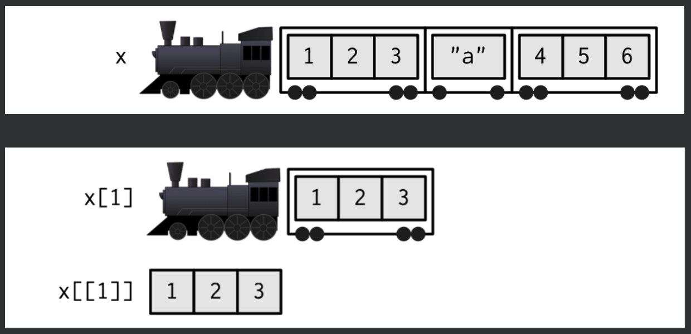
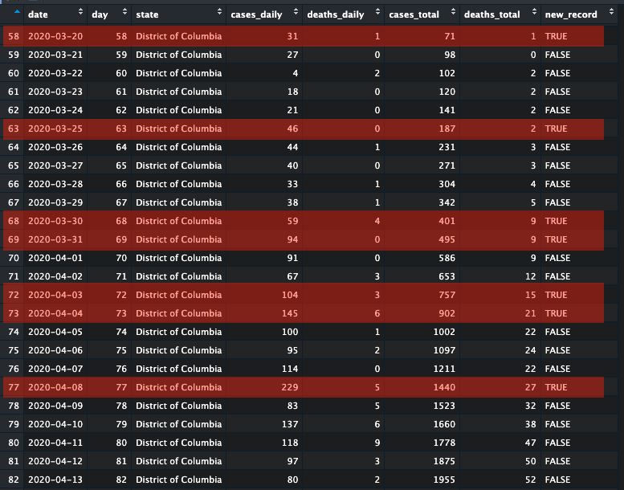

```{r, child="../setup.Rmd"}
```

```{r}
#| include: false

theme_set(theme_gray(base_size = 20))
options(width = 80)
```

---

class: inverse

# Quiz 6

```{r, echo=FALSE}
countdown(
  minutes      = 10,
  warn_when    = 30,
  update_every = 1,
  top          = 0,
  right        = 0,
  font_size    = '3em'
)
```

.leftcol[

## Write your name on the quiz!

## Rules:

- Work alone; no outside help of any kind is allowed.
- No calculators, no notes, no books, no computers, no phones.

]

.rightcol[

<br>
<center>

</center>

]

---

```{r child="topics/0.Rmd"}
```

---

```{r child="topics/1.Rmd"}
```

---

# Motivation

I want a summary of a variable in a data frame:

```{r}
head(diamonds)
```

---

# Motivation

I want a summary of a variable in a data frame:

```{r}
length(diamonds$price)
mean(diamonds$price)
sd(diamonds$price)
```

---

# Motivation

I want a summary of a variable in a data frame:

```{r}
diamonds %>%
  summarise(
    n = n(),
    mean = mean(price),
    sd = sd(price)
  )
```

---

# Motivation

I can get **grouped** summaries really fast now:

.leftcol[

```{r}
diamonds %>%
  group_by(cut) %>% #<<
  summarise(
    n = n(),
    mean = mean(price),
    sd = sd(price)
  )
```

]

.rightcol[

```{r}
diamonds %>%
  group_by(color) %>% #<<
  summarise(
    n = n(),
    mean = mean(price),
    sd = sd(price)
  )
```

]

---

# Convert this to a function

.leftcol[

```{r}
diamonds %>%
  group_by(color) %>%
  summarise(
    n = n(),
    mean = mean(price),
    sd = sd(price)
  )
```

]

.rightcol[

```{r}
my_summary <- function(df, var) {
  df %>%
    group_by(var) %>% #<<
    summarise(
      n = n(),
      mean = mean(price),
      sd = sd(price)
    )
}
```

]

---

# ...but this doesn't work

```{r}
#| error: true

my_summary <- function(df, var) {
  df %>%
    group_by(var) %>% #<<
    summarise(
      n = n(),
      mean = mean(price),
      sd = sd(price)
    )
}

my_summary(diamonds, color)
```

---

# **Solution**: "embrace" your variables 🤗

.leftcol[

```{r}
my_summary <- function(df, var) {
  df %>%
    group_by({{ var }}) %>% #<<
    summarise(
      n = n(),
      mean = mean(price),
      sd = sd(price)
    )
}
```

]

.rightcol[

```{r}
my_summary(diamonds, cut)
my_summary(diamonds, color)
```

]

---

### Make it even more general!

```{r}
my_summary <- function(df, group, var) {
  df %>%
    group_by({{ group }}) %>%
    summarise(
      n = n(),
      mean = mean({{ var }}),
      sd = sd({{ var }})
    )
}
```

```{r}
my_summary(diamonds, cut, price)
```

---

### Make it even more general!

```{r}
my_summary <- function(df, group, var) {
  df %>%
    group_by({{ group }}) %>%
    summarise(
      n = n(),
      mean = mean({{ var }}),
      sd = sd({{ var }})
    )
}
```

```{r}
my_summary(diamonds, color, carat)
```

---

### Use it on a different data frame!

.leftcol[

```{r}
library(palmerpenguins)

glimpse(penguins)
```

]

--

.rightcol[

```{r}
my_summary(penguins, sex, body_mass_g)
my_summary(penguins, species, bill_length_mm)
```

]

---

### Defining a filter condition

```{r}
filter_summary <- function(df, condition, var) {
  df %>%
    filter({{ condition }}) %>% #<<
    summarise(
      n = n(),
      mean = mean({{ var }}, na.rm = TRUE),
      sd = sd({{ var }}, na.rm = TRUE)
    )
}
```

```{r}
filter_summary(penguins, species == 'Adelie', bill_length_mm)
```

---

class: inverse

```{r, echo=FALSE}
countdown(
  minutes      = 15,
  warn_when    = 30,
  update_every = 1,
  top          = 0,
  right        = 0,
  font_size    = '2em'
)
```

## Your turn - write the following functions

.leftcol[

```{r}
#| eval: false

my_subset <- function(df, condition, cols)
```

Returns a subset of `df` by filtering the rows based on `condition` and only includes the select `cols`. Example:

```{r}
#| echo: false

my_subset <- function(df, condition, cols) {
  df %>% 
    filter({{ condition }}) %>% 
    select({{ cols }})
}
```

```{r}
#| eval: false

nycflights13::flights %>% 
  my_subset(month == 12, c("carrier", "flight"))
```

```{r}
#| echo: false

nycflights13::flights %>% 
  my_subset(month == 12, c("carrier", "flight")) %>% 
  head(5)
```

]

.rightcol[

```{r}
#| eval: false

count_p <- function(df, group)
```

Returns a summary data frame of the count of rows in `df` by `group` as well as the percentage of those counts.

```{r}
#| echo: false

count_p <- function(df, group) {
  df %>% 
    count({{ group }}, sort = TRUE) %>% 
    mutate(p = n / sum(n))
}
```

```{r}
#| eval: false
nycflights13::flights %>%
  count_p(carrier)
```

```{r}
#| echo: false
nycflights13::flights %>%
  count_p(carrier) %>% 
  head()
```

]

---

.leftcol[

### Testing data frame functions 

Function: 

```{r}
my_summary <- function(df, group, var) {
  df %>%
    group_by({{ group }}) %>%
    summarise(
      n = n(),
      mean = mean({{ var }}),
      sd = sd({{ var }})
    )
}
```

]

.rightcol[

Make two data frames and compare them

```{r}
test_my_summary <- function() {
  
  cat("Testing my_summary()...")

  df1 <- diamonds %>% 
    my_summary(cut, price)  
  
  df2 <- diamonds %>% 
    group_by(cut) %>% 
    summarise(
      n = n(),
      mean = mean(price),
      sd = sd(price)
    )
  
  stopifnot(identical(df1, df2)) #<<
  
  cat("passed!")
}

test_my_summary()
```

]

---

```{r child="topics/2.Rmd"}
```

---

# Motivation

I want to see a histogram of multiple variables

.leftcol[

```{r}
diamonds %>%
  ggplot() +
  geom_histogram((aes(x = price)))
```

]

.rightcol[

```{r}
diamonds %>%
  ggplot() +
  geom_histogram((aes(x = carat)))
```

]

---

# Convert this to a function

```{r}
my_hist <- function(df, var) {
  df %>%
    ggplot() +
    geom_histogram((aes(x = {{ var }}))) # <<
}
```

.leftcol[

```{r}
my_hist(diamonds, price)
```

]

.rightcol[

```{r}
my_hist(diamonds, carat)
```

]

---

## Combine with other functions

```{r}
filtered_hist <- function(df, condition, var) {
  df %>%
    filter({{ condition }}) %>% #<<
    ggplot() +
    geom_histogram((aes(x = {{ var }}))) 
}
```

.leftcol[

```{r}
filtered_hist(diamonds, color == "E", price)
```

]

.rightcol[

```{r}
filtered_hist(diamonds, color == "J", price)
```

]

---

class: inverse

```{r, echo=FALSE}
countdown(
  minutes      = 10,
  warn_when    = 30,
  update_every = 1,
  top          = 0,
  right        = 0,
  font_size    = '2em'
)
```

## Your turn

Write the function `filtered_scatter` which plots a scatterplot based on a condition, then use it for the two examples below.

```{r}
#| eval: false

filtered_scatter <- function(df, condition, x, y)
```

```{r}
#| echo: false

filtered_scatter <- function(df, condition, x, y) {
  df %>% 
    filter({{ condition }}) %>% 
    ggplot() +
    geom_point(aes(x = {{ x }}, y = {{ y }} ))
}
```

.leftcol[

```{r}
#| fig.height: 3
#| fig.width: 5

filtered_scatter(
  penguins, sex == "male", 
  x = body_mass_g, y = bill_length_mm)
```

]

.rightcol[

```{r}
#| fig.height: 3
#| fig.width: 5

filtered_scatter(
  penguins, species == "Gentoo", 
  x = body_mass_g, y = flipper_length_mm)
```

]

---

## You can add layers to your custom plot functions

```{r}
#| fig.height: 4
#| fig.width: 5

filtered_scatter(
  penguins, species == "Gentoo", 
  x = body_mass_g, y = flipper_length_mm) + 
  theme_bw() #<<
```

---

class: inverse, center

# .fancy[Break]

```{r, echo=FALSE}
countdown(
  minutes      = 5,
  warn_when    = 30,
  update_every = 1,
  left         = 0,
  right        = 0,
  top          = 1,
  bottom       = 0,
  margin       = "5%",
  font_size    = "8em"
)
```

---

```{r child="topics/3.Rmd"}
```

---

class: center, middle 

# Iterating _without_ purrr

---

## Gapminder example

```{r}
library(gapminder)
library(tidyverse)

head(gapminder)
```

Hans Rosling discusses Gapminder data https://youtu.be/hVimVzgtD6w

---

## Gapminder life expectancy

```{r}
#| echo: false
#| fig.width: 15
#| fig.height: 5

gapminder |>  
  ggplot(aes(x = year, y = lifeExp)) +
  geom_line(aes(group = country), color = "white") +
  facet_wrap(~ continent, ncol = 5) +
  stat_summary(geom = "line", fun = mean, color = "#C7B41D", lwd = 1.5) +
  scale_x_continuous(breaks = seq(1950, 2010, by = 15)) +
  theme_dark() +
  theme(
    strip.text = element_text(size = 15),
    axis.text = element_text(size = 10),
    axis.title = element_text(size = 15)
  )
```

---

#### .center[What am I doing here? Are there mistakes?]

```{r}
#| eval: false

africa <- gapminder[gapminder$continent == "Africa", ]
africa_mm <- max(africa$lifeExp) - min(africa$lifeExp)

americas <- gapminder[gapminder$continent == "Americas", ]
americas_mm <- max(americas$lifeExp) - min(americas$lifeExp)

asia <- gapminder[gapminder$continent == "Asia", ]
asia_mm <- max(asia$lifeExp) - min(africa$lifeExp)

europe <- gapminder[gapminder$continent == "Europe", ]
europe_mm <- max(europe$lifeExp) - min(europe$lifeExp)

oceania <- gapminder[gapminder$continent == "Oceania", ]
oceania_mm <- max(europe$lifeExp) - min(oceania$lifeExp)

cbind(
  continent = c("Africa", "Asias", "Europe", "Oceania"),
  max_minus_min = c(africa_mm, americas_mm, asia_mm, europe_mm, oceania_mm)
)
```

```{r, echo=FALSE}
countdown(
  minutes      = 1,
  update_every = 1,
  top          = 0,
  right        = 0,
  font_size    = '2em'
)
```

---

### 1.  What are the drawbacks of this code?

### 2.  How would you do it instead?

```{r}
#| eval: false

africa <- gapminder[gapminder$continent == "Africa", ]
africa_mm <- max(africa$lifeExp) - min(africa$lifeExp)

americas <- gapminder[gapminder$continent == "Americas", ]
americas_mm <- max(americas$lifeExp) - min(americas$lifeExp)

asia <- gapminder[gapminder$continent == "Asia", ]
asia_mm <- max(asia$lifeExp) - min(africa$lifeExp)

europe <- gapminder[gapminder$continent == "Europe", ]
europe_mm <- max(europe$lifeExp) - min(europe$lifeExp)

oceania <- gapminder[gapminder$continent == "Oceania", ]
oceania_mm <- max(europe$lifeExp) - min(oceania$lifeExp)

cbind(
  continent = c("Africa", "Asias", "Europe", "Oceania"),
  max_minus_min = c(africa_mm, americas_mm, asia_mm, europe_mm, oceania_mm)
)
```

---

## An alternative solution

```{r}
#| eval: false

gapminder %>% 
 group_by(continent) %>% 
 summarize(max_minus_min = max(lifeExp) - min(lifeExp))
```

--

.leftcol[

`group_by` approach

```{r}
#| echo: false

gapminder %>% 
 group_by(continent) %>% 
 summarize(max_minus_min = max(lifeExp) - min(lifeExp))
```

]

.rightcol[

previous approach

```{r}
#| echo: false

africa <- gapminder[gapminder$continent == "Africa", ]
africa_mm <- max(africa$lifeExp) - min(africa$lifeExp)

americas <- gapminder[gapminder$continent == "Americas", ]
americas_mm <- max(americas$lifeExp) - min(americas$lifeExp)

asia <- gapminder[gapminder$continent == "Asia", ]
asia_mm <- max(asia$lifeExp) - min(africa$lifeExp)

europe <- gapminder[gapminder$continent == "Europe", ]
europe_mm <- max(europe$lifeExp) - min(europe$lifeExp)

oceania <- gapminder[gapminder$continent == "Oceania", ]
oceania_mm <- max(europe$lifeExp) - min(oceania$lifeExp)

cbind(
  continent = c("Africa", "Asias", "Europe", "Oceania"),
  max_minus_min = c(africa_mm, americas_mm, asia_mm, europe_mm, oceania_mm)
)
```

]

---

## More iteration

```{r}
year <- 2017:2021
location <- c("Orlando", "San Diego", "Austin", "San Francisco", "remote")

conf <- rep("", length(year))
for (i in 1:length(conf)) {
 conf[i] <- paste0("The ", year[i], " RStudio Conference was in ", location[i], ".")
}
conf
```

--

#### Can you think of other ways to do this?

---

## More iteration, cont.

```{r}
year <- 2017:2021
location <- c("Orlando", "San Diego", "Austin", "San Francisco", "remote")
```

--

```{r}
paste0("The ", year, " RStudio Conference was in ", location, ".")
```

--

```{r}
glue::glue("The {year} RStudio Conference was in {location}.")
```

---

class: center, middle 

# Introducing `purrr`

<center>

</center>

Loaded automatically with `library(tidyverse)`

---

class: center, middle

## `purrr::map(x, f, ...)`

<br>

--

## for every element of `x` do `f`

---

background-image: url("images/lego1.jpeg")
background-size: contain
class: center

<br>

## `x = minis`

## `f = add_antenna`

---

background-image: url("images/lego2.jpeg")
background-size: contain
class: center

<br>

## `map(minis, add_antenna)`

---

class: center 

## for every element of `x` do `f`

<center>

</center>

---

## `map()` returns a list 

Vector example 

```{r}
addTen <- function(x) {
  return(x + 10)
}
```

--

```{r}
#| eval: false

map(c(1, 7, 13), addTen)
```

--

```{r}
#| echo: false

map(c(1, 7, 13), addTen)
```

---

## .center[Working with lists feels like...]

<center>

</center>

.center[https://media.giphy.com/media/Bqn8Z7xdPCFy0/giphy.gif]

---

## .center[Subsetting lists]

<center>

</center>

.font87[source: https://shannonpileggi.github.io/iterating-well-with-purrr/#/subsetting-lists]

---

<center>

</center>

.leftcol[

```{r}
x <- list(c(1, 2, 3), "a", c(4, 5, 6))
```

]

.rightcol[

```{r}
x[1]
x[[1]]
```

]

---

# Example data: `sw_people`

```{r}
library(repurrrsive)
```

.leftcol[

```{r}
sw_people
```

]

.rightcol[

<center>

</center>

]

---

## How many films was each Star Wars character in?

## `map(sw_people, f = 🤷)`

--

#### Workflow:

### 1. Do it for one element.
### 2. Find the general recipe.
### 3. Drop into `map()` to do for all.

---

# 1. Do it for one element

--

.leftcol[

```{r}
x <- sw_people[[1]]
x
```

]

--

.rightcol[

View the variables we have to work with:

```{r}
names(x)
```

Extract the films 

```{r}
x$films
```

]

---

# 1. Do it for one element

### How many films was each Star Wars character in?

--

.leftcol[

Character 1:

```{r}
x <- sw_people[[1]]
length(x$films)
```

]

--

.rightcol[

Character 2:

```{r}
x <- sw_people[[2]]
length(x$films)
```

]

---

# 2. Find the general recipe

### How many films was each Star Wars character in?

```{r}
x <- sw_people[[1]]
length(x$films)
```

#### Recipe:

### `x <- sw_people[[index]]`

### `length(x$films)`

---

# 3. Drop into `map()` to do for all items in list.

.leftcol[

#### Recipe:

### `x <- sw_people[[index]]`

### `length(x$films)`

]

.rightcol[

#### Do for all items in list:

```{r}
get_film_length <- function(x) {
    return(length(x$films))
}

map(sw_people, get_film_length)
```

]

---

## for every element of `x` do `f`

.leftcol[

<center>

</center>

]

.rightcol[

```{r}
get_film_length <- function(x) {
    return(length(x$films))
}

map(sw_people, get_film_length)
```

]

---

# Simplify it with "anonymous" functions

.leftcol[

Version 1: **Custom function**

```{r}
get_film_length <- function(x) {
    return(length(x$films))
}

map(sw_people, get_film_length)
```

]

.rightcol[

Version 2: **Anonymous function**

```{r}
map(sw_people, function(x) length(x$films))
```

]

---

## Anonymous functions

Three ways of specifying anonymous functions:

```{r}
#| eval: false 

map(sw_people, function(x) length( x$films)) # supported in base R
map(sw_people,        \(x) length( x$films)) # supported R > 4.1.0
map(sw_people,           ~ length(.x$films)) # supported in purrr
```

---

```{r, echo=FALSE}
countdown(
  minutes      = 3,
  update_every = 1,
  top          = 0,
  right        = 0,
  font_size    = '2em'
)
```

# Quick practice

- How many `vehicles` does each Star Wars character have? 

(use `sw_people`)

- How many `titles` does each character in Game of Thrones have? 

(use `got_chars`)

---

## Type specific map variants

```{r}
map_int(sw_people, \(x) length(x$films))
```

--

`map_lgl()`: Returns a _logical_ vector

`map_int()`: Returns a _integer_ vector

`map_dbl()`: Returns a _double_ vector

`map_chr()`: Returns a _character_ vector

---

```{r, echo=FALSE}
countdown(
  minutes      = 3,
  update_every = 1,
  top          = 0,
  right        = 0,
  font_size    = '2em'
)
```

# Quick practice

#### Replace `map()` with type-specific `map()`.

```{r}
#| eval: false

# What's each character's name?
map(got_chars, \(x) x$name)
map(sw_people, \(x) x$name)

# What color is each SW character's hair?
map(sw_people, \(x) x$hair_color)

# Is the GoT character alive?
map(got_chars, \(x) x$alive)

# Is the SW character female?
map(sw_people, \(x) x$gender == "female")

# How heavy is each SW character?
map(sw_people, \(x) x$mass)
```

---

## How many films was each Star Wars character in?

.leftcol[

```{r}
map(sw_people, \(x) length(x$films))
```

]

.rightcol[

<br><br>

### .center[.red[Wait, which character?]]

]

---

# Use a tibble to get the character name as well!

.leftcol[

Returns a list of data frames:

```{r}
map(sw_people, \(x) tibble(
    name = x$name, 
    n_vehicles = length(x$films)
  )
)
```

]

--

.rightcol[

Use `map_df()` to merge the data frames 

```{r}
map_df(sw_people, \(x) tibble( #<<
    name = x$name, 
    n_vehicles = length(x$films)
  )
)
```

]

---

class: inverse

```{r, echo=FALSE}
countdown(
  minutes      = 15,
  warn_when    = 30,
  update_every = 1,
  top          = 0,
  right        = 0,
  font_size    = '2em'
)
```

## Your turn 

Try to answer these questions:

1. Which SW film has the most characters? (use `sw_films`)
2. Which SW species has the highest average lifespan? (use `sw_species`)
3. Which GoT character(s) have been played by multiple actors? (use `got_chars`)

---

## Sometimes you really need do something on each row

Use a `for` loop to iterate across each row in a data frame:

```{r}
#| eval: false 

for (i in 1:nrow(df)) {
  row <- df[i,]
  # Do stuff with row
}
```

---

## .center[Example: tagging a new daily covid case record]

```{r}
covid_dc <- read_csv(here::here('data', 'us_covid.csv')) %>% 
  filter(state == 'District of Columbia') %>% 
  select(-state)

head(covid_dc)
```

---

## .center[Example: tagging a new daily covid case record]

.leftcol[

Initialize new column

```{r}
covid_dc$new_record <- FALSE

glimpse(covid_dc)
```

]

.rightcol[

Now loop through each row and check if a new record is met

```{r}
record <- 0
for (i in 1:nrow(covid_dc)) {
  
  # Get the nubmer of cases on row i
  num_cases <- covid_dc[i,]$cases_daily
  
  # Check if new record is met
  if (num_cases > record) {    
    
    # Update new record in covid_dc
    covid_dc[i, ]$new_record <- TRUE 
    
    # Update new record
    record <- num_cases
  }
}
```

]

---

<center>

</center>

---

## Preview [HW 11](https://p4a.seas.gwu.edu/2023-Spring/hw/11-programming-with-data.html)
