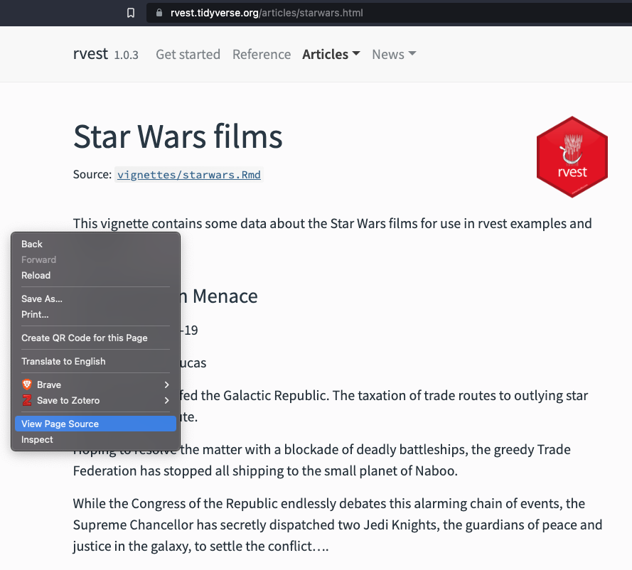
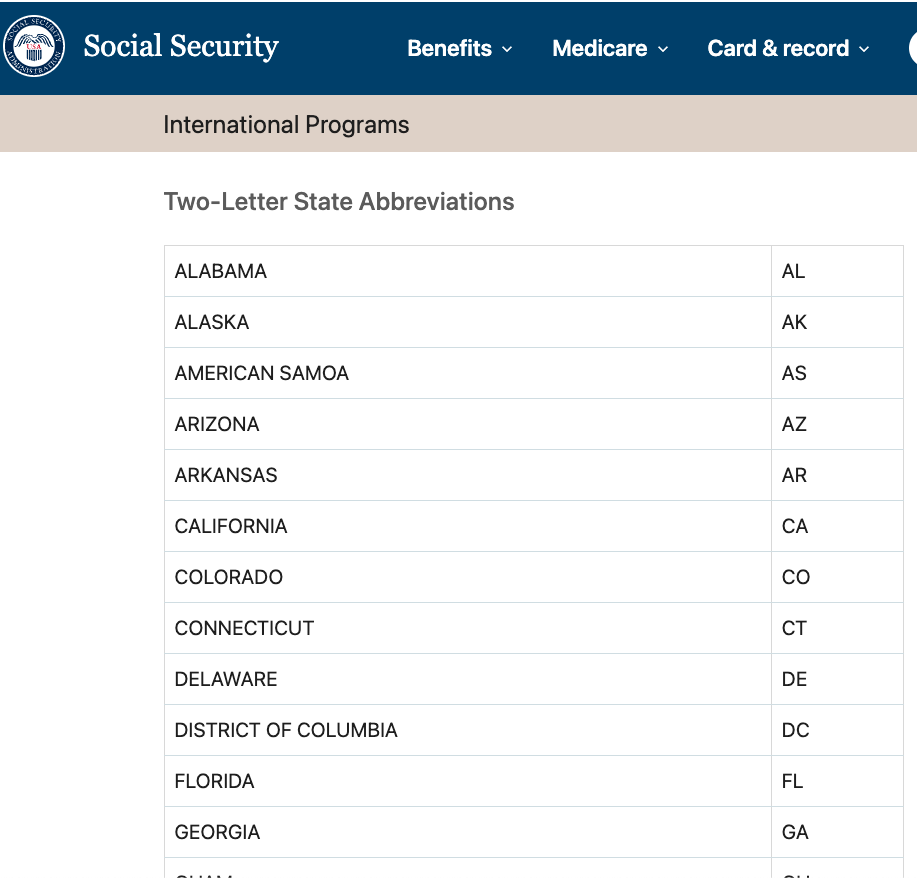
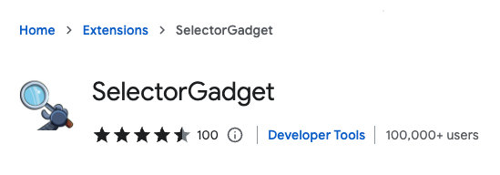
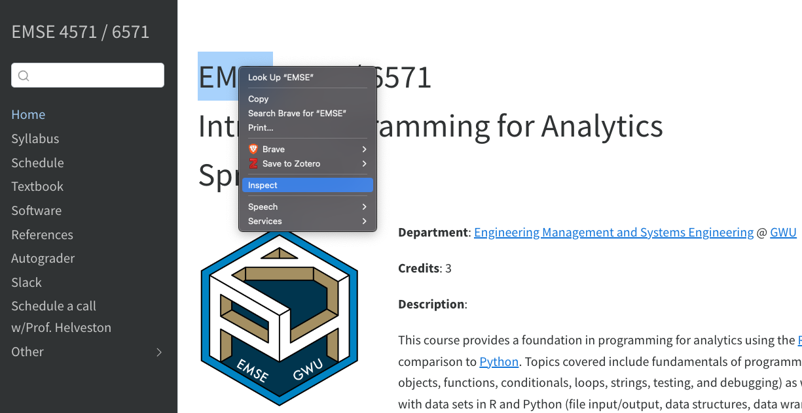

```{r, child="../setup.Rmd"}
```

---

```{r child="topics/0.Rmd"}
```

---

#### Some disclaimers ([here](https://r4ds.hadley.nz/webscraping.html#scraping-ethics-and-legalities) for more details)

You're probably okay if the data is:

- Public
- Non-personal
- Factual

Otherwise, consult a lawyer and / or maybe don't scrape it.

#### Terms of service

Generally are not upheld, unless you **need an account to access the data**.

#### Copyright

Data is not copyright protected (in the US). But works are. Be careful.

---

```{r child="topics/1.Rmd"}
```

---

## **H**yper**T**ext **M**arkup **L**anguage 

```{html}
<html>
<head>
  <title>Page title</title>
</head>
<body>
  <h1 id='first'>A heading</h1>
  <p>Some text &amp; <b>some bold text.</b></p>
  
</body>
```

HTML has a hierarchical structure formed by:

- Start and end **"tags"** (e.g. `<tag>` and `</tag>`)
- Optional attributes (e.g. `id='first'`)
- Contents (everything in between the start and end tag).

---

.leftcol[

## Common tags

- `<h1>` = Header level 1
- `<a>` = [Url]() link
- `<b>` = **Bold** text 
- `<i>` = _Italic_ text
- `<p>` = Paragraph
- `<li>` = List item

]

.rightcol[

## Attributes

- `id`: Element identifier, e.g.<br>`<h1 id='first'>A heading</h1>`
- `class`: Styling class, e.g.<br>`<h1 class='header'>A heading</h1>`

]

---

class: middle

.leftcol40[

# Quick example

- Go [here](https://rvest.tidyverse.org/articles/starwars.html)
- Right-click, select<br>"View Page Source"

]

.rightcol60[

https://rvest.tidyverse.org/articles/starwars.html
<center>

</center>

]

---

## **Strategy**: Use tags and classes to parse html

.leftcol[

`source_code`

```{html}
<html>
<head>
  <title>Page title</title>
</head>
<body>
  <h1 id='first'>A heading</h1> #<<
  <p>Some text &amp; <b>some bold text.</b></p>
  
</body>
```

]

--

.rightcol[

Use `{rvest}` package to parse html

```{r}
#| eval: false

library(rvest)

html <- read_html(source_code)

html %>% 
  html_elements("h1") #<<
```

```{r}
#| echo: false 

library(rvest)

source_code <- minimal_html("
  <html>
<head>
  <title>Page title</title>
</head>
<body>
  <h1 id='first'>A heading</h1>
  <p>Some text &amp; <b>some bold text.</b></p>
  
</body>
  ")

source_code %>% 
  html_elements("h1")
```

]

---

## **Strategy**: Use tags and classes to parse html

.leftcol[

`source_code`

```{html}
<html>
<head>
  <title>Page title</title>
</head>
<body>
  <h1 id='first'>A heading</h1>
  <p>Some text &amp; <b>some bold text.</b></p> #<<
  
</body>
```

]

--

.rightcol[

Use `{rvest}` package to parse html

```{r}
#| eval: false 

library(rvest)

html <- read_html(source_code)

html %>% 
  html_elements("p") #<<
```

```{r}
#| echo: false 

source_code %>% 
  html_elements("p")
```

]

---

## Dealing with multiple nodes (bullet list example)

.leftcol[

`source_code`

```{html}
<ul>
  <li><b>C-3PO</b> is a <i>droid</i> that weighs <span class='weight'>167 kg</span></li>
  <li><b>R4-P17</b> is a <i>droid</i></li>
  <li><b>R2-D2</b> is a <i>droid</i> that weighs <span class='weight'>96 kg</span></li>
  <li><b>Yoda</b> weighs <span class='weight'>66 kg</span></li>
</ul>
```

]

.rightcol[

Rendered source code (in a browser)

```{r}
#| echo: false 

htmltools::HTML("<ul>
  <li><b>C-3PO</b> is a <i>droid</i> that weighs <span class='weight'>167 kg</span></li>
  <li><b>R4-P17</b> is a <i>droid</i></li>
  <li><b>R2-D2</b> is a <i>droid</i> that weighs <span class='weight'>96 kg</span></li>
  <li><b>Yoda</b> weighs <span class='weight'>66 kg</span></li>
</ul>")
```

]

---

## Dealing with multiple nodes (bullet list example)

.leftcol[

`source_code`

```{html}
<ul>
  <li><b>C-3PO</b> is a <i>droid</i> that weighs <span class='weight'>167 kg</span></li>
  <li><b>R4-P17</b> is a <i>droid</i></li>
  <li><b>R2-D2</b> is a <i>droid</i> that weighs <span class='weight'>96 kg</span></li>
  <li><b>Yoda</b> weighs <span class='weight'>66 kg</span></li>
</ul>
```

```{r}
#| echo: false 

source_code <- minimal_html("
  <ul>
    <li><b>C-3PO</b> is a <i>droid</i> that weighs <span class='weight'>167 kg</span></li>
    <li><b>R4-P17</b> is a <i>droid</i></li>
    <li><b>R2-D2</b> is a <i>droid</i> that weighs <span class='weight'>96 kg</span></li>
    <li><b>Yoda</b> weighs <span class='weight'>66 kg</span></li>
  </ul>
  ")
```


]

--

.rightcol[

Use `{rvest}` package to parse html

```{r}
#| eval: false

library(rvest)

html <- read_html(source_code)

html %>% 
  html_elements("li") #<<
```

```{r}
#| echo: false 

source_code %>% 
  html_elements("li") #<<
```

]

---

## Extract the names with `"b"`

.leftcol[

`source_code`

```{html}
<ul>
  <li><b>C-3PO</b> is a <i>droid</i> that weighs <span class='weight'>167 kg</span></li>
  <li><b>R4-P17</b> is a <i>droid</i></li>
  <li><b>R2-D2</b> is a <i>droid</i> that weighs <span class='weight'>96 kg</span></li>
  <li><b>Yoda</b> weighs <span class='weight'>66 kg</span></li>
</ul>
```

]

.rightcol[

Use `{rvest}` package to parse html

```{r}
#| eval: false

library(rvest)

html <- read_html(source_code)

html %>% 
  html_elements("li") %>% 
  html_element("b") #<<
```

```{r}
#| echo: false 

source_code %>% 
  html_elements("li") %>% 
  html_element("b") #<<
```

]

---

## Extract the _text_ with `html_text2()`

.leftcol[

`source_code`

```{html}
<ul>
  <li><b>C-3PO</b> is a <i>droid</i> that weighs <span class='weight'>167 kg</span></li>
  <li><b>R4-P17</b> is a <i>droid</i></li>
  <li><b>R2-D2</b> is a <i>droid</i> that weighs <span class='weight'>96 kg</span></li>
  <li><b>Yoda</b> weighs <span class='weight'>66 kg</span></li>
</ul>
```

]

.rightcol[

Use `{rvest}` package to parse html

```{r}
#| eval: false

library(rvest)

html <- read_html(source_code)

html %>% 
  html_elements("li") %>% 
  html_element("b") %>% 
  html_text2() #<<
```

```{r}
#| echo: false 

source_code %>% 
  html_elements("li") %>% 
  html_element("b") %>% 
  html_text2()
```

]

---

## Extract the weights using `".weight"` class

.leftcol[

`source_code`

```{html}
<ul>
  <li><b>C-3PO</b> is a <i>droid</i> that weighs <span class='weight'>167 kg</span></li>
  <li><b>R4-P17</b> is a <i>droid</i></li>
  <li><b>R2-D2</b> is a <i>droid</i> that weighs <span class='weight'>96 kg</span></li>
  <li><b>Yoda</b> weighs <span class='weight'>66 kg</span></li>
</ul>
```

]

.rightcol[

Use `{rvest}` package to parse html

```{r}
#| eval: false

library(rvest)

html <- read_html(source_code)

html %>% 
  html_elements("li") %>% 
  html_element(".weight") %>% #<<
  html_text2() #<<
```

```{r}
#| echo: false 

source_code %>% 
  html_elements("li") %>% 
  html_element(".weight") %>% #<<
  html_text2() #<<
```

]

---

## Putting it together in a data frame


.leftcol45[

```{r}
#| eval: false

library(rvest)

items <- read_html(source_code) %>% 
  html_elements("li")
```

```{r}
#| echo: false 

items <- source_code %>% 
  html_elements("li")
```

]

.rightcol55[

```{r}
data <- tibble(
  name = items %>% 
    html_element("b") %>% 
    html_text2(), 
  weight = items %>% 
    html_element(".weight") %>% 
    html_text2() %>% 
    parse_number()
) 

data
```

]

---

### `html_table()` is awesome (if the site uses an HTML table)

.leftcol[

Some pages have HTML tables in the source code, e.g. 

https://www.ssa.gov/international/coc-docs/states.html

<center>

</center>

]

--

.rightcol[

```{r}
url <- "https://www.ssa.gov/international/coc-docs/states.html"
df <- read_html(url) %>% 
  html_table() #<<

df
```

]

---

## Find elements with [SelectorGadget](https://chrome.google.com/webstore/detail/selectorgadget/mhjhnkcfbdhnjickkkdbjoemdmbfginb?hl=en) 

<center>

</center>

---

## Find elements with "inspect"

<center>

</center>

---

class: inverse

```{r, echo=FALSE}
countdown(
  minutes      = 15,
  warn_when    = 30,
  update_every = 1,
  top          = 0,
  right        = 0,
  font_size    = '2em'
)
```

## Your turn

Scrape data on famous quotes from
http://quotes.toscrape.com/

Your resulting data frame should have these fields:

- `quote`: The quote
- `author`: The author of the quote
- `about_url`: The url to the "about" page

```{r}
#| echo: false

url <- "http://quotes.toscrape.com"
html <- read_html(url)
quote_nodes <- html %>% 
    html_elements(".quote")
df <- tibble(
    quote = quote_nodes %>%
        html_element(".text") %>%
        html_text(),
    author = quote_nodes %>%
        html_element(".author") %>%
        html_text(), 
    about_url = quote_nodes %>%
        html_element("a") %>% 
        html_attr("href")
) %>% 
    mutate(about_url = paste0(url, about_url))

glimpse(df)
```

---

```{r child="topics/2.Rmd"}
```

---

class: center, middle, inverse 

# What if there is more than one page to scrape?

--

<br>

# .orange[Use a loop!]

---

# Iterative scraping!

<br>

## 1. Find the url pattern
## 2. Scrape one page
## 3. Iteratively scrape each page with `map_df()`

---

## 1. Find the url pattern

Example: http://quotes.toscrape.com/

url to page 2: http://quotes.toscrape.com/page/2

Pattern: `http://quotes.toscrape.com/page/` + `#`

--

<br>

I can _build_ the url to any page with `paste()`:

```{r}
root <- "http://quotes.toscrape.com/page/"
page <- 3
url <- paste(root, page, sep = "")
url
```

---

## 2. Scrape one page

.leftcol[

Build the url to a single page:

```{r}
root <- "http://quotes.toscrape.com/page/"
page <- 3
url <- paste(root, page, sep = "")
url #<<
```

]

.rightcol[

Scrape the data on that page: 

```{r}
quote_nodes <- read_html(url) %>% #<<
    html_elements(".quote")
df <- tibble(
    quote = quote_nodes %>%
        html_element(".text") %>%
        html_text(),
    author = quote_nodes %>%
        html_element(".author") %>%
        html_text(), 
    about_url = quote_nodes %>%
        html_element("a") %>% 
        html_attr("href")
) %>% 
    mutate(about_url = paste0(url, about_url))
```

]

---

## 3. Iteratively scrape each page with `map_df()`

.leftcol55[

Make a function to get data from a page:

.code70[

```{r}
get_page_data <- function(page) {
    root <- "http://quotes.toscrape.com/page/"
    url <- paste(root, page, sep = "")
    quote_nodes <- read_html(url) %>% 
        html_elements(".quote")
    df <- tibble(
        quote = quote_nodes %>%
            html_element(".text") %>%
            html_text(),
        author = quote_nodes %>%
            html_element(".author") %>%
            html_text(), 
        about_url = quote_nodes %>%
            html_element("a") %>% 
            html_attr("href")
    ) %>% 
        mutate(about_url = paste0(url, about_url))
    return(df)
}
```

]]

--

.rightcol45[

Iterate with `map_df()`:

.code70[

```{r}
#| eval: false 

pages <- 1:10

df <- map_df(pages, \(x) get_page_data(x))
```

]]

---

class: inverse

```{r, echo=FALSE}
countdown(
  minutes      = 15,
  warn_when    = 30,
  update_every = 1,
  top          = 0,
  right        = 0,
  font_size    = '2em'
)
```

## Your turn

Template code is provided to scrape data on F1 drivers for the 2022 season from
https://www.formula1.com/en/results.html/2022/drivers.html

Your job is to extend it to scrape the data from seasons 2010 to 2022.

Your final dataset should look like this:

```{r}
#| echo: false 

url <- "https://www.formula1.com/en/results.html/2022/drivers.html"
df_list <- read_html(url) %>% 
    html_table()
df <- df_list[[1]]
df$year <- 2022
df <- df %>% 
    select(
        year, position = Pos, driver = Driver, nationality = Nationality, 
        team = Car, points = PTS
    ) %>% 
    separate(driver, into = c('first', 'last', 'abb'))
head(df)
```

---

class: inverse, center

# .fancy[Break]

```{r, echo=FALSE}
countdown(
  minutes      = 5,
  warn_when    = 30,
  update_every = 1,
  left         = 0,
  right        = 0,
  top          = 1,
  bottom       = 0,
  margin       = "5%",
  font_size    = "8em"
)
```

---

```{r child="topics/3.Rmd"}
```

---

class: center, middle, inverse

# Hopefully you won't need to scrape

---

# Before you start scraping, ask...

<br>

## 1. Is there a (formatted) dataset I can download?<br>(e.g. see [this page](https://eda.seas.gwu.edu/2022-Fall/help/finding-data.html))

--

## 2. Is there an API I can use?

---

class: middle 

# .center[Application Programming Interface (API)]

<br>

> A set of defined rules that enable different applications to communicate (and pass data) with each other

--

<br>

#### .center[Basically, APIs make it easier to get data from the web]

---


class: inverse

```{r, echo=FALSE}
countdown(
  minutes      = 15,
  warn_when    = 30,
  update_every = 1,
  top          = 0,
  right        = 0,
  font_size    = '2em'
)
```

## Your turn

---
