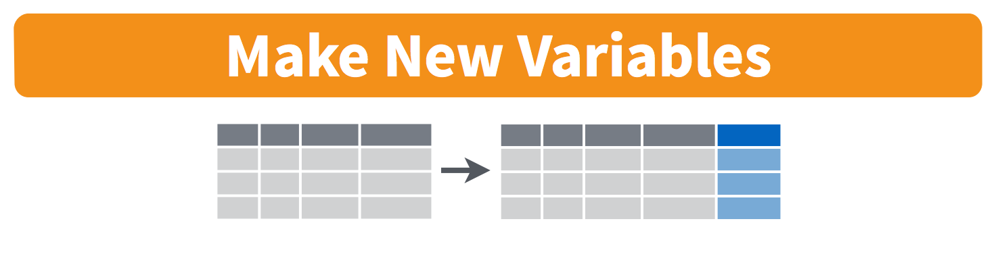
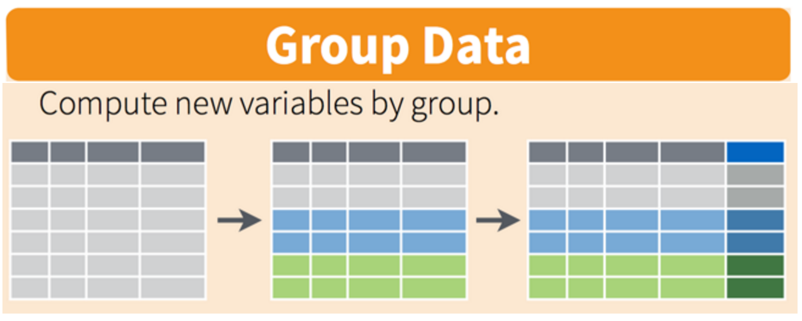

```{r, child="../setup.Rmd"}
```

```{r, include=FALSE}
beatles <- tibble(
    firstName   = c("John", "Paul", "Ringo", "George"),
    lastName    = c("Lennon", "McCartney", "Starr", "Harrison"),
    instrument  = c("guitar", "bass", "drums", "guitar"),
    yearOfBirth = c(1940, 1942, 1940, 1943),
    deceased    = c(TRUE, FALSE, FALSE, TRUE)
)

spicegirls <- tibble(
    firstName   = c("Melanie", "Melanie", "Emma", "Geri", "Victoria"),
    lastName    = c("Brown", "Chisholm", "Bunton", "Halliwell", "Beckham"),
    spice       = c("Scary", "Sporty", "Baby", "Ginger", "Posh"),
    yearOfBirth = c(1975, 1974, 1976, 1972, 1974),
    deceased    = c(FALSE, FALSE, FALSE, FALSE, FALSE)
)

theme_set(theme_gray(base_size = 20))
bears <- read_csv(here::here('data', 'bear_killings.csv'))
birds <- read_csv(here::here('data', 'wildlife_impacts.csv'))
```

---

# Format: 2-part exam

.leftcol[

## Part 1

- Hand-written exam (like midterm).
- You may use a single 8.5 x 11 sheet of notes.
- No calculators, no books, no computers, no phones, no internet.

]

.rightcol[

## Part 2 (data analysis)

- Need your laptop (make sure it's charged!). 
- Can only start Part 2 after turning in Part 1.
- You may use RStudio, the course website, and chatGPT.

]

---

# What's on the final? 

## Comprehensive, except for Webscraping & Monte Carlo

.leftcol[

## Part 1

- 10 True / False questions.
- 4 Short answer questions.
- Hand-write one function and test function.

]

.rightcol[

## Part 2

- Read in a dataset. 
- Answer questions about the data (using tidyverse tools).
- Make a visualization about the data.
- Bonus: Scrape a website.

]

---

# Zero tolerance policy on cheating

Reasons to not cheat:

- Evidence of working with another person on the final results in a 0 for all individuals involved (and I'll push for class failure too).
- It's sooooooo easy to tell if you cheated (trust me, I'll know).
- I'm letting you use chatGPT for part 2!
- I'm a pretty soft grader anyway (you'll get 50% for just _trying_!).

---

# Things to review

--

- Lecture slides, especially practice puzzles covered in class)

--

- Previous quizzes

--

- Memorize syntax for:

  - operators (e.g. mod `%%` and integer division `%/%`)
  - "number choping" 
  - if / else statements
  - loops
  - functions
  - test functions
  - dplyr functions (`select`, `filter`, `mutate`, `arrange`, `group_by`, `summarise`)

---

```{r child="topics/0.Rmd"}
```

---

```{r child="topics/1.Rmd"}
```

---

class: middle, inverse, center 

# .fancy[Basics]

---

## Operators: Relational (`=`, `<`, `>`, `<=`, `>=`) and Logical (`&`, `|`, `!`)

```{r}
x <- FALSE
y <- FALSE
z <- TRUE
```

a Write a logical statement that compares the objects `x`, `y`, and `z` and returns `TRUE`

b) Fill in **relational** operators to make this statement return `TRUE`:

`! (x __ y) & ! (z __ y)`

c) Fill in **logical** operators to make this statement return `FALSE`:

`! (x __ y) | (z __ y)`

---

# Numeric Data

--

.leftcol[

Doubles:

```{r}
typeof(3.14)
```

]

--

.rightcol[

"Integers":

```{r}
typeof(3)
```

]

---

# Actual Integers

--

Check if a number is an "integer":

--

.leftcol[

```{r}
n <- 3
is.integer(n) # Doesn't work!
```

]

--

.rightcol[

```{r}
n == as.integer(n) # Compare n to a converted version of itself
```

]

---

# Logical Data

`TRUE` or `FALSE`

--

```{r}
x <- 1
y <- 2
```

--

```{r}
x > y # Is x greater than y?
```

--

```{r}
x == y
```

---

## Tricky data type stuff

--

.leftcol[

Logicals become numbers when doing math

```{r}
TRUE + 1 # TRUE becomes 1
```

```{r}
FALSE + 1 # FALSE becomes 0
```

]

--

.rightcol[

Be careful of accidental strings

```{r}
typeof("3.14")
typeof("TRUE")
```

]

---

# Integer division: `%/%`

Integer division drops the remainder

--

```{r}
4 / 3 # Regular division
4 %/% 3 # Integer division
```

---

# Integer division: `%/%`

Integer division drops the remainder

--

What will this return?

```{r, eval=FALSE}
4 %/% 4
```

--

```{r, echo=FALSE}
4 %/% 4
```

--

What will this return?

```{r, eval=FALSE}
4 %/% 5
```

--

```{r, echo=FALSE}
4 %/% 5
```

---

# Modulus operator: `%%`

Modulus returns the remainder _after_ doing integer division

--

```{r}
5 %% 3
```

--

```{r}
3.1415 %% 3
```

---

# Modulus operator: `%%`

Modulus returns the remainder _after_ doing integer division

--

What will this return?

```{r, eval=FALSE}
4 %% 4
```

--

```{r, echo=FALSE}
4 %% 4
```

--

What will this return?

```{r, eval=FALSE}
4 %% 5
```

--

```{r, echo=FALSE}
4 %% 5
```

---

## Number "chopping" with 10s (only works with `n > 0`)

--
.pull-left[
The mod operator (`%%`) "chops" a number and returns everything to the _right_

```{r}
123456 %% 1
123456 %% 10
123456 %% 100
```
]
--
.pull-right[
Integer division (`%/%`) "chops" a number and returns everything to the _left_

```{r}
123456 %/% 1
123456 %/% 10
123456 %/% 100
```
]

---

class: middle, inverse, center 

# .fancy[Functions]

---

# Basic function syntax

.code90[
```{r eval=FALSE}
functionName <- function(arguments) {
    # Do stuff here
    return(something)
}
```
]

---

# Basic function syntax

In English:

> "`functionName` is a `function` of `arguments` that does..."

.code90[
```{r eval=FALSE}
functionName <- function(arguments) {
    # Do stuff here
    return(something)
}
```
]

---

# Basic function syntax

Example:

> "`squareRoot` is a `function` of `n` that...returns the square root of `n`"

```{r}
squareRoot <- function(n) {
    return(n^0.5)
}
```

--

```{r}
squareRoot(64)
```

---

# Test function "syntax"

--

.leftcol[

### Function:

```{r, eval=FALSE}
functionName <- function(arguments) {
    # Do stuff here
    return(something)
}
```

]

--

.rightcol[

### Test function:

```{r, eval=FALSE}
test_functionName <- function() {
    cat("Testing functionName()...")
    # Put test cases here
    cat("Passed!\n")
}
```

]

---

# Writing test cases with `stopifnot()`

`stopifnot()` stops the function if whatever is inside the `()` is not `TRUE`.

--

.leftcol[

### Function:

```{r}
isEven <- function(n) {
    return((n %% 2) == 0)
}
```

- `isEven(1)` should be `FALSE`
- `isEven(2)` should be `TRUE`
- `isEven(-7)` should be `FALSE`

]

--

.rightcol[

### Test function:

```{r}
test_isEven <- function() {
    cat("Testing isEven()...")
    stopifnot(isEven(1) == FALSE)
    stopifnot(isEven(2) == TRUE)
    stopifnot(isEven(-7) == FALSE)
    cat("Passed!\n")
}
```

]

---

# When testing _numbers_, use `almostEqual()`

--

.leftcol[

Rounding errors can cause headaches:

```{r}
x <- 0.1 + 0.2
x
x == 0.3
print(x, digits = 20)
```

]

--

.rightcol[

Define a function that checks if two values are _almost_ the same:

```{r}
almostEqual <- function(n1, n2, threshold = 0.00001) {
    return(abs(n1 - n2) <= threshold)
}
```

```{r}
x <- 0.1 + 0.2
almostEqual(x, 0.3)
```

]

---

## Make sure you know how to write `almostEqual()`

.leftcol70[

```{r}
almostEqual <- function(n1, n2, threshold = 0.00001) {
    return(abs(n1 - n2) <= threshold)
}
```

]

---

class: middle, inverse, center 

# .fancy[Conditionals]

---

# Use `if` statements to filter function inputs

Example: Write the function `isEvenNumber(n)` that returns `TRUE` if `n` is an even number and `FALSE` otherwise. **If `n` is not a number, the function should return `FALSE`**.

--

.leftcol40[

```{r}
isEvenNumber <- function(n) {
    return((n %% 2) == 0)
}
```

```{r, error=TRUE}
isEvenNumber(2)
isEvenNumber("not_a_number")
```

]

--

.rightcol60[

```{r}
isEvenNumber <- function(n) {
    if (! is.numeric(n)) { return(FALSE) } #<<
    return((n %% 2) == 0)
}
```

```{r}
isEvenNumber(2)
isEvenNumber("not_a_number")
```

]

---

class: middle, inverse, center 

# .fancy[Loops]

---

.leftcol[

### Use `for` loops when the number of iterations is **_known_**.

1. Build the sequence
2. Iterate over it

```{r}
for (i in 1:5) { # Define the sequence #<<
    cat(i, '\n')
}
```

]

--

.rightcol[

### Use `while` loops when the number of iterations is **_unknown_**.

1. Define stopping condition
2. Manually increase condition

```{r}
i <- 1
while (i <= 5) { # Define stopping condition #<<
    cat(i, '\n')
    i <- i + 1 # Increase condition #<<
}
```

]

---

## Search for something in a sequence

Example: count the **even** numbers in sequence: `1, (2), 3, (4), 5`

--

.leftcol[

### `for` loop

```{r}
count <- 0 # Initialize count #<<
for (i in seq(5)) {
    if (i %% 2 == 0) { #<<
        count <- count + 1 # Update #<<
    } #<<
}
```

```{r}
count
```

]

--

.rightcol[

### `while` loop

```{r}
count <- 0 # Initialize count #<<
i <- 1
while (i <= 5) {
    if (i %% 2 == 0) { #<<
        count <- count + 1 # Update #<<
    } #<<
    i <- i + 1
}
```

```{r}
count
```

]
---

class: middle, inverse, center 

# .fancy[Vectors]

---

# The universal vector generator: `c()`

--

.cols3[

## Numeric vectors

```{r}
x <- c(1, 2, 3)
x
```

]

--

.cols3[

## Character vectors

```{r}
y <- c('a', 'b', 'c')
y
```

]

--

.cols3[

## Logical vectors
```{r}
z <- c(TRUE, FALSE, TRUE)
z
```

]

---

# Elements in vectors must be the same type

### Type hierarchy:

- `character` > `numeric` > `logical`
- `double` > `integer`

--

.cols3[

Coverts to characters:

```{r}
c(1, "foo", TRUE)
```

]

--

.cols3[

Coverts to numbers:

```{r}
c(7, TRUE, FALSE)
```

]

--

.cols3[

Coverts to double:

```{r}
c(1L, 2, pi)
```

]

---

# Most functions operate on vector _elements_

--

```{r}
x <- c(3.14, 7, 10, 15)
```

--

```{r}
round(x)
```

--

```{r}
isEven <- function(n) {
    return((n %% 2) == 0)
}
```

```{r}
isEven(x)
```

---

## "Summary" functions **return one value**

--

```{r}
x <- c(3.14, 7, 10, 15)
```

--

.leftcol[

```{r}
length(x)
sum(x)
prod(x)
```

]

.rightcol[

```{r}
min(x)
max(x)
mean(x)
```

]

---

# Use brackets `[]` to get elements from a vector

```{r}
x <- seq(1, 10)
```

--

.leftcol[.code80[

Indices start at 1:

```{r}
x[1] # Returns the first element
```

```{r}
x[3] # Returns the third element
```

```{r}
x[length(x)] # Returns the last element
```

]]

--

.rightcol[.code80[

Slicing with a vector of indices:

```{r}
x[1:3]  # Returns the first three elements
```
```{r}
x[c(2, 7)] # Returns the 2nd and 7th elements
```

]]

---

# Use negative integers to _remove_ elements


.code70[

```{r}
x <- seq(1, 10)
```

]

--

.code70[

```{r}
x[-1] # Drops the first element
```
```{r}
x[-1:-3] # Drops the first three elements
```
```{r}
x[-c(2, 7)] # Drops the 2nd and 7th elements
```
```{r}
x[-length(x)] # Drops the last element
```

]

---

# Slicing with logical indices

--

```{r}
x <- seq(1, 20, 3)
x
```

--

```{r}
x > 10 # Create a logical vector based on some condition
```

--

Slice `x` with logical vector - only `TRUE` elements will be returned:

```{r}
x[x > 10]
```

---

# Comparing vectors

Check if 2 vectors are the same:

```{r}
x <- c(1, 2, 3)
y <- c(1, 2, 3)
```

```{r, eval=FALSE}
x == y
```

--

```{r, echo=FALSE}
x == y
```

---

# Comparing vectors with `all()` and `any()`

--

.leftcol[

`all()`: Check if _all_ elements are the same
```{r}
x <- c(1, 2, 3)
y <- c(1, 2, 3)
all(x == y)
```

```{r}
x <- c(1, 2, 3)
y <- c(-1, 2, 3)
all(x == y)
```

]

--

.rightcol[

`any()`: Check if _any_ elements are the same

```{r}
x <- c(1, 2, 3)
y <- c(1, 2, 3)
any(x == y)
```

```{r}
x <- c(1, 2, 3)
y <- c(-1, 2, 3)
any(x == y)
```

]

---

class: middle, inverse, center 

# .fancy[Strings]

---

class: center

## Case conversion & substrings

|Function         |  Description                            |
|:----------------|:----------------------------------------|
|`str_to_lower()` | converts string to lower case           |
|`str_to_upper()` | converts string to upper case           |
|`str_to_title()` | converts string to title case           |
|`str_length()`   | number of characters                    |
|`str_sub()`      | extracts substrings                     |
|`str_locate()`   | returns indices of substrings           |
|`str_dup()`      | duplicates characters                   |

---

# Quick practice:

```{r, echo=FALSE}
countdown(
  minutes      = 5,
  warn_when    = 30,
  update_every = 1,
  top          = 0,
  right        = 0,
  font_size    = '2em'
)
```

Create this string object: 

```{r, eval=FALSE}
x <- 'thisIsGoodPractice'
```

Then use **stringr** functions to transform `x` into the following strings:

.leftcol[

- `'thisIsGood'`
- `'practice'`
- `'GOOD'`
- `'thisthisthis'`
- `'GOODGOODGOOD'`

]

.rightcol[

**Hint**: You'll need these:

- `str_to_lower()`
- `str_to_upper()`
- `str_locate()`
- `str_sub()`
- `str_dup()`

]

---

class: center

## Padding, splitting, & merging

|Function         |  Description                            |
|:----------------|:----------------------------------------|
|`str_trim()`     | removes leading and trailing whitespace |
|`str_pad()`      | pads a string                           |
|`paste()`        | string concatenation                    |
|`str_split()`    | split a string into a vector            |

---

## Quick practice:

```{r, echo=FALSE}
countdown(
  minutes      = 5,
  warn_when    = 30,
  update_every = 1,
  top          = 0,
  right        = 0,
  font_size    = '2em'
)
```

.font90[

Create the following objects:

```{r, eval=FALSE}
x <- 'this_is_good_practice'
y <- c('hello', 'world')
```

Use `stringr` functions to transform `x` and `y` into the following:

.leftcol60[

- `"hello world"`
- `"***hello world***"`
- `c("this", "is", "good", "practice")`
- `"this is good practice"`
- `"hello world, this is good practice"`

]

.rightcol40[

**Hint**: You'll need these:

- `str_trim()`
- `str_pad()`
- `paste()`
- `str_split()`

]]

---

class: center

## Detecting & replacing

|Function         |  Description                            |
|:----------------|:----------------------------------------|
|`str_sort()`     | sort a string alphabetically            |
|`str_order()`    | get the order of a sorted string        |
|`str_detect()`   | match a string in another string        |
|`str_replace()`  | replace a string in another string      |

---

# Quick practice:

```{r, echo=FALSE}
countdown(
  minutes      = 5,
  warn_when    = 30,
  update_every = 1,
  top          = 0,
  right        = 0,
  font_size    = '2em'
)
```

```{r}
fruit[1:5]
```

Use `stringr` functions to answer the following questions about the  `fruit` vector:

1. How many fruit have the string `"rr"` in it?
2. Which fruit end with string `"fruit"`?
3. Which fruit contain more than one `"o"` character?

**Hint**: You'll need to use `str_detect()` and `str_count()`

---

```{r child="topics/2.Rmd"}
```

---

class: inverse, center, middle

# Data Frame Basics

---

## **Columns**: _Vectors_ of values (must be same data type)

```{r}
beatles
```

--

Extract a column using `$`

```{r}
beatles$firstName
```

---

# Create new variables with the `$` symbol

--

Add the hometown of the bandmembers:

```{r}
beatles$hometown <- 'Liverpool'
beatles
```

---

## **Rows**: Information about individual observations

--

Information about _John Lennon_ is in the first row:

```{r}
beatles[1,]
```

--

Information about _Paul McCartney_ is in the second row:

```{r}
beatles[2,]
```

---

## Access elements by index: `DF[row, column]`

```{r, echo=FALSE}
beatles <- tibble(
    firstName   = c("John", "Paul", "Ringo", "George"),
    lastName    = c("Lennon", "McCartney", "Starr", "Harrison"),
    instrument  = c("guitar", "bass", "drums", "guitar"),
    yearOfBirth = c(1940, 1942, 1940, 1943),
    deceased    = c(TRUE, FALSE, FALSE, TRUE)
)
```

General form for indexing elements:

```{r, eval=FALSE}
DF[row, column]
```

--

.leftcol[

Select the element in row 1, column 2:

```{r}
beatles[1, 2]
```

]

--

.rightcol[

Select the elements in rows 1 & 2 and columns 2 & 3:

```{r}
beatles[c(1, 2), c(2, 3)]
```

]

---

# Steps to importing external data files

--

## 1. Create a path to the data

```{r}
library(here)
pathToData <- here('data', 'data.csv') #<<
pathToData
```

--

## 2. Import the data

```{r, eval=FALSE}
library(readr)
df <- read_csv(pathToData)#<<
```

---

class: inverse, center, middle

# Data Wrangling

---

class: center

### The tidyverse: `stringr` + `dplyr` + `readr` +  `ggplot2` + ...

<center>

</center>Art by [Allison Horst](https://www.allisonhorst.com/)

---

# **Know how to use these functions!**

- `select()`: subset columns
- `filter()`: subset rows on conditions
- `arrange()`: sort data frame
- `mutate()`: create new columns by using information from other columns
- `group_by()`: group data to perform grouped operations
- `summarize()`: create summary statistics (usually on grouped data)
- `count()`: count discrete rows

---

# Select columns with `select()`

<br>
<center>

</center>

---

# Select columns with `select()`

```{r}
spicegirls %>% 
    select(firstName, lastName)
```

---

# Select rows with `filter()`

<br>
<center>

</center>

---

# Select rows with `filter()`

Example: Filter the band members born after 1974

```{r}
spicegirls %>% 
    filter(yearOfBirth > 1974)
```

---

# Removing missing values

Drop all rows where `variable` is `NA`

```{r, eval=FALSE}
data %>% 
    filter(!is.na(variable))
```

---

# **Don't make this common mistake!**

.leftcol[

## Wrong! 

```{r}
#| eval: false 

data %>% 
  filter(data, condition)
```

]

.rightcol[

## Right! 

```{r}
#| eval: false 

data %>% 
  filter(condition)
```

Or: 

```{r}
#| eval: false 

filter(data, condition)
```

]

---

class: center, middle

## Create new variables with `mutate()`

<br>
<center>

</center>

---

# Create new variables with `mutate()`

Example: Use the `yearOfBirth` variable to compute the age of each band member

```{r}
spicegirls %>%
    mutate(age = 2022 - yearOfBirth)
```

---

class: center

# Split-apply-combine with `group_by`

<br>
<center>

</center>

---

## Compute values by group with `group_by`

Compute the mean band member age for **each band**

```{r}
bands %>%
    mutate(
        age = 2020 - yearOfBirth,
        mean_age = mean(age)) # This is the mean across both bands #<<
```

---

## Compute values by group with `group_by`

Compute the mean band member age for each band

```{r}
bands %>%
    mutate(age = 2020 - yearOfBirth) %>%
    group_by(band) %>% # Everything after this will be done each band #<<
    mutate(mean_age = mean(age))
```

---

class: center

# Summarize data frames with `summarise()`

<br>
<center>

</center>

---

## Summarize data frames with `summarise()`

Compute the mean band member age for **each band**

```{r}
bands %>%
    mutate(age = 2020 - yearOfBirth) %>%
    group_by(band) %>%
    summarise(mean_age = mean(age)) # Drops all variables except for group #<<
```

---

## If you only want a quick count, use `count()`

These do the same thing:

.leftcol[

```{r}
bands %>%
    group_by(band) %>%
    summarise(n = n())
```

]

.rightcol[

```{r}
bands %>%
    count(band)
```

]

---

class: inverse, center, middle

# Data Visualization

---

.leftcol[


]

.rightcol[

# "Grammar of Graphics"

Concept developed by Leland Wilkinson (1999)

**ggplot2** package developed by Hadley Wickham (2005)

]

---

# Making plot layers with ggplot2

<br>

### 1. The data (we'll use `bears`)
### 2. The aesthetic mapping (what goes on the axes?)
### 3. The geometries (points? bars? etc.)

---

# Layer 1: The data

The `ggplot()` function initializes the plot with whatever data you're using

.leftcol[

```{r ggblank, fig.show='hide'}
bears %>% 
  ggplot()
```

]

.rightcol[.blackborder[

```{r ref.label='ggblank', echo=FALSE, fig.height=5, fig.width=7}
```

]]

---

# Layer 2: The aesthetic mapping

The `aes()` function determines which variables will be _mapped_ to the geometries<br>(e.g. the axes)

.leftcol[

```{r ggaes, fig.show='hide'}
bears %>% 
  ggplot(aes(x = year, y = age))  #<<
```
]

.rightcol[.blackborder[

```{r ref.label='ggaes', echo=FALSE, fig.height=5, fig.width=7}
```

]]

---

# Layer 3: The geometries

Use `+` to add geometries (e.g. points)

.leftcol[

```{r ggpoint, fig.show='hide'}
bears %>% 
  ggplot(aes(x = year, y = age)) +
  geom_point() #<<
```

]

.rightcol[.blackborder[

```{r ref.label='ggpoint', echo=FALSE, fig.height=5, fig.width=7}
```

]]

---

# Scatterplots with `geom_point()`

Change the color of all points:

.leftcol[

```{r ggbearsblue, fig.show='hide'}
bears %>% 
  ggplot(aes(x = year, y = age)) +
  geom_point(color = 'blue') #<<
```

]

.rightcol[.blackborder[

```{r ref.label='ggbearsblue', echo=FALSE, fig.height=5, fig.width=7}
```

]]

---

# Scatterplots with `geom_point()`

Map the point color to a **variable**:

.leftcol[

```{r ggbearsage, fig.show='hide'}
bears %>% 
  ggplot(aes(x = year, y = age)) +
  geom_point(aes(color = gender)) #<<
```

Note that `color = gender` is _inside_ `aes()`

]

.rightcol[.blackborder[

```{r ref.label='ggbearsage', echo=FALSE, fig.height=5, fig.width=7}
```

]]

---

## Make bar charts with `geom_col()`

.leftcol[

```{r bears_geom_col_pipe, fig.show='hide'}
bears %>%
  count(month) %>% #<<
  ggplot() +
  geom_col(aes(x = month, y = n))
```

]

.rightcol[

```{r ref.label='bears_geom_col_pipe', echo=FALSE, fig.height=5, fig.width=7, fig.align='center'}
```

]

---

### Change bar width:  `width`
### Change bar color: `fill`
### Change bar outline: `color`

.leftcol[

```{r bears_geom_col_colors, fig.show='hide'}
bears %>%
  count(month) %>%
  ggplot() +
  geom_col(
    mapping = aes(x = month, y = n),
    width = 0.7, #<<
    fill = "blue", #<<
    color = "red" #<<
  )
```

]

.rightcol[

```{r ref.label='bears_geom_col_colors', echo=FALSE, fig.height=5, fig.width=7, fig.align='center'}
```

]

---

## Rearrange bars by reordering the factors

.leftcol[

```{r bears_geom_col_reorder, fig.show='hide'}
bears %>%
  count(month) %>%
  ggplot() +
  geom_col(
    aes(
      x = reorder(month, n), #<<
      y = n
    )
  )
```

]

.rightcol[

```{r ref.label='bears_geom_col_reorder', echo=FALSE, fig.height=5, fig.width=7, fig.align='center'}
```

]

---

class: inverse, center, middle

# Programming with Data

---

# Convert this to a function

.leftcol[

Single-use pipeline

```{r}
diamonds %>%
  group_by(color) %>%
  summarise(
    n = n(),
    mean = mean(price),
    sd = sd(price)
  )
```

]

--

.rightcol[

As a function by "embracing" variable 🤗

```{r}
my_summary <- function(df, group, var) {
  df %>%
    group_by({{ group }}) %>% #<<
    summarise(
      n = n(),
      mean = mean({{ var }}), #<<
      sd = sd({{ var }}) #<<
    ) 
}
```

]

---

### Use it on a different data frame!

.leftcol[

```{r}
library(palmerpenguins)

my_summary(penguins, sex, body_mass_g)
```

]

.rightcol[

```{r}
my_summary(penguins, species, bill_length_mm)
```

]

---

class: center, middle 

## Iterating on data with `purrr`

<center>

</center>

Loaded automatically with `library(tidyverse)`

---

class: center, middle

## `purrr::map(x, f, ...)`

<br>

## for every element of `x` do `f`

---

background-image: url("images/lego1.jpeg")
background-size: contain
class: center

<br>

## `x = minis`

## `f = add_antenna`

---

background-image: url("images/lego2.jpeg")
background-size: contain
class: center

<br>

## `map(minis, add_antenna)`

---

class: center 
background-color: #fff

## for every element of `x` do `f`

<center>

</center>

---

# Some examples

What will this return?

```{r}
# eval: false

map(1:3, \(x) x %% 2 == 0)
```

--

```{r}
map(1:3, \(x) x %% 2 == 0)
```

---

# Some examples

What will this return?

```{r}
# eval: false

sum(map_int(1:3, \(x) x %% 2 == 0))
```

--

```{r}
sum(map_int(1:3, \(x) x %% 2 == 0))
```

---

class: inverse, center, middle

# Webscraping

---

## There will be a bonus question on scraping a website

## General tips:

`html_element()`:

- Know when to use `html_element()` vs `html_elements()`
- **Warning**: ChatGPT doesn't know `html_element()` - it only knows `html_node()`

`html_table()`:

- If you use `html_table()`, remember it returns a **list** of tables.
- Usually you want the first table, something like this:

```{r}
#| eval: false 

tables <- html %>% html_table()
df <- tables[[1]]
```

---

class: inverse, center, middle

# Monte Carlo

---

# Monte Carlo Simulation: _Computing Probability_

### General process:

- Run a series of trials.
- In each trial, simulate an event (e.g. a coin toss, a dice roll, etc.).
- Count the number of "successful" trials
<br><br>

--

### $\frac{\text{# Successful Trials}}{\text{# Total Trials}}$ = Observed Odds $\simeq$ Expected Odds

--

### **Law of large numbers**:<br>As _N_ increases, Observed Odds `r fa('angle-double-right')` Expected Odds

---

### Discrete, **Independent** Events: `sample(replace = TRUE)`

What is the probability of rolling a 6-sided dice 3 times<br>and getting the sequence 1, 3, 5?

```{r}
library(tidyverse)

dice <- c(1, 2, 3, 4, 5, 6)
N <- 10000

rolls <- tibble(
  roll1 = sample(x = dice, size = N, replace = T),
  roll2 = sample(x = dice, size = N, replace = T),
  roll3 = sample(x = dice, size = N, replace = T)
)

successes <- rolls %>%
  filter(roll1 == 1 & roll2 == 3 & roll3 == 5)

nrow(successes) / N
```

---

### Discrete, **Dependent** Events: `sample(replace = FALSE)`

What are the odds that 3 cards drawn from a 52-card deck will sum to 13?

Repeat the 3-card draw _N_ times:

```{r}
deck <- rep(c(seq(1, 10), 10, 10, 10), 4) 

N <- 100000
count <- 0
for (i in 1:N) {
   draw <- sample(x = deck, size = 3, replace = FALSE) #<<
   if (sum(draw) == 13) {
      count <- count + 1
   }
}

count / N # Compute the probability
```

---

class: inverse, center, middle

# Begin list of all problems solved in class

---

class: inverse

## General function writing

.leftcol[

`eggCartons(eggs)`: Write a function that reads in a non-negative number of eggs and prints the number of egg cartons required to hold that many eggs. Each egg carton holds one dozen eggs, and you cannot buy fractional egg cartons.

- eggCartons(0) == 0
- eggCartons(1) == 1
- eggCartons(12) == 1
- eggCartons(25) == 3

]

.rightcol[

`militaryTimeToStandardTime(n)`: Write a function that takes an integer between 0 and 23 (representing the hour in [military time](http://militarytimechart.com/)), and returns the same hour in standard time.

- militaryTimeToStandardTime(0) == 12
- militaryTimeToStandardTime(3) == 3
- militaryTimeToStandardTime(12) == 12
- militaryTimeToStandardTime(13) == 1
- militaryTimeToStandardTime(23) == 11

]

---

class: inverse

# Number chopping

.leftcol[
`onesDigit(x)`: Write a function that takes an integer and returns its ones digit.

Tests:
- onesDigit(123) == 3
- onesDigit(7890) == 0
- onesDigit(6) == 6
- onesDigit(-54) == 4
]

.rightcol[
`tensDigit(x)`: Write a function that takes an integer and returns its tens digit.

Tests:
- tensDigit(456) == 5
- tensDigit(23) == 2
- tensDigit(1) == 0
- tensDigit(-7890) == 9
]

---

class: inverse

# Top-down design

Create a function, `isRightTriangle(a, b, c)` that returns `TRUE` if the triangle formed by the lines of length `a`, `b`, and `c` is a right triangle and `FALSE` otherwise. Use the `hypotenuse(a, b)` function in your solution. **Hint**: you may not know which value (`a`, `b`, or `c`) is the hypotenuse.

.leftcol[.code80[
```{r}
hypotenuse <- function(a, b) {
    return(sqrt(sumOfSquares(a, b)))
}
```
```{r}
sumOfSquares <- function(a, b) {
    return(a^2 + b^2)
}
```
]]

---

class: inverse

# Conditionals (if / else)

`getType(x)`: Write the function `getType(x)` that returns the type of the data (either `integer`, `double`, `character`, or `logical`). Basically, it does the same thing as the `typeof()` function (but you can't use `typeof()` in your solution).

- `getType(3) == "double"`
- `getType(3L) == "integer"`
- `getType("foo") == "character"`
- `getType(TRUE) == "logical"`

---

class: inverse

# Conditionals (if / else)

For each of the following functions, start by writing a test function that tests the function for a variety of values of inputs. Consider cases that you might not expect!

.leftcol[
`isFactor(f, n)`: Write the function `isFactor(f, n)` that takes two integer values and returns `TRUE` if `f` is a factor of `n`, and `FALSE` otherwise. Note that every integer is a factor of `0`. Assume `f` and `n` will only be numeric values, e.g. `2` is a factor of `6`.
]

.rightcol[
`isMultiple(m, n)`: Write the function `isMultiple(m, n)` that takes two integer values and returns `TRUE` if `m` is a multiple of `n` and `FALSE` otherwise. Note that `0` is a multiple of every integer other than itself. Hint: You may want to use the `isFactor(f, n)` function you just wrote above. Assume `m` and `n` will only be numeric values.
]

---

class: inverse

# Conditionals (if / else)

Write the function `getInRange(x, bound1, bound2)` which takes 3 numeric values: `x`, `bound1`, and `bound2` (`bound1` is not necessarily less than `bound2`). If `x` is between the two bounds, just return `x`, but if `x` is less than the lower bound, return the lower bound, or if `x` is greater than the upper bound, return the upper bound. For example:

- `getInRange(1, 3, 5)` returns `3` (the lower bound, since 1 is below [3,5])
- `getInRange(4, 3, 5)` returns `4` (the original value, since 4 is between [3,5])
- `getInRange(6, 3, 5)` returns `5` (the upper bound, since 6 is above [3,5])
- `getInRange(6, 5, 3)` returns `5` (the upper bound, since 6 is above [3,5])

**Bonus**: Re-write `getInRange(x, bound1, bound2)` without using conditionals

---

class: inverse

## `for` loops

.font80[
`sumFromMToN(m, n)`: Write a function that sums the total of the integers between `m` and `n`.<br>**Challenge**: Try solving this without a loop!

- `sumFromMToN(5, 10) == (5 + 6 + 7 + 8 + 9 + 10)`
- `sumFromMToN(1, 1) == 1`

`sumEveryKthFromMToN(m, n, k)`: Write a function to sum every kth integer from `m` to `n`.

- `sumEveryKthFromMToN(1, 10, 2) == (1 + 3 + 5 + 7 + 9)`
- `sumEveryKthFromMToN(5, 20, 7) == (5 + 12 + 19)`
- `sumEveryKthFromMToN(0, 0, 1) == 0`

`sumOfOddsFromMToN(m, n)`: Write a function that sums every _odd_ integer between `m` and `n`.

- `sumOfOddsFromMToN(4, 10) == (5 + 7 + 9)`
- `sumOfOddsFromMToN(5, 9) == (5 + 7 + 9)`
]

---

class: inverse

## `for` loop with `break` & `next`

`sumOfOddsFromMToNMax(m, n, max)`: Write a function that sums every _odd_ integer from `m` to `n` until the sum is less than the value `max`. Your solution should use both `break` and `next` statements.

- `sumOfOddsFromMToNMax(1, 5, 4) == (1 + 3)`
- `sumOfOddsFromMToNMax(1, 5, 3) == (1)`
- `sumOfOddsFromMToNMax(1, 5, 10) == (1 + 3 + 5)`

---

class: inverse

## `while` loops

.leftcol[
`isMultipleOf4Or7(n)`: Write a function that returns `TRUE` if `n` is a multiple of 4 or 7 and `FALSE` otherwise.

- `isMultipleOf4Or7(0) == FALSE`
- `isMultipleOf4Or7(1) == FALSE`
- `isMultipleOf4Or7(4) == TRUE`
- `isMultipleOf4Or7(7) == TRUE`
- `isMultipleOf4Or7(28) == TRUE`
]

.rightcol[
`nthMultipleOf4Or7(n)`: Write a function that returns the nth positive integer that is a multiple of either 4 or 7.

- `nthMultipleOf4Or7(1) == 4`
- `nthMultipleOf4Or7(2) == 7`
- `nthMultipleOf4Or7(3) == 8`
- `nthMultipleOf4Or7(4) == 12`
- `nthMultipleOf4Or7(5) == 14`
- `nthMultipleOf4Or7(6) == 16`
]

---

class: inverse

## Loops / Vectors

.leftcol[
`isPrime(n)`: Write a function that takes a non-negative integer, `n`, and returns `TRUE` if it is a prime number and `FALSE` otherwise. Use a loop or vector:

- `isPrime(1) == FALSE`
- `isPrime(2) == TRUE`
- `isPrime(7) == TRUE`
- `isPrime(13) == TRUE`
- `isPrime(14) == FALSE`
]

.rightcol[
`nthPrime(n)`: Write a function that takes a non-negative integer, `n`, and returns the nth prime number, where `nthPrime(1)` returns the first prime number (2). Hint: use a while loop!

- `nthPrime(1) == 2`
- `nthPrime(2) == 3`
- `nthPrime(3) == 5`
- `nthPrime(4) == 7`
- `nthPrime(7) == 17`
]

---

class: inverse

# Vectors

.font80[
`reverse(x)`: Write a function that returns the vector in reverse order. You cannot use the `rev()` function.

- `all(reverseVector(c(5, 1, 3)) == c(3, 1, 5))`
- `all(reverseVector(c('a', 'b', 'c')) == c('c', 'b', 'a'))`
- `all(reverseVector(c(FALSE, TRUE, TRUE)) == c(TRUE, TRUE, FALSE))`


`alternatingSum(a)`: Write a function that takes a vector of numbers `a` and returns the alternating sum, where the sign alternates from positive to negative or vice versa.

- `alternatingSum(c(5,3,8,4)) == (5 - 3 + 8 - 4)`
- `alternatingSum(c(1,2,3)) == (1 - 2 + 3)`
- `alternatingSum(c(0,0,0)) == 0`
- `alternatingSum(c(-7,5,3)) == (-7 - 5 + 3)`
]

---

class: inverse

# Strings

1) `reverseString(s)`: Write a function that returns the string `s` in reverse order.

- `reverseString("aWordWithCaps") == "spaChtiWdroWa"`
- `reverseString("abcde") == "edcba"`
- `reverseString("") == ""`

2) `isPalindrome(s)`: Write a function that returns `TRUE` if the string `s` is a [Palindrome](https://en.wikipedia.org/wiki/Palindrome) and `FALSE` otherwise.

- `isPalindrome("abcba") == TRUE`
- `isPalindrome("abcb") == FALSE`
- `isPalindrome("321123") == TRUE`

---

class: inverse

# Strings

.font90[

1) `sortString(s)`: Write the function `sortString(s)` that takes a string `s` and returns back an alphabetically sorted string.

- `sortString("cba") == "abc"`
- `sortString("abedhg") == "abdegh"`
- `sortString("AbacBc") == "aAbBcc"`

2) `areAnagrams(s1, s2)`: Write the function `areAnagrams(s1, s2)` that takes two strings, `s1` and `s2`, and returns `TRUE` if the strings are [anagrams](https://en.wikipedia.org/wiki/Anagram), and `FALSE` otherwise. **Treat lower and upper case as the same letters**.

- `areAnagrams("", "") == TRUE`
- `areAnagrams("aabbccdd", "bbccddee") == FALSE`
- `areAnagrams("TomMarvoloRiddle", "IAmLordVoldemort") == TRUE`

]

---

class: inverse

## Data Frame Basics

Answer these questions using the `beatles` data frame:

1. Create a new column, `playsGuitar`, which is `TRUE` if the band member plays the guitar and `FALSE` otherwise.
2. Filter the data frame to select only the rows for the band members who have four-letter first names.
3. Create a new column, `fullName`, which contains the band member's first and last name separated by a space (e.g. `"John Lennon"`)

---

class: inverse

### Data Wrangling: `select()` & `filter()`

.font90[

1) Create the data frame object `df` by using `here()` and `read_csv()` to load the `wildlife_impacts.csv` file in the `data` folder.

2) Use the `df` object and the `select()` and `filter()` functions to answer the following questions:

- Create a new data frame, `df_birds`, that contains only the variables (columns) about the species of bird.
- Create a new data frame, `dc`, that contains only the observations (rows) from DC airports.
- Create a new data frame, `dc_birds_known`, that contains only the observations (rows) from DC airports and those where the species of bird is known.
- How many _known_ unique species of birds have been involved in accidents at DC airports?

]

---

class: inverse

### Data Wrangling: `select()` & `filter()` w/Pipes

.font90[

1) Create the data frame object `df` by using `here()` and `read_csv()` to load the `wildlife_impacts.csv` file in the `data` folder.

2) Use the `df` object and `select()`, `filter()`, and `%>%` to answer the following questions:

- Create a new data frame, `dc_dawn`, that contains only the observations (rows) from DC airports that occurred at dawn.
- Create a new data frame, `dc_dawn_birds`, that contains only the observations (rows) from DC airports that occurred at dawn and only the variables (columns) about the species of bird.
- Create a new data frame, `dc_dawn_birds_known`, that contains only the observations (rows) from DC airports that occurred at dawn and only the variables (columns) about the KNOWN species of bird.
- How many _known_ unique species of birds have been involved in accidents at DC airports at dawn?

]

---

class: inverse

### Data Wrangling: `mutate()` & `arrange()`

.font90[

1) Create the data frame object `df` by using `here()` and `read_csv()` to load the `wildlife_impacts.csv` file in the `data` folder.

2) Use the `df` object with `%>%` and `mutate()` to create the following new variables:

- `height_miles`: The `height` variable converted to miles (Hint: there are 5,280 feet in a mile).
- `cost_mil`: Is `TRUE` if the repair costs was greater or equal to $1 million, `FALSE` otherwise.
- `season`: One of four seasons based on the `incident_month` variable:

  - `spring`: March, April, May
  - `summer`: June, July, August
  - `fall`: September, October, November
  - `winter`: December, January, February

]

---

class: inverse

### Data Wrangling: `group_by()` & `summarise()`

.font90[

1) Create the data frame object `df` by using `here()` and `read_csv()` to load the `wildlife_impacts.csv` file in the `data` folder.

2) Use the `df` object and `group_by()`, `summarise()`, `count()`, and `%>%` to answer the following questions:

- Create a summary data frame that contains the mean `height` for each different time of day.
- Create a summary data frame that contains the maximum `cost_repairs_infl_adj` for each year.
- Which _month_ has had the greatest number of reported incidents?
- Which _year_ has had the greatest number of reported incidents?

]

---

class: inverse

## Data Viz: `geom_point()`

Use the `birds` data frame to create the following plots

.leftcol[

```{r, ggpoint_p1, echo=FALSE, fig.height=5, fig.width=7}
ggplot(
  data = birds,
  mapping = aes(x=cost_repairs_infl_adj, y=height)) +
  geom_point()
```

]

.rightcol[

```{r, ggpoint_p2, echo=FALSE, fig.height=5, fig.width=7}
birds %>%
  mutate(phase_of_flt = str_to_lower(phase_of_flt)) %>%
  ggplot(aes(x = speed, y = height)) +
  geom_point(aes(color = phase_of_flt))
```

]

---

## Data Viz: `geom_col()`

Use the `bears` and `birds` data frame to create the following plots

.leftcol[

```{r, ggbar_p1, echo=FALSE, fig.height=5, fig.width=7}
bears %>%
  count(year, gender) %>%
  ggplot() +
  geom_col(aes(x = year, y = n, fill = gender)) +
  labs(
    x     = "Year",
    y     = 'Number of killings',
    fill  = "Victim gender",
    title = "Annual deadly bear attacks over time")
```

]

.rightcol[

```{r, ggbar_p2, echo=FALSE, fig.height=5, fig.width=7}
birds %>%
  filter(!is.na(cost_repairs_infl_adj)) %>%
  group_by(incident_year) %>%
  summarise(maxCost = max(cost_repairs_infl_adj)) %>%
  ggplot() +
  geom_col(aes(x = incident_year, y = maxCost)) +
  labs(
    x     = "Year",
    y     = 'Maximum cost ($)',
    title = "Max annual cost from wildlife impact")
```

]

---

class: inverse

## Writing Data Functions 1

.leftcol[

```{r}
#| eval: false

my_subset <- function(df, condition, cols)
```

Returns a subset of `df` by filtering the rows based on `condition` and only includes the select `cols`. Example:

```{r}
#| echo: false

my_subset <- function(df, condition, cols) {
  df %>% 
    filter({{ condition }}) %>% 
    select({{ cols }})
}
```

```{r}
#| eval: false

nycflights13::flights %>% 
  my_subset(
    condition = month == 12, 
    cols = c("carrier", "flight")
  )
```

```{r}
#| echo: false

nycflights13::flights %>% 
  my_subset(month == 12, c("carrier", "flight")) %>% 
  head(5)
```

]

.rightcol[

```{r}
#| eval: false

count_p <- function(df, group)
```

Returns a summary data frame of the count of rows in `df` by `group` as well as the percentage of those counts.

```{r}
#| echo: false

count_p <- function(df, group) {
  df %>% 
    count({{ group }}, sort = TRUE) %>% 
    mutate(p = n / sum(n))
}
```

```{r}
#| eval: false
nycflights13::flights %>%
  count_p(carrier)
```

```{r}
#| echo: false
nycflights13::flights %>%
  count_p(carrier) %>% 
  head()
```

]

---

class: inverse

## Writing Data Functions 2

Write the function `filtered_scatter` which plots a scatterplot based on a condition, then use it for the two examples below.

```{r}
#| eval: false

filtered_scatter <- function(df, condition, x, y)
```

```{r}
#| echo: false

filtered_scatter <- function(df, condition, x, y) {
  df %>% 
    filter({{ condition }}) %>% 
    ggplot() +
    geom_point(aes(x = {{ x }}, y = {{ y }} ))
}
```

.leftcol[

```{r}
#| fig.height: 3
#| fig.width: 5

filtered_scatter(
  penguins, sex == "male", 
  x = body_mass_g, y = bill_length_mm)
```

]

.rightcol[

```{r}
#| fig.height: 3
#| fig.width: 5

filtered_scatter(
  penguins, species == "Gentoo", 
  x = body_mass_g, y = flipper_length_mm)
```

]

---

class: inverse
 
## Monte Carlo: Coins & Dice

.leftcol70[

Using the `sample()` function, conduct a monte carlo simulation to estimate the answers to these questions:

- If you flipped a coin 3 times in a row, what is the probability that you'll get three "tails" in a row?
- If you rolled 2 dice, what is the probability that you'll get "snake-eyes" (two 1's)?
- If you rolled 2 dice, what is the probability that you'll get an outcome that sums to 8?

]

---

class: inverse

## Monte Carlo: Cards

Use the `sample()` function and a monte carlo simulation to estimate the answers to these questions:

.leftcol[

- What are the odds that four cards drawn from a 52-card deck will have the same suit?
- What are the odds that five cards drawn from a 52-card deck will sum to a prime number?

- Aces = 1
- Jack = 10
- Queen = 10
- King = 10

]

.rightcol[

**Hint**: use `isPrime()` to help:

```{r}
isPrime <- function(n) {
    if (n == 2) { return(TRUE) }
    for (i in seq(2, n-1)) {
        if (n %% i == 0) {
            return(FALSE)
        }
    }
    return(TRUE)
}
```

]

---

class: inverse

## Monte Carlo: Estimate $\pi$

.leftcol30[

```{r cirle-points, echo=FALSE, fig.width=5, fig.height=5}
N <- 5000

points <- tibble(
    x = runif(N, min = -1, max = 1),
    y = runif(N, min = -1, max = 1)) %>%
    mutate(
        radius = sqrt(x^2 + y^2),
        pointInCircle = ifelse(radius <= 1, TRUE, FALSE))

pi_points <- ggplot(points) +
    geom_point(aes(x = x, y = y, color = pointInCircle), size = 0.3) +
    theme_minimal() +
    scale_color_manual(values=c('red', 'blue')) +
    theme(text = element_text(size=20), legend.position = 'bottom') +
    guides(colour = guide_legend(override.aes = list(size=8)))

pi_points
```

$\pi = 4 \left( \frac{A_{circle}}{A_{square}} \right)$

]

.rightcol70[.font90[

1. Create a tibble with variables `x` and `y` that each contain 10,000 random points between -1 and 1, representing the (x, y) coordinates to a random point inside a square of side length 2 centered at `(x, y) = (0, 0)`. **Hint**: use `runif()`

2. Create a new column, `radius`, that is equal to the distance to each `(x, y)` point from the center of the square.

3. Create a new column, `pointInCircle`, that is `TRUE` if the point lies _within_ the circle inscribed in the square, and `FALSE` otherwise.

4. Create the scatterplot on the left (don't worry about the precise colors, dimensions, etc.).

5. Estimate $\pi$ by multiplying 4 times the ratio of points inside the circle to the total number of points

]]

---

class: inverse

## Monte Carlo: Monte Hall Problem

.leftcol40[

```{r, echo=FALSE, out.width='80%'}
include_graphics(file.path('images', 'monte_hall.jpg'))
```

1. You choose door 1, 2, or 3
2. One door is removed
3. Should you swap doors?

]

.rightcol60[.font90[

In this simulation, the prize is always behind door #1:

- If you choose door #1, you must KEEP it to win.
- If you choose door #2 or #3, you must SWAP to win.

1) Create the tibble, `choices`, with two variables:
- `door` contains the first door chosen (`1`, `2`, or `3`)
- `swap` contains a logical (`TRUE` or `FALSE`) for whether the contestant swaps doors. **Hint**: use `sample()`

2) Create a new tibble, `wins`, which contains only the rows from `choices` that resulted in a win.

3) Compute the percentage of times the contestant won after swapping doors.

]]
