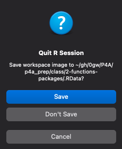
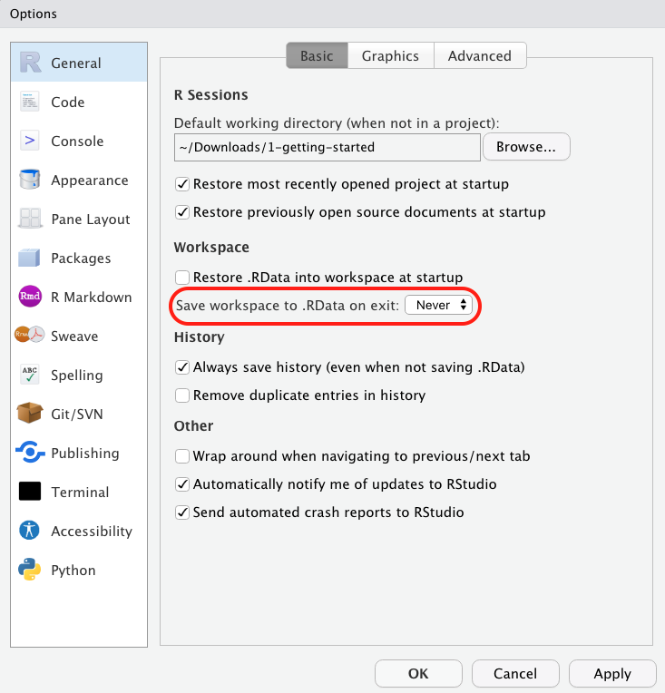
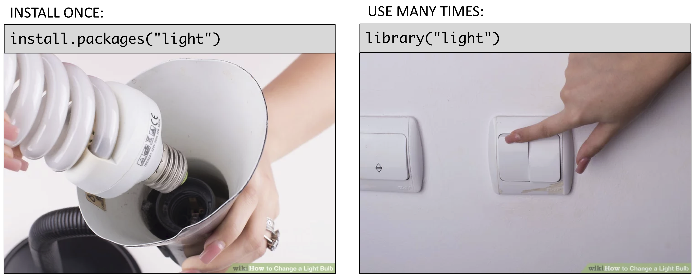
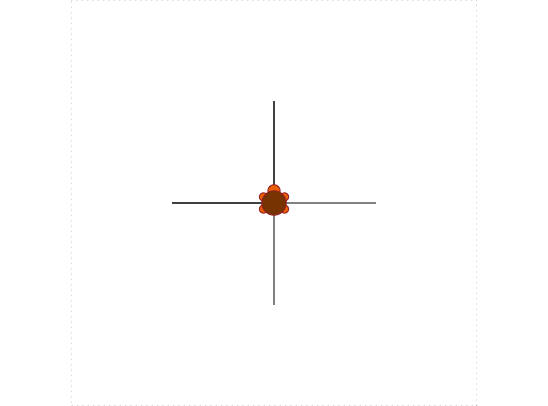

```{r, child="../setup.Rmd"}
```

```{r, include=FALSE}
library(hrbrthemes)
```

---

class: inverse

# Quiz 1

```{r, echo=FALSE}
countdown(
  minutes      = 10,
  warn_when    = 30,
  update_every = 1,
  top          = 0,
  right        = 0,
  font_size    = '3em'
)
```

.leftcol[

## Write your name on the quiz!

## Rules:

- Work alone; no outside help of any kind is allowed.
- No calculators, no notes, no books, no computers, no phones.

]

.rightcol[

<br>
<center>

</center>

]

---

class: center, middle, inverse

# .font150[.fancy[.orange[Tip of the week]]<br><br>What's with that .RData file?]

---

class: center

## Don't save the `.RData` file on exit

--

.leftcol30[

<center>

</center>

]

--

.rightcol70[

<center>

</center>

]

---

```{r child="topics/0.Rmd"}
```

---

```{r child="topics/1.Rmd"}
```

---

# Funtions take this form:

## `name(argument)`

--

```{r}
sqrt(225)
```

--

Not every function has an argument:

```{r}
date()
```

---

### Some functions have multiple arguments:

```{r}
round(3.1415, 2)
```

--

### Arguments have names too:

```{r}
round(x = 3.1415, digits = 2)
```

--

### If you don't include all arguments, default values will be used:

```{r}
round(x = 3.1415)
```

---

# For arguments, use "`=`" , not "`<-`"

--

.leftcol[

### `=`<br>Arguments are "local" to the function

```{r}
round(x = 3.1415, digits = 2)
```
```{r, eval=FALSE}
x
```
```
Error: object 'x' not found
```

]

--

.rightcol[

### `<-`<br>Arguments also get created "globally"

```{r}
round(x <- 3.1415, digits <- 2)
x
digits
```

]

---

# Use `?` to get help

```{r, eval=FALSE}
?round()
```

--

```
Rounding of Numbers

Description

Usage
ceiling(x)
floor(x)
trunc(x, ...)

round(x, digits = 0)
signif(x, digits = 6)
Arguments
x          a numeric vector. Or, for round and signif, a complex vector.
digits    integer indicating the number of decimal places (round) or significant digits (signif) to be used. Negative values are allowed (see ‘Details’).
```

---

# Combining functions

--

You can use functions as arguments to other functions:

```{r}
round(sqrt(7), digits = 2)
```

--

What do you think this will return:

```{r, eval=FALSE}
sqrt(1 + abs(-8))
```

--

```{r, echo=FALSE}
sqrt(1 + abs(-8))
```

---

## Frequently used **math** functions

.font90[
Function   | Description       | Example input    | Example output
---------- | ------------------|------------------|---------------
`sqrt()`   | Square root       | `sqrt(64)`       | `r sqrt(64)`
`round(x, digits=0)` | Round `x` to the `digits` decimal place | `round(3.1415, digits=2)` | `r round(3.1415, digits=2)`
`floor(x)` | Round `x` **down** the nearest integer | `floor(3.9)` | `r floor(3.9)`
`ceiling(x)` | Round `x` **up** the nearest integer | `ceiling(3.1)` | `r ceiling(3.1)`
`abs()`    | Absolute value    | `abs(-42)`   | `r abs(-42)`
`min()`    | Minimum value     | `min(1, 2, 3)`   | `r min(1, 2, 3)`
`max()`    | Maximum value     | `max(1, 2, 3)`   | `r max(1, 2, 3)`

]

---

class: inverse

```{r, echo=FALSE}
countdown(
  minutes      = 5,
  warn_when    = 30,
  update_every = 15,
  top          = 0,
  right        = 0,
  font_size    = '2em'
)
```

# Your turn

.leftcol[

Consider the following code blocks:

Block 1:
```{r, eval=FALSE}
val <- abs(x <- sqrt(10))
result <- round(val, digits <- sqrt(10))
answer <- x*digits
answer
```

Block 2:
```{r, eval=FALSE}
val <- sqrt(abs(min(-42, -64, 81)))
result <- floor(y = min(val, log(10)))
answer <- result*val
answer
```

]

.rightcol[

Now follow these steps:

1. Don't run the code (yet)!
2. Write down out what you expect R will return when these lines are run in sequence.
3. Compare your expectations with each other.
4. Run the code and compare the results with your expectations.

]

---

```{r child="topics/2.Rmd"}
```

---

# Use these patterns:

--

.leftcol40[

### Convert type of `x`:
###`as.______(x)`
<br>

### Check type of `x`:
### `is.______(x)`

]

--

.rightcol60[

### Replace "`______`" with:

- ### `character`
- ### `logical`
- ### `numeric` / `double` / `integer`

]

---

## Convert type with `as.______(x)`

--

.leftcol[
### Convert **numeric** types:

```{r}
as.numeric("3.1415")
as.double("3.1415")
as.integer("3.1415")
```

]

--

.rightcol[

### Convert **non-numeric** types:

```{r}
as.character(3.1415)
as.logical(3.1415)
```

]

---

# A few notes on converting types

--

.leftcol[

### Converting any number to a logical returns `TRUE` except for `0`

```{r}
as.logical(7)
as.logical(0)
```

]

--

.rightcol[

### `TRUE = 1`, `FALSE = 0`:

```{r}
as.numeric(TRUE)
as.numeric(FALSE)
```

]

---

# A few notes on converting types

### Not everything can be converted.

--

.leftcol[

```{r}
as.numeric('7')   # Works
as.numeric('foo') # Doesn't work
```

]

---

# A few notes on converting types

### `as.integer()` is the same as `floor()`:

.leftcol[

```{r}
as.integer(3.14)
as.integer(3.99)
```

]

---

## Check type with `is.______(x)`

--

.leftcol[

### Checking **numeric** types:

```{r}
is.numeric(3.1415)
is.double(3.1415)
is.integer(3.1415)
```

]

--

.rightcol[

### Checking **non-numeric** types:

```{r}
is.character(3.1415)
is.logical(3.1415)
```

]

---

# Integers are weird

--

```{r}
is.integer(7)
```

...because R thinks `7` is really `7.0`

--

<br>

**To check if a number is an integer _in value_:**

```{r}
7 == as.integer(7)
```

---

class: inverse

```{r, echo=FALSE}
countdown(
  minutes      = 8,
  warn_when    = 30,
  update_every = 15,
  top          = 0,
  right        = 0,
  font_size    = '2em'
)
```

# Your turn

Consider the following code (don't run it):
```{r, eval=FALSE}
number    <- as.logical(as.numeric('3'))
character <- is.character(typeof(7))
true      <- as.logical("FALSE")
false     <- as.logical(as.numeric(TRUE))

! (number == character) & (true | false) | (number & false)
```

Now follow these steps:

1. Don't run the code (yet)!
2. Write down out what you expect R will return when these lines are run in sequence.
3. Compare your expectations with each other.
4. Run the code and compare the results with your expectations.

---

class: inverse, center

# .fancy[Break]

```{r, echo=FALSE}
countdown(
  minutes      = 5,
  warn_when    = 30,
  update_every = 1,
  left         = 0,
  right        = 0,
  top          = 1,
  bottom       = 0,
  margin       = "5%",
  font_size    = "8em"
)
```

---

```{r child="topics/3.Rmd"}
```

---

background-color: #fff
class: center

# >15,000 [packages](https://cran.r-project.org/web/packages/available_packages_by_name.html) on the [CRAN](https://cran.r-project.org/)

```{r, echo=FALSE, fig.width=11, fig.height=7, fig.align='center'}
# Chart source: https://gist.github.com/daroczig/3cf06d6db4be2bbe3368

# library(rvest)
# 
# df <- read_html('https://cran.rstudio.com/src/contrib/') %>% 
#     html_nodes('a')

read_csv(here::here('data', 'packages.csv')) %>% 
    ggplot(aes(x = first_release, y = index)) +
    geom_line(size = 1.5, col = 'dodgerblue') +
    scale_y_continuous(labels = scales::comma) +
    theme_ipsum(base_size = 22, axis_title_size = 20) +
    geom_hline(yintercept = 0, col = 'black', size = 0.5) + 
    labs(
        x = "Year",
        y = "Number of packages",
        title = "Number of R packages on CRAN"
    )
```

---

## Installing: `install.packages("packagename")`

--

<br>

### Package name must be in quotes

```{r eval=FALSE}
install.packages("packagename") # This works
install.packages(packagename)   # This doesn't work
```

--

<br>

### **You only need to install a package once!**

---

## Loading: `library(packagename)`

--

<br>

### Package name _doesn't_ need to be in quotes

```{r eval=FALSE}
library("packagename") # This works
library(packagename)   # This also works
```

--

<br>

### **You need to _load_ the package every time you use it!**

---

background-color: #fff
class: center

# Installing vs. Loading

<center>

</center>

---

## Example: **wikifacts**

Install the [Wikifacts](https://github.com/keithmcnulty/wikifacts) package, by Keith McNulty:

```{r eval=FALSE}
install.packages("wikifacts")
```

--

Load the package:

```{r eval=FALSE}
library("wikifacts") # Load the library
```

--

Use one of the package functions

```{r eval=FALSE}
wiki_randomfact()
```
```{r echo=FALSE}
wikifacts::wiki_randomfact()
```

---

## Example: **wikifacts**

Now, restart your RStudio session:

> Session -> Restart R

--

Try using the package function again:

```{r, error=TRUE}
wiki_randomfact()
```

---

# Using only _some_ package functions

--

<br>

### Functions can be accessed with this pattern:
`packagename::functionname()`

--

```{r}
wikifacts::wiki_randomfact()
```

---

# Learn more about a package:

## `help(package = 'packagename')`

--

<br>

```{r, eval=FALSE}
help(package = 'wikifacts')
```

---

class: inverse

```{r, echo=FALSE}
countdown(
  minutes      = 10,
  warn_when    = 30,
  update_every = 15,
  top          = 0,
  right        = 0,
  font_size    = '2em'
)
```

# Your turn

.leftcol60[

1. Install the `TurtleGraphics` package.
2. Restart RStudio.
3. Load the `TurtleGraphics` package.
4. Use the `turtle_init()` function to create a turtle.
5. Use `help(package = "TurtleGraphics")` to learn about other functions to control your turtle.
6. Try drawing this shape with your turtle<br>(hint: the length of each line is `50` units).
7. Compare your results and code with each other.

]

.rightcol40[



]

```{r, eval=FALSE, echo=FALSE}
library(TurtleGraphics)
turtle_init()
turtle_move(distance = 25, direction = 'forward')
turtle_move(distance = 50, direction = 'backward')
turtle_forward(25)
turtle_turn(90, direction = 'left')
turtle_move(distance = 25, direction = 'forward')
turtle_move(distance = 50, direction = 'backward')
turtle_forward(25)
turtle_reset()
```

---

```{r child="topics/4.Rmd"}
```

---

# [Polya](https://en.wikipedia.org/wiki/George_P%C3%B3lya)’s Problem Solving Technique

<br>

--

### **Step 1**: Understand the problem

--

### **Step 2**: Devise a plan

--

### **Step 3**: Carry out the plan

--

### **Step 4**: Check your work

---

# Polya’s Problem Solving Technique

.leftcol[

### .red[**Step 1**: Understand the problem]
### **Step 2**: Devise a plan
### **Step 3**: Carry out the plan
### **Step 4**: Check your work

]

--

.rightcol[

- Seems obvious (easy to overlook)
- Restate the problem in your own words
- Draw a figure
- What information do you _have_?
- What information do you _need_?

]

---

# Polya’s Problem Solving Technique

.leftcol[

### **Step 1**: Understand the problem
### .red[**Step 2**: Devise a plan]
### **Step 3**: Carry out the plan
### **Step 4**: Check your work

]

--

.rightcol[

- Do you know a related problem?
- Look at the unknown!
- Guess and check
- Eliminate possibilities
- Consider special cases
- Work backwards

]

---

# Polya’s Problem Solving Technique

.leftcol[

### **Step 1**: Understand the problem
### **Step 2**: Devise a plan
### .red[**Step 3**: Carry out the plan]
### **Step 4**: Check your work

]

--

.rightcol[

- (this is where you write code)
- **Be patient**
- Stick to the plan...
- ...until the plan fails, then change your plan
- Error message != plan has failed

]

---

# Polya’s Problem Solving Technique

.leftcol[

### **Step 1**: Understand the problem
### **Step 2**: Devise a plan
### **Step 3**: Carry out the plan
### .red[**Step 4**: Check your work]

]

--

.rightcol[

- Seems obvious (easy to overlook)
- Check intermediate values
- Can you derive the solution differently?

]

---

class: inverse

```{r, echo=FALSE}
countdown(
  minutes      = 10,
  warn_when    = 30,
  update_every = 15,
  bottom       = 0,
  left         = 0,
  font_size    = '2em'
)
```

# Polya practice: What's your degree worth?

.leftcol35[

1. Understand the problem
2. Devise a plan
3. Carry out the plan
4. Check your work

]

.rightcol65[

In the U.S., the average annual salary of a high school graduate is [$35,256](https://smartasset.com/retirement/the-average-salary-by-education-level), and the average salary of a GW graduate is
<a href="https://www.payscale.com/research/US/School=George_Washington_University_(GWU)/Salary">$76,151</a>. However, GW grads pay an average of $70,000 / year (tuition + fees + housing) for 4 years for their degree, and high school grads are working that entire time. 

Assuming immediate employment after graduation, .orange[how many years after graduating will the GW grad need to work until their net income (salary minus cost of education) surpasses that of the average high school graduate?]

(NOTE: This is a _very_ rough estimate - we're assuming away interest rates, inflation, promotions, etc.)

]

---

class: inverse

```{r, echo=FALSE}
countdown(
  minutes      = 10,
  warn_when    = 30,
  update_every = 15,
  bottom       = 0,
  left         = 0,
  font_size    = '2em'
)
```

# Polya practice: Should you buy a Hybrid car?

.leftcol35[

1. Understand the problem
2. Devise a plan
3. Carry out the plan
4. Check your work

]

.rightcol65[

Kevin is deciding between purchasing a Toyota Prius, which sells for $27,600, and a Toyota Camry, which sells for $24,000. He knows he can get an average fuel economy of 55 miles per gallon (mpg) in the Prius but only 28 mpg in the Camry on average. He also knows that he typically drives 12,000 miles each year, and the average price of gasoline is $3.00 / gallon.

.orange[How long (in years) would Kevin have to drive the Prius for the money he saves in fuel savings to be greater than the price premium compared to the Camry?]

]
