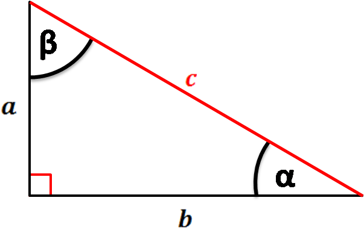
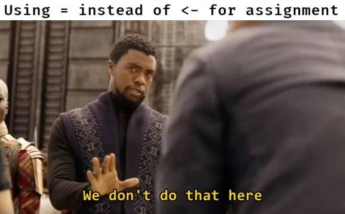
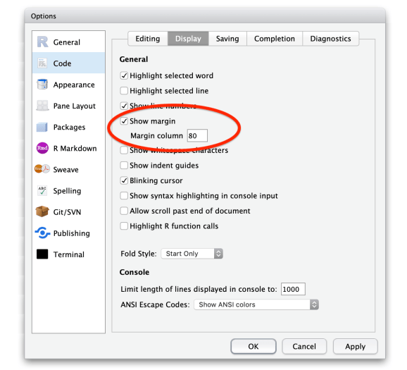

```{r, child="../setup.Rmd"}
```

---

class: inverse

# Quiz 2

```{r, echo=FALSE}
countdown(
  minutes      = 10,
  warn_when    = 30,
  update_every = 1,
  top          = 0,
  right        = 0,
  font_size    = '3em'
)
```

.leftcol[

## Write your name on the quiz!

## Rules:

- Work alone; no outside help of any kind is allowed.
- No calculators, no notes, no books, no computers, no phones.

]

.rightcol[

<br>
<center>

</center>

]

---

```{r child="topics/0.Rmd"}
```

---

```{r child="topics/1.Rmd"}
```

---

# Basic function syntax

.code90[

```{r eval=FALSE}
name <- function(arguments) {
    # Do stuff here
    return(something)
}
```

]

---

# Basic function syntax

In English:

> "`name()` is a `function` of `arguments` that does..."

In Code: 

.code90[

```{r eval=FALSE}
name <- function(arguments) {}

```

]

---

# Basic function syntax

> "`squareRoot()` is a `function` of `n` that...returns the square root of `n`"

.code90[

```{r}
squareRoot <- function(n) {
    return(n^0.5)
}
```

]

--

.code90[

```{r}
squareRoot(64)
```

]

---

# `return()` and `cat()` statements

--

.leftcol[.code90[

```{r}
isPositive <- function(n) {
    return(n > 0)
}
```

]]

--

.rightcol[.code90[

```{r}
isPositive <- function(n) {
    cat(n > 0)
}
```

]]

---

# `return()` and `cat()` statements

.leftcol[.code90[

```{r}
isPositive <- function(n) {
    return(n > 0)
}
```

`return()` _returns_ back a value

```{r, eval=FALSE}
test <- isPositive(7)
test
```
```
TRUE
```

]]

.rightcol[.code90[

```{r}
isPositive <- function(n) {
    cat(n > 0)
}
```

]]

---

# `return()` and `cat()` statements

.leftcol[.code90[

```{r}
isPositive <- function(n) {
    return(n > 0)
}
```

`return()` _returns_ back a value

```{r, eval=FALSE}
test <- isPositive(7)
test
```
```
TRUE
```

]]

.rightcol[.code90[

```{r}
isPositive <- function(n) {
    cat(n > 0)
}
```

`cat()` _prints_ a value to the console

```{r, eval=FALSE}
test <- isPositive(7)
```

```
TRUE
```

```{r, eval=FALSE}
test
```

```
Error: object 'test' not found
```

]]

---

## `cat()` is short for "concatenating"

--

```{r}
print_x <- function(x) {
    cat("The value of x is", x)
}
```

--

```{r}
print_x(7)
```

--

```{r}
print_x_squared <- function(x) {
    cat("The value of x is", x, "and the value of x^2 is", x^2)
}
```

--

```{r}
print_x_squared(7)
```

---

## `cat()` adds a space between values by default

--

```{r}
print_x <- function(x) {
    cat("The value of x is", x)
}
```

--

```{r}
print_x(7)
```

--

Modify separator with the `sep` argument:

```{r}
print_x <- function(x) {
    cat("The value of x is", x, sep = ": ")
}
```

--

```{r}
print_x(7)
```

---

class: inverse

```{r, echo=FALSE}
countdown(
  minutes      = 5,
  warn_when    = 30,
  update_every = 15,
  top          = 0,
  right        = 0,
  font_size    = '2em'
)
```

# Your turn: Code tracing practice

.leftcol[.code80[

Consider these functions:
```{r}
f1 <- function(x) {
    return(x^3)
}
f2 <- function(x) {
    cat(x^3)
}
f3 <- function(x) {
    cat(x^3)
    return(x^4)
}
f4 <- function(x) {
    return(x^3)
    cat(x^4)
}
```

]]

.rightcol[.code80[

What will these lines of code produce?

Write your answer down first, _then_ run the code to check.
```{r, eval=FALSE}
f1(2)
f2(2)
f3(2)
f4(2)
```

]]

---

```{r child="topics/2.Rmd"}
```

---

# Local objects

### All objects inside function are **"local"** - they don't exist in the _global_ environment

--

.leftcol[.code90[

### Example:
```{r}
squareOfX <- function(x) {
  y <- x^2     # y here is "local" #<<
  return(y)
}
```

]]

--

.rightcol[

```{r}
squareOfX(3)
```

If you try to call `y`, you'll get an error:

```{r, eval=FALSE}
y
```

```
Error: object 'y' not found
```

]

---

# Global objects

### **Global** objects exist in the main environment.

--

### **NEVER, NEVER, NEVER** call global objects inside functions.

--

.leftcol[

```{r}
print_x <- function(x) {
    cat(x)
    cat(n)  # n is global! #<<
}

n <- 7 # Define n in the *global* environment

print_x(5)
```

]

--

.rightcol[

```{r}
n <- 6

print_x(5)
```

**Function behavior shouldn't change with the same arguments!**

]

---

# Global objects

### All objects inside functions should be **arguments** to that function

--

.leftcol[

```{r error=TRUE}
print_x <- function(x, n = NULL) {
    cat(x)
    cat(n)  # n is local! #<<
}

n <- 7 # Define n in the *global* environment

print_x(5)
```

]

--

.rightcol[

```{r}
n <- 6

print_x(5)
```

Use `n` as argument:

```{r}
print_x(5, n)
```

]

---

class: inverse

```{r, echo=FALSE}
countdown(
  minutes      = 10,
  warn_when    = 30,
  update_every = 15,
  top          = 0,
  right        = 0,
  font_size    = '2em'
)
```

# Your turn: Code tracing practice

.leftcol[.code70[

Consider this code:

```{r}
x <- 7
y <- NULL
f1 <- function(x) {
    cat(x^3)
    cat(y, x)
}
f2 <- function(x, y = 7) {
    cat(x^3, y)
}
f3 <- function(x, y) {
    cat(x^3)
    cat(y)
}
f4 <- function(x) {
    return(x^3)
    cat(x^4)
}
```

]]

.rightcol[.code70[

What will these lines of code produce?

Write your answer down first, _then_ run the code to check.
```{r, eval=FALSE}
f1(2)
f2(2)
f3(2)
f4(2)
```

]]

---

class: inverse, center

# .fancy[Break]

```{r, echo=FALSE}
countdown(
  minutes      = 5,
  warn_when    = 30,
  update_every = 1,
  left         = 0,
  right        = 0,
  top          = 1,
  bottom       = 0,
  margin       = "5%",
  font_size    = "8em"
)
```

---

```{r child="topics/3.Rmd"}
```

---

# "Top Down" design

--

## 1. Break the problem into pieces

--

## 2. Solve the "highest level" problem first

--

## 3. Then solve the smaller pieces

---

.leftcol40[

**Example**: Given values `a` and `b`, find the value `c` such that the triangle formed by lines of length `a`, `b`, and `c` is a right triangle (in short, find the hypotenuse)

<br>

<br>

]

---

.leftcol40[

**Example**: Given values `a` and `b`, find the value `c` such that the triangle formed by lines of length `a`, `b`, and `c` is a right triangle (in short, find the hypotenuse)

<br>


]

.rightcol55[

### Hypotenuse: $c = \sqrt{a^2 + b^2}$
### Break the problem into two pieces:
### $c = \sqrt{x}$
### $x = a^2 + b^2$

]

---

.leftcol40[

**Example**: Given values `a` and `b`, find the value `c` such that the triangle formed by lines of length `a`, `b`, and `c` is a right triangle (in short, find the hypotenuse)

<br>


]

.rightcol55[

### Hypotenuse: $c = \sqrt{a^2 + b^2}$
### Break the problem into two pieces:
### $c = \sqrt{x}$

```{r}
hypotenuse <- function(a, b) {
    return(sqrt(sumOfSquares(a, b)))
}
```

### $x = a^b + b^2$

```{r}
sumOfSquares <- function(a, b) {
    return(a^2 + b^2)
}
```

]

---

class: inverse

```{r, echo=FALSE}
countdown(
  minutes      = 12,
  warn_when    = 30,
  update_every = 15,
  top          = 0,
  right        = 0,
  font_size    = '2em'
)
```

# Your turn

Create a function, `isRightTriangle(a, b, c)` that returns `TRUE` if the triangle formed by the lines of length `a`, `b`, and `c` is a right triangle and `FALSE` otherwise. Use the `hypotenuse(a, b)` function in your solution. 

.leftcol[.code80[

```{r}
hypotenuse <- function(a, b) {
    return(sqrt(sumOfSquares(a, b)))
}
```

```{r}
sumOfSquares <- function(a, b) {
    return(a^2 + b^2)
}
```

]]

```{r, echo=FALSE}
isRightTriangle <- function(a, b, c) {
    test1 <- (c == hypotenuse(a, b))
    test2 <- (b == hypotenuse(a, c))
    test3 <- (a == hypotenuse(b, c))
    return(test1 | test2 | test3)
}
```

---

```{r child="topics/4.Rmd"}
```

---

# Style matters!

--

## Which is easier to understand?

.leftcol60[.code80[

V1:

```{r}
sumofsquares<-function(a,b)return(a^2 + b^2)
```

V2:

```{r}
sum_of_squares <- function(a, b) {
    return(a^2 + b^2)
}
```

]]

---

# Style matters!

## Which is easier to understand?

.leftcol60[.code80[

V1:

```{r}
sumofsquares<-function(a,b)return(a^2 + b^2)
```

V2: <- **This one is _much_ better!**

```{r}
sum_of_squares <- function(a, b) {
    return(a^2 + b^2)
}
```

]]

---

# Use the "Advanced R" style guide:

## http://adv-r.had.co.nz/Style.html

<br>

--

## Other good style tips on [this blog post](https://www.r-bloggers.com/%F0%9F%96%8A-r-coding-style-guide/)

---

# Style guide: **Objects**

.leftcol[



]

--

.rightcol[

- Use ` <- ` for assignment, not ` = `
- Put spacing around operators<br>(e.g. `x <- 1`, not `x<-1`)
- Use [meaningful variable names](https://p4a.jhelvy.com/getting-started.html#use-meaningful-variable-names)
- This applies to file names too<br>(e.g. "`hw1.R`" vs. "`untitled.R`")

]

---

# Style guide: **Functions**

Generally, function names should be verbs:

```{r, eval=FALSE}
add()      # Good
addition() # Bad
```

--

Avoid using the "`.`" symbol:

```{r, eval=FALSE}
get_hypotenuse()  # Good
get.hypotenuse()  # Bad
```

--

Use curly braces, with indented code inside:

```{r, eval=FALSE}
sum_of_squares <- function(a, b) {
    return(a^2 + b^2)
}
```

---

class: center

.leftcol[

## Indent by 4 spaces

<center>

</center>

]

.rightcol[

## Set line length to 80

<center>

</center>

]

---

class: inverse

```{r, echo=FALSE}
countdown(
  minutes      = 15,
  warn_when    = 30,
  update_every = 15,
  top          = 0,
  right        = 0,
  font_size    = '2em'
)
```

# Your turn

.leftcol[

`onesDigit(x)`: Write a function that takes an integer and returns its ones digit.

Tests:
- onesDigit(123) == 3
- onesDigit(7890) == 0
- onesDigit(6) == 6
- onesDigit(-54) == 4

]

.rightcol[

`tensDigit(x)`: Write a function that takes an integer and returns its tens digit.

Tests:
- tensDigit(456) == 5
- tensDigit(23) == 2
- tensDigit(1) == 0
- tensDigit(-7890) == 9

]

---

class: inverse

### Hint #1:

You may want to use `onesDigit(x)` as a helper function for `tensDigit(x)`

### Hint #2:

.leftcol[

The mod operator (`%%`) "chops" a number and returns everything to the _right_

```{r}
123456 %% 1
123456 %% 10
```

]

.rightcol[

The integer divide operator (`%/%`) "chops" a number and returns everything to the _left_

```{r}
123456 %/% 1
123456 %/% 10
```

]

---

class: inverse

```{r, echo=FALSE}
countdown(
  minutes      = 15,
  warn_when    = 30,
  update_every = 15,
  top          = 0,
  right        = 0,
  font_size    = '2em'
)
```

# Your turn

.leftcol[

`eggCartons(eggs)`: Write a function that takes a non-negative number of eggs and returns the number of egg cartons required to hold that many eggs. Each egg carton holds one dozen eggs, and you cannot buy fractional egg cartons.

- eggCartons(0) == 0
- eggCartons(1) == 1
- eggCartons(12) == 1
- eggCartons(25) == 3

]

.rightcol[

`militaryTimeToStandardTime(n)`: Write a function that takes an integer between 0 and 23 (representing the hour in [military time](http://militarytimechart.com/)), and returns the same hour in standard time.

- militaryTimeToStandardTime(0) == 12
- militaryTimeToStandardTime(3) == 3
- militaryTimeToStandardTime(12) == 12
- militaryTimeToStandardTime(13) == 1
- militaryTimeToStandardTime(23) == 11

]
