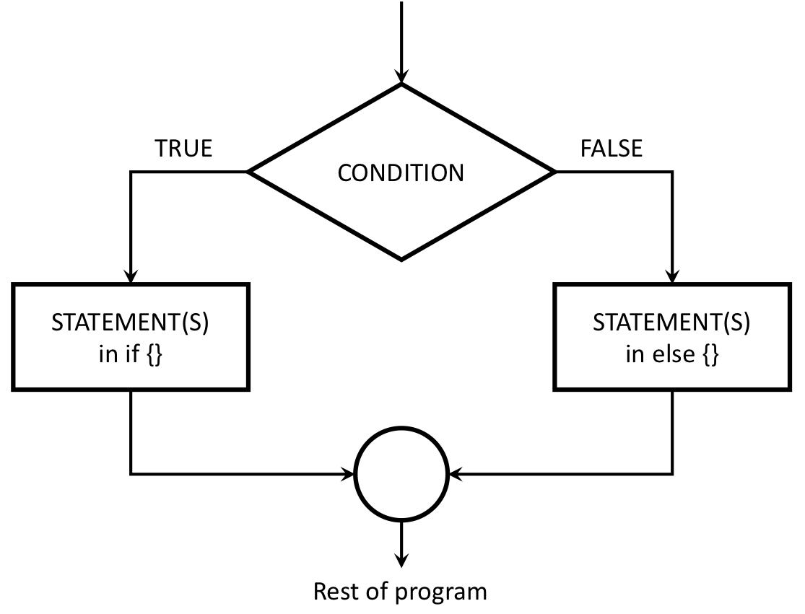

```{r, child="../setup.Rmd"}
```

---

```{r child="topics/0.Rmd"}
```

---

```{r child="topics/1.Rmd"}
```

---

# "Flow Control"

### Code that alters the otherwise linear flow of operations in a program.

--

.leftcol[

### This week:

- `if` statements
- `else` statements

]

--

.rightcol[

### Next week:

- `for` loops
- `while` loops
- `break` statements
- `next` statements

]

---

.leftcol40[.code90[

## The `if` statement

### Basic format

```{r, eval=FALSE}
if ( CONDITION ) {
    # Do stuff here
}
```

]]

--

<br>

.rightcol[

### Flow chart:


]

---

# Quick code tracing

.leftcol[.code80[

Consider this function:

```{r}
f <- function(x) {
    cat("A")
    if (x == 0) {
        cat("B")
        cat("C")
    }
    cat("D")
}
```

]]

.rightcol[.code80[

What will this print?

```{r, eval=FALSE}
f(1)
f(0)
```

]]

---

class: inverse

```{r, echo=FALSE}
countdown(
  minutes      = 3,
  warn_when    = 30,
  update_every = 15,
  top          = 0,
  right        = 0,
  font_size    = '2em'
)
```

# Quick practice

### Write the function `absValue(n)` that returns the absolute value of a number (and no cheating - you can't use the built-in `abs()` function!)

Tests:

- `absValue(7) == 7`
- `absValue(-7) == 7`
- `absValue(0) == 0`

---

.leftcol40[

## Adding an `else`

### Basic format:

.code80[

```{r, eval=FALSE}
if ( CONDITION ) {
  # Do stuff here
} else {
  # Do other stuff here
}
```

]]

--

<br>

.rightcol[

### Flow chart:



]

---

# Quick code tracing

.leftcol[.code70[

Consider this code:

```{r}
f <- function(x) {
    cat("A")
    if (x == 0) {
        cat("B")
        cat("C")
    } else {
        cat("D")
        if (x == 1) {
            cat("E")
        } else {
            cat("F")
        }
    }
    cat("G")
}
```

]]

.rightcol[.code80[

What will this print?

```{r, eval=FALSE}
f(0)
f(1)
f(2)
```

]]

---

.leftcol[

# `else if` chains

Example - "bracketing" problems:

```{r}
getLetterGrade <- function(score) {
    if (score >= 90) {
        grade <- "A"
    } else if (score >= 80) {
        grade <- "B"
    } else if (score >= 70) {
        grade <- "C"
    } else if (score >= 60) {
        grade <- "D"
    } else {
        grade <- "F"
    }
    return(grade)
}
```

]

--

.rightcol[

Check function output:

```{r}
getLetterGrade(99)
getLetterGrade(88)
getLetterGrade(70)
getLetterGrade(61)
getLetterGrade(22)
```

]

---

class: inverse

```{r, echo=FALSE}
countdown(
  minutes      = 10,
  warn_when    = 30,
  update_every = 15,
  top          = 0,
  right        = 0,
  font_size    = '2em'
)
```

# Your turn

Write the function `getType(x)` that returns the type of the data (either `integer`, `double`, `character`, or `logical`).

Basically, it should do the same thing as the `typeof()` function (but you can't use `typeof()` in your solution).

Tests:

- `getType(3) == "double"`
- `getType(3L) == "integer"`
- `getType("foo") == "character"`
- `getType(TRUE) == "logical"`

---

```{r child="topics/2.Rmd"}
```

---

# Why write test functions?

<br>

--

## 1. They help you understand the problem

--

## 2. They verify that a function is working as expected

---

background-image: url(images/rubber-duck.png)

## Test functions help you understand the problem

<br>

#### [Rubber Duck Debugging](https://rubberduckdebugging.com/)

---

# Test function "syntax"

--

.leftcol[.code80[

### Function:

```{r, eval=FALSE}
functionName <- function(arguments) {
    # Do stuff here
    return(something)
}
```

]]

--

.rightcol[.code80[

### Test function:

```{r, eval=FALSE}
test_functionName <- function() {
    cat("Testing functionName()...")
    # Put test cases here
    cat("Passed!\n")
}
```

]]

---

# Writing test cases with `stopifnot()`

`stopifnot()` stops the function if whatever is inside the `()` is not `TRUE`.

--

.leftcol[.code80[

### Function:

```{r}
isEven <- function(n) {
    return((n %% 2) == 0)
}
```

- `isEven(1)` should be `FALSE`
- `isEven(2)` should be `TRUE`
- `isEven(-7)` should be `FALSE`

]]

--

.rightcol[.code80[

### Test function:

```{r}
test_isEven <- function() {
    cat("Testing isEven()...")
    stopifnot(isEven(1) == FALSE)
    stopifnot(isEven(2) == TRUE)
    stopifnot(isEven(-7) == FALSE)
    cat("Passed!\n")
}
```

]]

---

# Writing test cases with `stopifnot()`

`stopifnot()` stops the function if whatever is inside the `()` is not `TRUE`.

.leftcol[.code80[

### Function:

```{r}
isEven <- function(n) {
    return((n %% 2) == 0)
}
```

- `isEven(1)` should be `FALSE`
- `isEven(2)` should be `TRUE`
- `isEven(-7)` should be `FALSE`

]]

.rightcol[.code80[

### Test function:

```{r}
test_isEven <- function() {
    cat("Testing isEven()...")
    stopifnot(isEven(1) == FALSE)
    stopifnot(isEven(2) == TRUE)
    stopifnot(isEven(-7) == FALSE)
    cat("Passed!\n")
}
```

```{r}
test_isEven()
```

]]

---

# Write the test function _first_!

.leftcol[.code80[

### Step 1: Write the test function

```{r}
test_isEven <- function() {
    cat("Testing isEven()...")
    stopifnot(isEven(1) == FALSE)
    stopifnot(isEven(2) == TRUE)
    stopifnot(isEven(-7) == FALSE)
    cat("Passed!\n")
}
```

]]

--

.rightcol[.code80[

### Step 2: Write the function

```{r}
isEven <- function(n) {
    return((n %% 2) == 0)
}
```

### Step 3: Test the function

```{r}
test_isEven()
```

]]

---

# Test cases to consider: NOLES

.leftcol40[

- ### **N**ormal cases
- ### **O**pposites
- ### **L**arge & small cases
- ### **E**dge cases
- ### **S**pecial cases

]

---

# Test cases to consider: NOLES

.leftcol40[

- ### .red[**N**ormal cases]
- ### **O**pposites
- ### **L**arge & small cases
- ### **E**dge cases
- ### **S**pecial cases

]

.rightcol60[.code80[

### Example:

```{r}
isEven <- function(n) {
    return((n %% 2) == 0)
}
```

]

- `isEven(1) == FALSE`
- `isEven(2) == TRUE`
- `isEven(-7) == FALSE`

]

---

# Test cases to consider: NOLES

.leftcol40[

- ### **N**ormal cases
- ### .red[**O**pposites]
- ### **L**arge & small cases
- ### **E**dge cases
- ### **S**pecial cases

]

.rightcol60[.code80[

### Example:

```{r}
isEven <- function(n) {
    return((n %% 2) == 0)
}
```

]

Need cases that return both `TRUE` and `FALSE`

- `isEven(52) == TRUE`
- `isEven(53) == FALSE`
- `isEven(5) == FALSE`
- `isEven(-5) == FALSE`

]

---

# Test cases to consider: NOLES

.leftcol40[

- ### **N**ormal cases
- ### **O**pposites
- ### .red[**L**arge & small cases]
- ### **E**dge cases
- ### **S**pecial cases

]

.rightcol60[.code80[

### Example:

```{r}
isEven <- function(n) {
    return((n %% 2) == 0)
}
```

]

- `isEven(8675309) == FALSE`
- `isEven(-8675309) == FALSE`
- `isEven(1) == FALSE`
- `isEven(-1) == FALSE`

]

---

# Test cases to consider: NOLES

.leftcol40[

- ### **N**ormal cases
- ### **O**pposites
- ### **L**arge & small cases
- ### .red[**E**dge cases]
- ### **S**pecial cases

]

.rightcol60[.code80[

### Example:

```{r}
isPositive <- function(n) {
    return(n > 0)
}
```

]

- `isPositive(0.000001) == TRUE`
- `isPositive(0) == FALSE`
- `isPositive(-0.000001) == FALSE`

]

---

# Test cases to consider: NOLES

.leftcol40[

- ### **N**ormal cases
- ### **O**pposites
- ### **L**arge & small cases
- ### **E**dge cases
- ### .red[**S**pecial cases]

]

.rightcol60[

- Negative numbers
- `0` and `1` for integers
- The empty string, `""`
- Strange input _types_, e.g. `"2"` instead of `2`.

]

---

# Testing function inputs

--

.leftcol45[.code80[

What if we gave `isEven()` the wrong input type?

```{r}
isEven <- function(n) {
    return((n %% 2) == 0)
}
```

```{r error=TRUE}
isEven('42')
```

]]

--

.rightcol55[.code80[

**An improved function with input checks**:

```{r}
isEven <- function(n) {
    if (! is.numeric(n)) {
        return(NaN)
    }
    return((n %% 2) == 0)
}
```

]]

---

# Testing function inputs

.leftcol45[.code80[

What if we gave `isEven()` the wrong input type?

```{r}
isEven <- function(n) {
    return((n %% 2) == 0)
}
```

```{r error=TRUE}
isEven('42')
```

]]

.rightcol55[.code80[

An improved function that checks inputs:

```{r}
isEven <- function(n) {
    if (! is.numeric(n)) {
        return(NaN)
    }
    return((n %% 2) == 0)
}
```

```{r}
isEven('42')
isEven(TRUE)
```

]]

---

class: inverse

```{r, echo=FALSE}
countdown(
  minutes      = 15,
  warn_when    = 30,
  update_every = 15,
  top          = 0,
  right        = 0,
  font_size    = '2em'
)
```

# Your turn

For each of the following functions, start by writing a test function that tests the function for a variety of values of inputs. Consider cases that you might not expect!

.leftcol[

1) Write the function `isFactor(f, n)` that takes two integer values and returns `TRUE` if `f` is a factor of `n`, and `FALSE` otherwise (e.g. `2` is a factor of `6`). Note that every integer is a factor of `0`. Assume `f` and `n` will only be numeric values.

]

.rightcol[

2) Write the function `isMultiple(m, n)` that takes two integer values and returns `TRUE` if `m` is a multiple of `n` and `FALSE` otherwise. Note that `0` is a multiple of every integer other than itself. Hint: You may want to use the `isFactor(f, n)` function you just wrote above. Assume `m` and `n` will only be numeric values.

]

---

class: inverse, center

# .fancy[Break]

```{r, echo=FALSE}
countdown(
  minutes      = 5,
  warn_when    = 30,
  update_every = 1,
  left         = 0,
  right        = 0,
  top          = 1,
  bottom       = 0,
  margin       = "5%",
  font_size    = "8em"
)
```

---

```{r child="topics/3.Rmd"}
```

---

background-color: #fff

<center>

</center>

---

# Debugging your code

Use `traceback()` to find the steps that led to an error (the "call stack")

--

Example:

```{r}
f <- function(x) {
    return(x + 1)
}

g <- function(x) {
    return(f(x) - 1)
}
```

--

```{r, error=TRUE}
g('a')
```

--

```{r, eval=FALSE}
traceback()
```

```
2: f(x) at #2
1: g("a")
```

---

# When testing _numbers_, use `almostEqual()`

.leftcol[.code80[

Rounding errors can cause headaches:

```{r}
x <- 0.1 + 0.2
x
```

```{r, eval=FALSE}
x == 0.3
```

]]

---

# When testing _numbers_, use `almostEqual()`

.leftcol[.code80[

Rounding errors can cause headaches:

```{r}
x <- 0.1 + 0.2
x
```

```{r, eval=FALSE}
x == 0.3
```

```
#> [1] FALSE
```

]]

---

# When testing _numbers_, use `almostEqual()`

.leftcol[.code80[

Rounding errors can cause headaches:

```{r}
x <- 0.1 + 0.2
x
```

```{r}
x == 0.3
print(x, digits = 20)
```

]]

---

# When testing _numbers_, use `almostEqual()`

.leftcol[.code80[

Rounding errors can cause headaches:

```{r}
x <- 0.1 + 0.2
x
x == 0.3
print(x, digits = 20)
```

]]

.rightcol[.code80[

Define a function that checks if two values are _almost_ the same:
```{r}
almostEqual <- function(n1, n2, threshold = 0.00001) {
    return(abs(n1 - n2) <= threshold)
}
```

```{r}
x <- 0.1 + 0.2
almostEqual(x, 0.3)
```

]]

---

# Checking for integer values

.leftcol[

Since numbers are doubles by default, the `is.integer(x)` function can be confusing:

.code80[

```{r}
is.integer(7)
```

]]

--

.rightcol[

Define a new function that returns `TRUE` if the _value_ is an integer:

.code80[

```{r}
is.integer.val <- function(x) {
    return(almostEqual(x, round(x)))
}
is.integer.val(7)
```

]]

---

# Checking for special data types

--

.leftcol[

**Not available**: `NA`<br>_value is "missing"_

```{r}
x <- NA
x == NA
```

]

--

.rightcol[

**No value**: `NULL`<br>_no value whatsoever_

```{r}
x <- NULL
x == NULL
```

]

---

# Checking for special data types

.leftcol[

**Not available**: `NA`<br>_value is "missing"_

```{r}
x <- NA
x == NA
```

Have to use special function:

```{r}
is.na(x)
```

]

.rightcol[

**No value**: `NULL`<br>_no value whatsoever_

```{r}
x <- NULL
x == NULL
```

Have to use special function:

```{r}
is.null(x)
```

]

---

class: inverse

```{r, echo=FALSE}
countdown(
  minutes      = 15,
  warn_when    = 30,
  update_every = 15,
  top          = 0,
  right        = 0,
  font_size    = '2em'
)
```

# Your turn

Write the function `getInRange(x, bound1, bound2)` which takes 3 numeric values: `x`, `bound1`, and `bound2`. `bound1` is not necessarily less than `bound2`. If `x` is between the two bounds, return `x`, but if `x` is less than the lower bound, return the lower bound, or if `x` is greater than the upper bound, return the upper bound. For example:

- `getInRange(1, 3, 5)` returns `3` (the lower bound, since 1 is below [3,5])
- `getInRange(4, 3, 5)` returns `4` (the original value, since 4 is between [3,5])
- `getInRange(6, 3, 5)` returns `5` (the upper bound, since 6 is above [3,5])
- `getInRange(6, 5, 3)` returns `5` (the upper bound, since 6 is above [3,5])

You should also write a test function called `test_getInRange()`.

**Bonus**: Try writing `getInRange(x, bound1, bound2)` without using `if` or `else`

---

# [HW 4](https://p4a.seas.gwu.edu/2023-Spring/hw/4-conditionals-testing.html)

## You'll need to write a _test function_ for each function!
