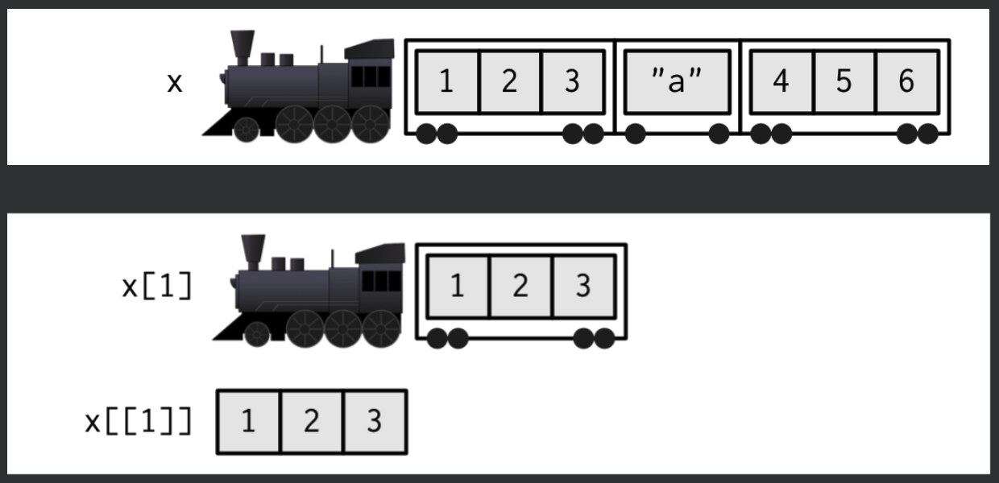

```{r, child="../setup.Rmd"}
```

---

```{r child="topics/0.Rmd"}
```

---

```{r child="topics/1.Rmd"}
```

---

# We've already been using vectors!

.code80[

```{r}
x <- 1
x
```

]

--

.code80[

```{r}
is.vector(x)
```

]

--

.code80[

```{r}
length(x)
```

]

---

# The universal vector generator: `c()`

--

.cols3[

## Numeric vectors

```{r}
x <- c(1, 2, 3)
x
```

]

--

.cols3[

## Character vectors

```{r}
y <- c('a', 'b', 'c')
y
```

]

--

.cols3[

## Logical vectors

```{r}
z <- c(TRUE, FALSE, TRUE)
z
```

]

---

# Elements in vectors must be the same type

### Type hierarchy:

- `character` > `numeric` > `logical`
- `double` > `integer`

--

.cols3[

Coverts to characters:

```{r}
c(1, "foo", TRUE)
```

]

--

.cols3[

Coverts to numbers:

```{r}
c(7, TRUE, FALSE)
```

]

--

.cols3[

Coverts to double:

```{r}
c(1L, as.integer(2), 3.14)
```

]

---

# Other ways to make a vector

--

.leftcol[

Sequences (we saw these last week):

```{r}
seq(1, 5)
```

```{r}
1:5
```

]

--

.rightcol[

Repeating a value:

```{r}
rep(5, 3)
```

```{r}
rep("snarf", 3)
```

]

---

# Repeating a vector

.leftcol[.code80[

Repeating a sequence

```{r}
x <- rep(seq(1, 3), times = 3)
x
length(x)
```

]]

--

.rightcol[.code80[

Note what the `each` argument does:

```{r}
x <- rep(seq(1, 3), each = 3)
x
length(x)
```

]]

---

# You can name vector elements

```{r}
x <- seq(5)
x
```

--

```{r}
names(x)
```

---

# You can name vector elements

```{r}
x <- seq(5)
x
```

--

.leftcol[

1) Add names with the `names()` function:

```{r}
names(x) <- c('a', 'b', 'c', 'd', 'e')
x
```

]

--

.rightcol[

2) Create a named vector:

```{r}
y <- c('a'=1, 'b'=2, 'c'=3, 'd'=4, 'e'=5)
y
```

]

---

# Quick code tracing

```{r, echo=FALSE}
countdown(
  minutes      = 2,
  warn_when    = 30,
  update_every = 1,
  top          = 0,
  right        = 0,
  font_size    = '2em'
)
```

.code80[

What will each of these lines produce?

```{r, eval=FALSE}
rep(c(TRUE, FALSE, "TRUE"), 2)
```

```{r, eval=FALSE}
seq(FALSE, 3)
```

```{r, eval=FALSE}
rep(c(seq(3), seq(2)), each = 2)
```

]

---

```{r child="topics/2.Rmd"}
```

---

## Math on vectors is done **by element**

```{r}
x <- 1:10
```

--

```{r}
x + 2
```

--

```{r}
x - 2
```

--

```{r}
x * 2
```

--

```{r}
x / 2
```

---

## Math on vectors is done **by element**

```{r}
x
```

```{r}
x %% 2
```

---

## Math on vectors is done **by element**

--

```{r}
x1 <- c(1, 2, 3)
x2 <- c(4, 5, 6)
```

--

```{r}
x1 + x2 # Returns (1+4, 2+5, 3+6)
```

--

```{r}
x1 - x2 # Returns (1-4, 2-5, 3-6)
```

--

```{r}
x1 * x2 # Returns (1*4, 2*5, 3*6)
```

--

```{r}
x1 / x2 # Returns (1/4, 2/5, 3/6)
```

---

# If dimensions don't match, R "wraps" the vector

--

```{r}
x1 <- c(1, 2, 3, 4)
x2 <- c(4, 5)
```

```{r, eval=FALSE}
x1 + x2
```

--

```{r, echo=FALSE}
x1 + x2
```

--

```{r}
x1 <- c(1, 2, 3, 4)
x2 <- c(1)
```

```{r, eval=FALSE}
x1 + x2
```

--

```{r, echo=FALSE}

x1 + x2
```

---

# Most R functions work on vectors

--

.leftcol[.code80[

```{r}
x <- c(3.1415, 1.618, 2.718)
x
```

```{r}
round(x, 2)
```

```{r}
sqrt(x)
```

]]

--

.rightcol[.code80[

Works with your own functions too:

```{r}
isEven <- function(x) {
    return((x %% 2) == 0)
}
```

```{r}
x <- c(1, 4, 5, 10)
isEven(x)
```

]]

---

# Using vectors instead of a loop: **Summation**

Example: Sum the integers from 1 to 10

--

.leftcol[.code80[

Summing with a loop:

```{r}
x <- seq(1, 10)

total <- 0
for (i in x) {
    total <- total + i
}
total
```

]]

--

.rightcol[.code80[

Use a _summary function_ on the vector:

```{r}
sum(x)
```

]]

---

## **Summary functions** return one value

--

```{r}
x <- 1:10
```

--

.leftcol[

```{r}
length(x)
sum(x)
prod(x)
```

]

--

.rightcol[

```{r}
min(x)
max(x)
mean(x)
median(x)
```

]

---

# Quick code tracing

```{r, echo=FALSE}
countdown(
  minutes      = 3,
  warn_when    = 30,
  update_every = 1,
  top          = 0,
  right        = 0,
  font_size    = '2em'
)
```

.leftcol[.code80[

Consider this function:

```{r}
f <- function(x) {
    m <- x
    n <- sum(x + 4)
    m <- m + 5
    return(c(m, n))
}
```

]]

.rightcol[.code80[

What will each of these lines return?

```{r, eval=FALSE}
x <- c(1, 3)
f(x)
```

```{r, eval=FALSE}
y <- c(TRUE, FALSE, 1)
f(y)
```

]]

---

```{r child="topics/3.Rmd"}
```

---

# Comparing vectors

Check if 2 vectors are the same:

.code80[

```{r}
x <- c(1, 2, 3)
y <- c(1, 2, 3)
```

```{r, eval=FALSE}
x == y
```

]

--

.code80[

```{r, echo=FALSE}
x == y
```

]

---

# Comparing vectors with `all()` and `any()`

`all()`: Check if _all_ elements are the same

--

.leftcol[.code80[

```{r}
x <- c(1, 2, 3)
y <- c(1, 2, 3)
x == y
all(x == y)
```

]]

--

.rightcol[.code80[

```{r}
x <- c(1, 2, 3)
y <- c(-1, 2, 3)
x == y
all(x == y)
```

]]

---

# Comparing vectors with `all()` and `any()`

`any()`: Check if _any_ elements are the same

--

.leftcol[.code80[

```{r}
x <- c(1, 2, 3)
y <- c(1, 2, 3)
x == y
any(x == y)
```

]]

--

.rightcol[.code80[

```{r}
x <- c(1, 2, 3)
y <- c(-1, 2, 3)
x == y
any(x == y)
```

]]

---

# `all()` vs. `identical()`

--

.code80[

```{r}
x <- c(1, 2, 3)
y <- c(1, 2, 3)
names(x) <- c('a', 'b', 'c')
names(y) <- c('one', 'two', 'three')
```

]

--

.leftcol[.code80[

`all()` only compares the element _values_:

```{r}
all(x == y)
```

]]

--

.rightcol[.code80[

`identical()` compares _values_ and _names_:

```{r}
identical(x, y)
```

```{r}
names(y) <- c('a', 'b', 'c')
identical(x, y)
```

]]

---

class: inverse

```{r, echo=FALSE}
countdown(
  minutes      = 10,
  warn_when    = 30,
  update_every = 1,
  top          = 0,
  right        = 0,
  font_size    = '2em'
)
```

## Your turn

Re-write `isPrime(n)` from last week, but **without loops!**.

Remember, `isPrime(n)` takes a non-negative integer, `n`, and returns `TRUE` if it is a prime number and `FALSE` otherwise. Here are some test cases:

- `isPrime(1) == FALSE`
- `isPrime(2) == TRUE`
- `isPrime(7) == TRUE`
- `isPrime(13) == TRUE`
- `isPrime(14) == FALSE`

(If you're stuck, go to the next slide for a hint)

---

class: inverse

## Hint

Loop solution:

.code80[

```{r, eval=FALSE}
isPrime <- function(n) {
    if (n <= 1) {
        return(FALSE)
    }
    if (n == 2) {
        return(TRUE)
    }
    for (i in seq(2, (n - 1))) {
        if ((n %% i) == 0) {
            return(FALSE)
        }
    }
    return(TRUE)
}
```

]

---

class: inverse, center

# .fancy[Break]

```{r, echo=FALSE}
countdown(
  minutes      = 5,
  warn_when    = 30,
  update_every = 1,
  left         = 0,
  right        = 0,
  top          = 1,
  bottom       = 0,
  margin       = "5%",
  font_size    = "8em"
)
```

---

```{r child="topics/4.Rmd"}
```

---

# Use brackets `[]` to get elements from a vector

```{r}
x <- seq(1, 10)
```

--

.leftcol[

Indices start at 1:

```{r}
x[1] # Returns the first element
```

```{r}
x[3] # Returns the third element
```

```{r}
x[length(x)] # Returns the last element
```

]

--

.rightcol[

Slicing with a vector of indices:

```{r}
x[1:3]  # Returns the first three elements
```

```{r}
x[c(2, 7)] # Returns the 2nd and 7th elements
```

]

---

# Use negative integers to _remove_ elements

```{r}
x <- seq(1, 10)
```

--

```{r}
x[-1] # Drops the first element
```

--

```{r}
x[-1:-3] # Drops the first three elements
```

--

```{r}
x[-c(2, 7)] # Drops the 2nd and 7th elements
```

--

```{r}
x[-length(x)] # Drops the last element
```

---

# Slicing with logical indices

--

```{r}
x <- seq(1, 20, 3)
x
```

--

Create a logical vector based on some condition:

```{r}
x > 10
```

--

Slice `x` with logical vector - only `TRUE` indices will be returned:

```{r}
x[x > 10]
```

---

# You can also use `which()` to find indices

```{r}
x <- seq(1, 20, 3)
x
```

--

Use `which()` around a condition to get the indices where condition is `TRUE`:

```{r}
which(x > 10)
```

--

```{r}
x[which(x > 10)]
```

---

# Using names to slice a vector

```{r}
names(x) <- c('a', 'b', 'c', 'd', 'e', 'f', 'g')
x
```

--

```{r}
x['a']
```

--

```{r}
x[c('a', 'c')]
```

---

# Sorting vectors with `sort()`

--

```{r}
a = c(2, 4, 6, 3, 1, 5)
a
```

--

```{r}
sort(a)
```

--

```{r}
sort(a, decreasing = TRUE)
```

---

## `order()` returns the indices of the sorted vector

```{r}
a
order(a)
```

--

This does the same thing as `sort(a)`:

```{r}
a[order(a)]
```

---

# Look for membership with `%in%`

```{r}
cities <- c("atlanta", "dc", "nyc", "sf")
cities
```

--

```{r}
"chicago" %in% cities
```

--

```{r}
"dc" %in% cities
```

---

# Quick code tracing

```{r, echo=FALSE}
countdown(
  minutes      = 2,
  warn_when    = 30,
  update_every = 1,
  top          = 0,
  right        = 0,
  font_size    = '2em'
)
```

.leftcol[.code80[

Consider this function:

```{r, eval=FALSE}
f <- function(x) {
    for (i in seq(length(x))) {
        x[i] <- x[i] + sum(x) + max(x)
    }
    return(x)
}
```

]]

.rightcol[.code80[

What will this code return?

```{r, eval=FALSE}
x <- c(1, 2, 3)
f(x)
```

]]

---

class: inverse

```{r, echo=FALSE}
countdown(
  minutes      = 15,
  warn_when    = 30,
  update_every = 1,
  top          = 0,
  right        = 0,
  font_size    = '2em'
)
```

## Your turn

.font80[

1) `reverse(x)`: Write a function that returns the vector in reverse order. You cannot use the `rev()` function.

- `all(reverseVector(c(5, 1, 3)) == c(3, 1, 5))`
- `all(reverseVector(c('a', 'b', 'c')) == c('c', 'b', 'a'))`
- `all(reverseVector(c(FALSE, TRUE, TRUE)) == c(TRUE, TRUE, FALSE))`


2) `alternatingSum(a)`: Write a function that takes a vector of numbers `a` and returns the alternating sum, where the sign alternates from positive to negative or vice versa.

- `alternatingSum(c(5,3,8,4)) == (5 - 3 + 8 - 4)`
- `alternatingSum(c(1,2,3)) == (1 - 2 + 3)`
- `alternatingSum(c(0,0,0)) == 0`
- `alternatingSum(c(-7,5,3)) == (-7 - 5 + 3)`

**Challenge**: For each function, try writing a solution that uses loops and another that only uses vectors.

]

---

```{r child="topics/5.Rmd"}
```

---

# Elements in lists can be any object

--

.leftcol[.code80[

Vectors force things to one type:

```{r}
c(1, "foo", TRUE)
```

]]

--

.rightcol[.code80[

Lists store any type:

```{r}
list(1, "foo", TRUE)
```

]]

---

## .center[Subsetting lists]

<center>

</center>

.font87[source: https://shannonpileggi.github.io/iterating-well-with-purrr/#/subsetting-lists]

---

# Slice list with indices or names

.leftcol[.code80[

Slice with index using `[[]]`

```{r}
x <- list(
  c(1, 2, 3),
  c("foo", "bar"),
  TRUE
)
```

```{r}
x[[1]]
x[[2]]
```

]]

--

.rightcol[.code80[

Slice with name using ``[[]]` or `$`

```{r}
x <- list(
  numbers = c(1, 2, 3),
  chars   = c("foo", "bar"),
  logical = TRUE
)
```

```{r}
x[['numbers']]
x$numbers
```

]]

---

# [HW 6](https://p4a.seas.gwu.edu/2023-Spring/hw/6-vectors.html)

--

- Next week is Quiz 4 - the last quiz before the midterm.

--

- Midterm is during class period on 3/9.
