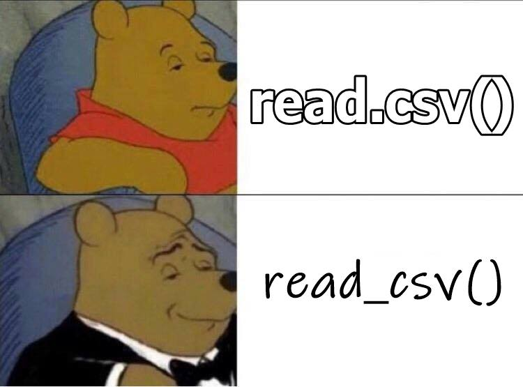

```{r, child="../setup.Rmd"}
```

```{r, include=FALSE}
beatles_reset <- tibble(
    firstName   = c("John", "Paul", "Ringo", "George"),
    lastName    = c("Lennon", "McCartney", "Starr", "Harrison"),
    instrument  = c("guitar", "bass", "drums", "guitar"),
    yearOfBirth = c(1940, 1942, 1940, 1943),
    deceased    = c(TRUE, FALSE, FALSE, TRUE)
)

pathToData <- here::here('data', 'data.csv')
wildlife_impacts <- read_csv(pathToData)
```

---

# Before we start

Make sure you have these packages installed and loaded:

```{r, eval=FALSE}
install.packages("stringr")
install.packages("dplyr")
install.packages("ggplot2")
install.packages("readr")
install.packages("here")
```

(At the top of the `practice.R` file)

Remember: you only need to install them once!

---

.leftcol[

## "The purpose of computing is _insight_, not numbers"
### - [Richard Hamming](https://en.wikipedia.org/wiki/Richard_Hamming)

]

.rightcol[


]

---

```{r child="topics/0.Rmd"}
```

---

```{r child="topics/1.Rmd"}
```

---

class: center

# The data frame...in Excel

<center>

</center>

---

# The data frame...in R

```{r}
beatles <- tibble(
    firstName   = c("John", "Paul", "Ringo", "George"),
    lastName    = c("Lennon", "McCartney", "Starr", "Harrison"),
    instrument  = c("guitar", "bass", "drums", "guitar"),
    yearOfBirth = c(1940, 1942, 1940, 1943),
    deceased    = c(TRUE, FALSE, FALSE, TRUE)
)

beatles
```

---

# The data frame...in RStudio

.leftcol[

```{r, eval=FALSE}
View(beatles)
```

]


---

## **Columns**: _Vectors_ of values (must be same data type)

```{r}
beatles
```

--

Extract a column using `$`

```{r}
beatles$firstName
```

---

## **Rows**: Information about individual observations

--

Information about _John Lennon_ is in the first row:

```{r}
beatles[1,]
```

--

Information about _Paul McCartney_ is in the second row:

```{r}
beatles[2,]
```

---

## Make a data frame with `data.frame()`

```{r}
beatles <- data.frame(
    firstName   = c("John", "Paul", "Ringo", "George"),
    lastName    = c("Lennon", "McCartney", "Starr", "Harrison"),
    instrument  = c("guitar", "bass", "drums", "guitar"),
    yearOfBirth = c(1940, 1942, 1940, 1943),
    deceased    = c(TRUE, FALSE, FALSE, TRUE)
)
```

--

```{r}
beatles
```

---

## Make a data frame with `tibble()`

```{r, eval=FALSE}
library(dplyr)
```

```{r}
beatles <- tibble(
    firstName   = c("John", "Paul", "Ringo", "George"),
    lastName    = c("Lennon", "McCartney", "Starr", "Harrison"),
    instrument  = c("guitar", "bass", "drums", "guitar"),
    yearOfBirth = c(1940, 1942, 1940, 1943),
    deceased    = c(TRUE, FALSE, FALSE, TRUE)
)
```

--

```{r}
beatles
```

---

## Why I use `tibble()` instead of `data.frame()`

--

1. The `tibble()` shows the **dimensions** and **data type**.

--

2. A tibble will only print the first few rows of data when you enter the object name
Example: `faithful` vs. `as_tibble(faithful)`

--

3. Columns of class `character` are _never_ converted into factors (don't worry about this for now...just know that tibbles make life easier with strings).

**Note**: I use the word **"data frame"** to refer to both `tibble()` and `data.frame()` objects

---

## Data frame vectors must have the same length

```{r, eval=FALSE}
beatles <- tibble(
    firstName   = c("John", "Paul", "Ringo", "George", "Bob"), # Added "Bob" #<<
    lastName    = c("Lennon", "McCartney", "Starr", "Harrison"),
    instrument  = c("guitar", "bass", "drums", "guitar"),
    yearOfBirth = c(1940, 1942, 1940, 1943),
    deceased    = c(TRUE, FALSE, FALSE, TRUE)
)
```

```{r, error=TRUE, echo=FALSE}
beatles <- tibble(
    firstName   = c("John", "Paul", "Ringo", "George", "BOB"),
    lastName    = c("Lennon", "McCartney", "Starr", "Harrison"),
    instrument  = c("guitar", "bass", "drums", "guitar"),
    yearOfBirth = c(1940, 1942, 1940, 1943),
    deceased    = c(TRUE, FALSE, FALSE, TRUE)
)
```

---

## Use `NA` for missing values

```{r}
beatles <- tibble(
    firstName   = c("John", "Paul", "Ringo", "George", "Bob"), 
    lastName    = c("Lennon", "McCartney", "Starr", "Harrison", NA), # Added NAs #<< 
    instrument  = c("guitar", "bass", "drums", "guitar", NA), #<<
    yearOfBirth = c(1940, 1942, 1940, 1943, NA), #<<
    deceased    = c(TRUE, FALSE, FALSE, TRUE, NA) #<<
)
```

--

```{r}
beatles
```

---

# Dimensions: `nrow()`, `ncol()`, & `dim()`

```{r}
nrow(beatles) # Number of rows
ncol(beatles) # Number of columns
dim(beatles)  # Number of rows and columns
```

---

### .center[Use `names()` or `colnames()` to see the available variables]

Get the names of columns:

```{r}
names(beatles)
colnames(beatles)
```

--

Get the names of rows (rarely needed):

```{r}
rownames(beatles)
```

---

# Changing the column names

Change the column names with `names()` or `colnames()`:

```{r, eval=FALSE}
names(beatles) <- c('one', 'two', 'three', 'four', 'five')
beatles
```

```{r, echo=FALSE}
df <- beatles
colnames(df) <- c('one', 'two', 'three', 'four', 'five')
df
```

---

# Changing the column names

Make all the column names upper-case:

```{r, eval=FALSE}
colnames(beatles) <- stringr::str_to_upper(colnames(beatles))
beatles
```

```{r, echo=FALSE}
colnames(df) <- str_to_upper(colnames(beatles))
df
```

---

## Combine data frames by columns using `bind_cols()`

Note: `bind_cols()` is from the **dplyr** library

```{r}
names <- tibble(
    firstName = c("John", "Paul", "Ringo", "George"),
    lastName  = c("Lennon", "McCartney", "Starr", "Harrison"))

instruments <- tibble(
    instrument = c("guitar", "bass", "drums", "guitar"))
```

--

```{r}
bind_cols(names, instruments)
```

---

## Combine data frames by rows using `bind_rows()`

Note: `bind_rows()` is from the **dplyr** library

```{r}
members1 <- tibble(
    firstName = c("John", "Paul"),
    lastName  = c("Lennon", "McCartney"))

members2 <- tibble(
    firstName = c("Ringo", "George"),
    lastName  = c("Starr", "Harrison"))
```

--

```{r}
bind_rows(members1, members2)
```

---

## Note: `bind_rows()` requires the **same** columns names:

```{r}
colnames(members2) <- c("firstName", "LastName") #<<
bind_rows(members1, members2)
```

Note how `<NA>`s were created

---

class: inverse

```{r, echo=FALSE}
countdown(
  minutes = 6,
  warn_when = 30,
  update_every = 1,
  top = 0,
  right = 0,
  font_size = '2em'
)
```

## Your turn

Answer these questions using the `animals_farm` and `animals_pet` data frames:

1. Write code to find how many _rows_ are in the `animals_farm` data frame?
2. Write code to find how many _columns_ are in the `animals_pet` data frame?
3. Create a new data frame, `animals`, by combining `animals_farm` and `animals_pet`.
4. Change the column names of `animals` to title case.
5. Add a new column to `animals` called `type` that tells if an animal is a `"farm"` or `"pet"` animal.

---

```{r child="topics/2.Rmd"}
```

---

## Access data frame columns using the `$` symbol

```{r, echo=FALSE}
beatles <- beatles_reset
```

```{r}
beatles$firstName
```

--

```{r}
beatles$lastName
```

---

# Creating new variables with the `$` symbol

--

Add the hometown of the bandmembers:

```{r}
beatles$hometown <- 'Liverpool'
beatles
```

---

# Creating new variables with the `$` symbol

Add a new `alive` variable:

```{r}
beatles$alive <- c(FALSE, TRUE, TRUE, FALSE)
beatles
```

---

## You can compute new variables from current ones

--

Compute and add the age of the bandmembers:

```{r}
beatles$age <- 2023 - beatles$yearOfBirth
beatles
```

---

## Access elements by index: `DF[row, column]`

```{r, echo=FALSE}
beatles <- tibble(
    firstName   = c("John", "Paul", "Ringo", "George"),
    lastName    = c("Lennon", "McCartney", "Starr", "Harrison"),
    instrument  = c("guitar", "bass", "drums", "guitar"),
    yearOfBirth = c(1940, 1942, 1940, 1943),
    deceased    = c(TRUE, FALSE, FALSE, TRUE)
)
```

General form for indexing elements:

```{r, eval=FALSE}
DF[row, column]
```

--

.leftcol[

Select the element in row 1, column 2:

```{r}
beatles[1, 2]
```

]

--

.rightcol[

Select the elements in rows 1 & 2 and columns 2 & 3:

```{r}
beatles[c(1, 2), c(2, 3)]
```

]

---

## Leave row or column "blank" to select all

--

```{r}
beatles[c(1, 2),] # Selects all COLUMNS for rows 1 & 2
```

--

```{r}
beatles[,c(1, 2)] # Selects all ROWS for columns 1 & 2
```

---

## Negative indices exclude row / column

--

```{r}
beatles[-1, ] # Select all ROWS except the first
```

--

```{r}
beatles[,-1] # Select all COLUMNS except the first
```

---

# You can select columns by their names

Note: you don't need the comma to select an entire column

--

.leftcol[

One column

```{r}
beatles['firstName']
```

]

--

<br>Multiple columns

.rightcol[
```{r}
beatles[c('firstName', 'lastName')]
```

]

---

## Use logical indices to _filter_ rows

--

**Which Beatles members are still alive?**<br>Create a logical vector using the `deceased` column:

```{r}
beatles$deceased == FALSE
```

--

Insert this logical vector in the ROW position of `beatles[,]`:

```{r}
beatles[beatles$deceased == FALSE,]
```

---

class: inverse

```{r, echo=FALSE}
countdown(
  minutes = 10,
  warn_when = 30,
  update_every = 1,
  top = 0,
  right = 0,
  font_size = '2em'
)
```

## Your turn

Answer these questions using the `beatles` data frame:

1. Create a new column, `playsGuitar`, which is `TRUE` if the band member plays the guitar and `FALSE` otherwise.
2. Filter the data frame to select only the rows for the band members who have four-letter first names.
3. Create a new column, `fullName`, which contains the band member's first and last name separated by a space (e.g. `"John Lennon"`)

---

class: inverse, center

# .fancy[Break]

```{r, echo=FALSE}
countdown(
  minutes      = 5,
  warn_when    = 30,
  update_every = 1,
  left         = 0,
  right        = 0,
  top          = 1,
  bottom       = 0,
  margin       = "5%",
  font_size    = "8em"
)
```

---

```{r child="topics/3.Rmd"}
```

---

# Getting data into R

<br>

## Options:

## 1. Load external packages
## 2. Read in external files (usually a `.csv`* file)

<br>

*csv = "comma-separated values"

---

## Data from an R package

```{r, eval=FALSE, message=FALSE}
library(ggplot2)
```

--

See which data frames are available in a package:

```{r, eval=FALSE}
data(package = "ggplot2")
```

---

# Find out about package data sets with `?`

```{r, eval=FALSE}
?msleep
```

```
msleep {ggplot2}

An updated and expanded version of the mammals sleep dataset

Description

This is an updated and expanded version of the mammals sleep dataset. Updated sleep times and weights were taken from V. M. Savage and G. B. West. A quantitative, theoretical framework for understanding mammalian sleep. Proceedings of the National Academy of Sciences, 104 (3):1051-1056, 2007.
```

---

# Previewing data frames: `msleep`

--

Look at the data in a "spreadsheet"-like way:

```{r, eval = FALSE}
View(msleep)
```

This is "read-only" so you can't corrupt the data `r emo::ji("smile")`

---

# My favorite quick summary: `glimpse()`

Preview each variable with `str()` or `glimpse()`

```{r, eval=FALSE}
glimpse(msleep)
```

.code80[

```{r, echo=FALSE}
glimpse(msleep)
```

]

---

## Also very useful for quick checks: `head()` and `tail()`

.leftcol[

View the **first** 6 rows with `head()`

```{r, eval=FALSE}
head(msleep)
```

.code80[

```{r, echo=FALSE}
head(msleep)
```

]]

.rightcol[

View the **last** 6 rows with `tail()`

```{r, eval=FALSE}
tail(msleep)
```

.code80[

```{r, echo=FALSE}
tail(msleep)
```

]]

---

# Importing an external data file

<br>

.leftcol60[
Note the `data.csv` file in your `data` folder.

- **DO NOT** double-click it!
- **DO NOT** open it in Excel!

Excel can **corrupt** your data!

(Don't believe me? read [this](https://journals.plos.org/ploscompbiol/article?id=10.1371/journal.pcbi.1008984))
]

--

.rightcol40[
If you **must** open it in Excel:

- Make a copy 
- Open the copy
]

---

# Steps to importing external data files

--

## 1. Create a path to the data

```{r}
library(here)
pathToData <- here('data', 'data.csv') #<<
pathToData
```

--

## 2. Import the data

```{r, eval=FALSE}
library(readr)
df <- read_csv(pathToData)#<<
```

---

## Using the **here** package to make file paths

The `here()` function builds the path to your **root** to your _working directory_ <br>(this is where your `.Rproj` file lives!)

```{r}
here()
```

--

The `here()` function builds the path to files _inside_ your working directory

```{r}
path_to_data <- here('data', 'data.csv')
path_to_data
```

---

# Avoid hard-coding file paths!

### (they can break on different computers)

```{r}
path_to_data <- 'data/data.csv'
path_to_data
```

# `r emo::ji("poop")``r emo::ji("poop")``r emo::ji("poop")`

---

class: center

.leftcol40[.left[

## Use the **here** package to make file paths

]]

.rightcol60[

<center><br>

</center>Art by [Allison Horst](https://www.allisonhorst.com/)

]

---

# Use `read_csv()`, not `read.csv()`

.leftcol[

<center>

</center>

]

.rightcol[

```{r, eval=FALSE}
path_to_data <- here('data', 'data.csv')
data <- read_csv(path_to_data) #<<
```

]

---

class: inverse

```{r, echo=FALSE}
countdown(
  minutes = 10,
  warn_when = 30,
  update_every = 1,
  top = 0,
  right = 0,
  font_size = '2em'
)
```

## Your turn

.font90[

1) Use the `here()` and `read_csv()` functions to load the `data.csv` file that is in the `data` folder. Name the data frame object `df`.

2) Use the `df` object to answer the following questions:

- How many rows and columns are in the data frame?
- Preview the different columns. What do you think this data is about? What might one row represent? What type of data is each column? (don't need to type this out...just inspect the data)
- How many unique airports are in the data frame?
- What is the earliest and latest observation in the data frame?
- What is the lowest and highest cost of any one repair in the data frame?

]

---

class: center

## Next week: better data wrangling with **dplyr**

<center>

</center>Art by [Allison Horst](https://www.allisonhorst.com/)

---

# Select rows with `filter()`

Example: Filter rows to find which Beatles members are still alive?

--

**Base R**:

```{r, eval=FALSE}
beatles[beatles$deceased == FALSE,]
```

--

**dplyr**:

```{r, eval=FALSE}
filter(beatles, deceased == FALSE)
```

---

# In 2 weeks: plotting with **ggplot2**

.leftcol[

## Translate _data_...

```{r, echo=FALSE}
msleep[15:25, c('brainwt', 'bodywt')]
```

]

.rightcol[

## ...into _information_

```{r fig.height=4.5, fig.width=6.5, message=FALSE, warning=FALSE, echo=FALSE}
library(ggplot2)
ggplot(msleep, aes(x=brainwt, y=bodywt)) +
    geom_point(alpha=0.6) +
    stat_smooth(method='lm', col='red', se=F, size=0.7) +
    scale_x_log10() +
    scale_y_log10() +
    labs(x='log(brain weight) in g', y='log(body weight) in kg') +
    theme_minimal()
```

]

---

# A note about HW 9

- You have what you need to start now.
- It will be _much_ easier if you use the **dplyr** functions (i.e. read ahead).

---

class: inverse

```{r, echo=FALSE}
countdown(
  minutes = 8,
  warn_when = 30,
  update_every = 1,
  top = 0,
  right = 0,
  font_size = '2em'
)
```

## Extra Practice!

1. Install the **dslabs** package. 
2. Load the package, then use `data(package = "dslabs")` to see the different data sets in this package. 
3. Pick one. 
4. Answer these questions:

- What is the dataset about?
- How many observations are in the data frame?
- What is the original source of the data?
- What type of data is each variable?
- Find one thing interesting about it to share.
