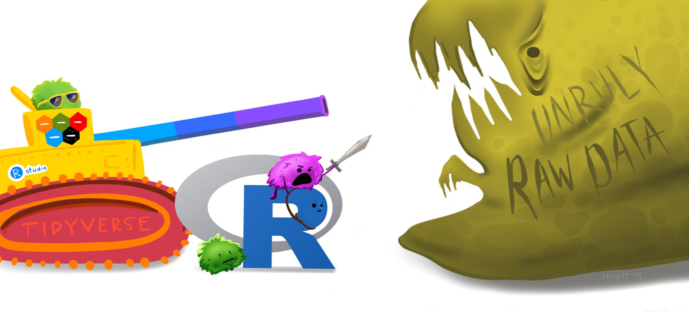

```{r, child="../setup.Rmd"}
```

```{r, include=FALSE}
spicegirls <- tibble(
    firstName   = c("Melanie", "Melanie", "Emma", "Geri", "Victoria"),
    lastName    = c("Brown", "Chisholm", "Bunton", "Halliwell", "Beckham"),
    spice       = c("Scary", "Sporty", "Baby", "Ginger", "Posh"),
    yearOfBirth = c(1975, 1974, 1976, 1972, 1974),
    deceased    = c(FALSE, FALSE, FALSE, FALSE, FALSE)
)

beatles <- tibble(
    firstName   = c("John", "Paul", "Ringo", "George"),
    lastName    = c("Lennon", "McCartney", "Starr", "Harrison"),
    yearOfBirth = c(1940, 1942, 1940, 1943),
    deceased    = c(TRUE, FALSE, FALSE, TRUE),
    band        = 'beatles'
)

spicegirls <- spicegirls %>%
    select(-spice) %>%
    mutate(band = 'spicegirls')
bands <- bind_rows(spicegirls, beatles)
```

---

class: inverse

# Quiz 5

```{r, echo=FALSE}
countdown(
  minutes      = 10,
  warn_when    = 30,
  update_every = 1,
  top          = 0,
  right        = 0,
  font_size    = '3em'
)
```

.leftcol[

## Write your name on the quiz!

## Rules:

- Work alone; no outside help of any kind is allowed.
- No calculators, no notes, no books, no computers, no phones.

]

.rightcol[

<br>
<center>

</center>

]

---

```{r child="topics/0.Rmd"}
```

---

```{r child="topics/1.Rmd"}
```

---

# Before we start

Make sure you have the "tidyverse" installed

```{r, eval=FALSE}
install.packages('tidyverse')
```

(this is at the top of the `practice.R` file)

Remember: you only need to install packages once!

---

class: center

### The tidyverse: `stringr` + `dplyr` + `readr` +  `ggplot2` + ...

<center>

</center>Art by [Allison Horst](https://www.allisonhorst.com/)

---

class: center

## Today: better data wrangling with **dplyr**

<center>

</center>Art by [Allison Horst](https://www.allisonhorst.com/)

---

class: center

# 80% of the job is data wrangling

<center>

</center>

---

# The main `dplyr` "verbs"

- `select()`: subset columns
- `filter()`: subset rows on conditions
- `arrange()`: sort data frame
- `mutate()`: create new columns by using information from other columns
- `group_by()`: group data to perform grouped operations
- `summarize()`: create summary statistics (usually on grouped data)
- `count()`: count discrete rows

---

# This week's British Band: **The Spice Girls**

```{r}
spicegirls <- tibble(
    firstName   = c("Melanie", "Melanie", "Emma", "Geri", "Victoria"),
    lastName    = c("Brown", "Chisholm", "Bunton", "Halliwell", "Beckham"),
    spice       = c("Scary", "Sporty", "Baby", "Ginger", "Posh"),
    yearOfBirth = c(1975, 1974, 1976, 1972, 1974),
    deceased    = c(FALSE, FALSE, FALSE, FALSE, FALSE)
)
spicegirls
```

---

# Select columns with `select()`

<br>
<center>

</center>

---

# Select columns with `select()`

Example: Select the columns `firstName` & `lastName`

--

**Base R**:

```{r}
spicegirls[c('firstName', 'lastName')]
```

---

# Select columns with `select()`

Example: Select the columns `firstName` & `lastName`

**dplyr**: (note that you don't need `""` around names)

```{r}
select(spicegirls, firstName, lastName)
```

---

# Select columns with `select()`

Use the `-` sign to drop columns:

```{r}
select(spicegirls, -firstName, -lastName)
```

---

# Select columns with `select()`

Select columns based on name criteria:

- `ends_with()` = Select columns that end with a character string
- `contains()` = Select columns that contain a character string
- `matches()` = Select columns that match a regular expression
- `one_of()` = Select column names that are from a group of names

---

# Select columns with `select()`

Select only the "name" columns

```{r}
select(spicegirls, ends_with('name'))
```

---

# Select rows with `filter()`

<br>
<center>

</center>

---

# Select rows with `filter()`

Example: Filter the band members born after 1974

```{r, eval=FALSE}
## # A tibble: 5 x 5
##   firstName lastName  spice  yearOfBirth deceased
##   <chr>     <chr>     <chr>        <dbl> <lgl>
## 1 Melanie   Brown     Scary         1975 FALSE #<<
## 2 Melanie   Chisholm  Sporty        1974 FALSE
## 3 Emma      Bunton    Baby          1976 FALSE #<<
## 4 Geri      Halliwell Ginger        1972 FALSE
## 5 Victoria  Beckham   Posh          1974 FALSE
```

---

# Select rows with `filter()`

Example: Filter the band members born after 1974

**Base R**:

```{r}
spicegirls[spicegirls$yearOfBirth > 1974,]
```

---

# Select rows with `filter()`

Example: Filter the band members born after 1974

**dplyr**:

```{r}
filter(spicegirls, yearOfBirth > 1974)
```

---

# Select rows with `filter()`

Example: Filter the band members born after 1974 **& are named "Melanie"**

**dplyr**:

```{r}
filter(spicegirls, yearOfBirth > 1974 & firstName == "Melanie")
```

---

# .center[Logic operators for `filter()`]

<br>

Description | Example
------------|------------
Values greater than 1 | `value > 1`
Values greater than or equal to 1 | `value >= 1`
Values less than 1 | `value < 1`
Values less than or equal to 1 | `value <= 1`
Values equal to 1 | `value == 1`
Values not equal to 1 | `value != 1`
Values in the set c(1, 4) | `value %in% c(1, 4)`

---

# Removing missing values

Drop all rows where `variable` is `NA`

```{r, eval=FALSE}
filter(data, !is.na(variable))
```

---

class: inverse

```{r, echo=FALSE}
countdown(
    minutes      = 10,
    warn_when    = 30,
    update_every = 1,
    top          = 0,
    right        = 0,
    font_size    = '2em'
)
```

## Your turn: wildlife impacts data

.font90[

1) Create the data frame object `df` by using `here()` and `read_csv()` to load the `wildlife_impacts.csv` file in the `data` folder.

2) Use the `df` object and the `select()` and `filter()` functions to answer the following questions:

- Create a new data frame, `df_birds`, that contains only the variables (columns) about the species of bird.
- Create a new data frame, `dc`, that contains only the observations (rows) from DC airports.
- Create a new data frame, `dc_birds_known`, that contains only the observations (rows) from DC airports and those where the species of bird is known.
- How many _known_ unique species of birds have been involved in accidents at DC airports?

]

---

```{r child="topics/2.Rmd"}
```

---

# Create sequences of operations with "pipes"

--

.leftcol[

<br>
<center>

</center>
[The Treachery of Images](https://en.wikipedia.org/wiki/The_Treachery_of_Images), René Magritte

]

--

.rightcol[

<center>

<a href = "https://magrittr.tidyverse.org/">magrittr package</a>
</center>

]

---

# Think of `%>%` as the words "...and then..."

--

**Without Pipes** (read from inside-out):

```{r, eval=FALSE}
leave_house(get_dressed(get_out_of_bed(wake_up(me))))
```

--

**With Pipes**:

```{r, eval=FALSE}
me %>%
    wake_up() %>%
    get_out_of_bed() %>%
    get_dressed() %>%
    leave_house()
```

---

# Sequence operations with pipes: `%>%`

--

1. Filter the band members born after 1974
2. Select only the columns `firstName` & `lastName`

--

**Without Pipes**:

```{r}
select(filter(spicegirls, yearOfBirth > 1974), firstName, lastName)
```

---

# Sequence operations with pipes: `%>%`

1. Filter the band members born after 1974
2. Select only the columns `firstName` & `lastName`

**With Pipes**:

```{r}
spicegirls %>%
    filter(yearOfBirth > 1974) %>%
    select(firstName, lastName)
```

---

# Think of the words "...and then..."

**Without Pipes**:

```{r, eval=FALSE}
select(filter(spicegirls, yearOfBirth > 1974), firstName, lastName)
```

**With Pipes**: Note that you don't need to repeat the dataframe name

```{r, eval=FALSE}
spicegirls %>%
    filter(yearOfBirth > 1974) %>%
    select(firstName, lastName)
```

---

# Sort rows with `arrange()`

--

Sort the data frame by year of birth:

```{r}
spicegirls %>%
    arrange(yearOfBirth)
```

---

# Sort rows with `arrange()`

Use the `desc()` function to sort in descending order:

```{r}
spicegirls %>%
    arrange(desc(yearOfBirth))
```

---

# Sort rows with `arrange()`

Example of filtering, arranging, and selecting:

```{r}
spicegirls %>%
    filter(yearOfBirth < 1975) %>%
    arrange(desc(yearOfBirth)) %>%
    select(ends_with('name'))
```

---

class: inverse

```{r, echo=FALSE}
countdown(
    minutes      = 10,
    warn_when    = 30,
    update_every = 1,
    top          = 0,
    right        = 0,
    font_size    = '2em'
)
```

## Your turn

.font90[

1) Create the data frame object `df` by using `here()` and `read_csv()` to load the `wildlife_impacts.csv` file in the `data` folder.

2) Use the `df` object and `select()`, `filter()`, and `%>%` to answer the following questions:

- Create a new data frame, `dc_dawn`, that contains only the observations (rows) from DC airports that occurred at dawn.
- Create a new data frame, `dc_dawn_birds`, that contains only the observations (rows) from DC airports that occurred at dawn and only the variables (columns) about the species of bird.
- Create a new data frame, `dc_dawn_birds_known`, that contains only the observations (rows) from DC airports that occurred at dawn and only the variables (columns) about the KNOWN species of bird.
- How many _known_ unique species of birds have been involved in accidents at DC airports at dawn?

]


---

class: inverse, center

# .fancy[Break]

```{r, echo=FALSE}
countdown(
  minutes      = 5,
  warn_when    = 30,
  update_every = 1,
  left         = 0,
  right        = 0,
  top          = 1,
  bottom       = 0,
  margin       = "5%",
  font_size    = "8em"
)
```

---

```{r child="topics/3.Rmd"}
```

---

class: center, middle

## Create new variables with `mutate()`

<br>
<center>

</center>

---

class: center
background-color: #fff

<center>

</center>Art by [Allison Horst](https://www.allisonhorst.com/)

---

# Create new variables with `mutate()`

Example: Use the `yearOfBirth` variable to compute the age of each band member

--

**Base R**:

```{r, eval=FALSE}
spicegirls$age <- 2022 - spicegirls$yearOfBirth
```

--

**dplyr**:

```{r}
spicegirls %>%
    mutate(age = 2022 - yearOfBirth)
```

---

# You can _immediately_ use new variables

```{r}
spicegirls %>%
    mutate(
        age = 2022 - yearOfBirth,
        meanAge  = mean(age)) # Immediately using the "age" variable #<<
```

---

# .center[Handling if/else conditions]

### .center[`ifelse(<condition>, <if TRUE>, <else>)`]

--

```{r}
spicegirls %>%
    mutate(
        yobAfter74 = ifelse(yearOfBirth > 1974, "yes", "no"))
```

---

class: inverse

```{r, echo=FALSE}
countdown(
    minutes      = 10,
    warn_when    = 30,
    update_every = 1,
    top          = 0,
    right        = 0,
    font_size    = '2em'
)
```

## Your turn

.font90[

1) Create the data frame object `df` by using `here()` and `read_csv()` to load the `wildlife_impacts.csv` file in the `data` folder.

2) Use the `df` object with `%>%` and `mutate()` to create the following new variables:

- `height_miles`: The `height` variable converted to miles (Hint: there are 5,280 feet in a mile).
- `cost_mil`: Is `TRUE` if the repair costs was greater or equal to $1 million, `FALSE` otherwise.
- `season`: One of four seasons based on the `incident_month` variable:

  - `spring`: March, April, May
  - `summer`: June, July, August
  - `fall`: September, October, November
  - `winter`: December, January, February

]

---

```{r child="topics/4.Rmd"}
```

---

# Split-apply-combine with `group_by`

<br>

### 1. **Split** the data into groups
### 2. **Apply** some analysis to each group
### 3. **Combine** the results

---

class: center

# Split-apply-combine with `group_by`

<br>
<center>

</center>

---

## Split-apply-combine with `group_by`

```{r}
bands
```

---

## Split-apply-combine with `group_by`

Compute the mean band member age for **each band**

```{r}
bands %>%
    mutate(
        age = 2020 - yearOfBirth,
        mean_age = mean(age)) # This is the mean across both bands #<<
```

---

## Split-apply-combine with `group_by`

Compute the mean band member age for each band

```{r}
bands %>%
    mutate(age = 2020 - yearOfBirth) %>%
    group_by(band) %>% # Everything after this will be done each band #<<
    mutate(mean_age = mean(age))
```

---

class: center

# Summarize data frames with `summarise()`

<br>
<center>

</center>

---

## Summarize data frames with `summarise()`

Compute the mean band member age for **each band**

```{r}
bands %>%
    mutate(age = 2020 - yearOfBirth) %>%
    group_by(band) %>%
    summarise(mean_age = mean(age)) # Drops all variables except for group #<<
```

---

## Summarize data frames with `summarise()`

Compute the mean, min, and max band member age for **each band**

```{r}
bands %>%
    mutate(age = 2020 - yearOfBirth) %>%
    group_by(band) %>%
    summarise(
        mean_age = mean(age),
        min_age = min(age),
        max_age = max(age))
```

---

## Computing counts of observations with `n()`

How many members are in each band?

```{r}
bands %>%
    mutate(age = 2020 - yearOfBirth) %>%
    group_by(band) %>%
    summarise(
        mean_age = mean(age),
        min_age = min(age),
        max_age = max(age),
        numMembers = n()) #<<
```

---

## If you only want a quick count, use `count()`

These do the same thing:

.leftcol[

```{r}
bands %>%
    group_by(band) %>%
    summarise(n = n())
```

]

.rightcol[

```{r}
bands %>%
    count(band)
```

]

---

## If you only want a quick count, use `count()`

You can count multiple combinations

```{r}
bands %>%
    mutate(nameStartsWithG = str_detect(firstName, '^G')) %>%
    count(band, nameStartsWithG)
```

---

class: inverse

```{r, echo=FALSE}
countdown(
    minutes      = 10,
    warn_when    = 30,
    update_every = 1,
    top          = 0,
    right        = 0,
    font_size    = '2em'
)
```

## Your turn

.font90[

1) Create the data frame object `df` by using `here()` and `read_csv()` to load the `wildlife_impacts.csv` file in the `data` folder.

2) Use the `df` object and `group_by()`, `summarise()`, `count()`, and `%>%` to answer the following questions:

- Create a summary data frame that contains the mean `height` for each different time of day.
- Create a summary data frame that contains the maximum `cost_repairs_infl_adj` for each year.
- Which _month_ has had the greatest number of reported incidents?
- Which _year_ has had the greatest number of reported incidents?

]

---

# Exporting data

```{r}
ageSummary <- bands %>%
    mutate(age = 2020 - yearOfBirth) %>%
    group_by(band) %>%
    summarise(
        mean_age = mean(age),
        min_age = min(age),
        max_age = max(age),
        numMembers = n())
ageSummary
```

---

# Exporting data: `here()` + `write_csv()`

Save the `ageSummary` data frame in your "data" folder:

--

1) Create a path to where you want to save the data

```{r}
library(here)
savePath <- here('data', 'ageSummary.csv')
```

--

2) Export the data

```{r, eval=FALSE}
library(readr)
write_csv(ageSummary, savePath)
```

---

# HW 9

--

Make sure you install the package `nycflights13`

```{r, eval=FALSE}
install.packages('nycflights13')
```

--

This package includes **5 data frames**:

```{r, eval=FALSE}
airlines
airports
flights
planes
weather
```
